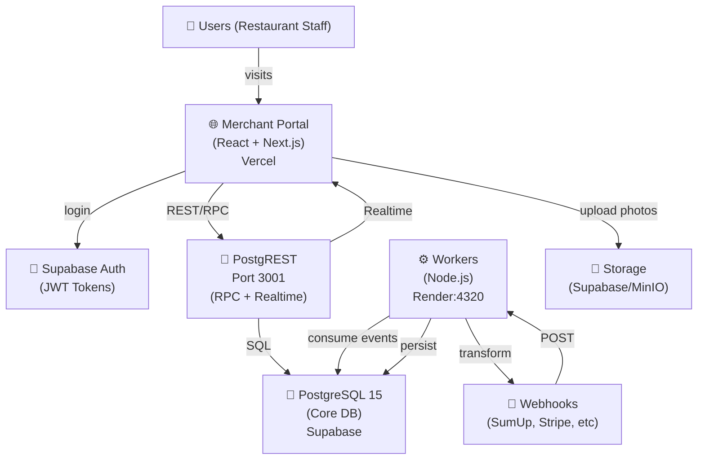

# ChefIApp SaaS — Architecture Blueprint

**Status**: Production-ready SaaS architecture for restaurant payment systems
**Stack**: Vercel (Frontend) + Supabase/PostgreSQL (Core) + Render/Node.js (Workers)
**Last Updated**: 2026-02-21

---

## 1. SYSTEM ARCHITECTURE

### 1.1 Component Diagram



### 1.2 Deployment Topology

| Component     | Platform             | Auto-Scale            | DB Access             | Notes                            |
| ------------- | -------------------- | --------------------- | --------------------- | -------------------------------- |
| **Frontend**  | Vercel               | Yes (CDN)             | None (via PostgREST)  | Static build + rewrites          |
| **Auth**      | Supabase Auth        | Managed               | None (JWT)            | Hosted login pages               |
| **Database**  | Supabase PostgreSQL  | Managed               | Service role + RLS    | Postgres 15, logical replication |
| **PostgREST** | Supabase             | Managed               | Auth role + anon role | Auto-generated REST API          |
| **Workers**   | Render (web service) | Manual (paid)         | Service key           | Webhook gateway + event bus      |
| **Storage**   | Supabase S3 / MinIO  | Managed / Self-hosted | Bucket policies       | Photos, receipts, exports        |

---

## 2. MULTI-TENANCY MODEL

### 2.1 Tenancy Architecture: Organization-Based

```sql
-- Tenant Structure (from migrations/20260304_gm_organizations.sql)

gm_organizations (1)
  ├─ id (UUID)
  ├─ name, slug (unique)
  ├─ owner_id (Keycloak user)
  ├─ plan_tier: 'free' | 'trial' | 'starter' | 'pro' | 'enterprise'
  ├─ max_restaurants (plan attribute)
  └─ metadata (JSONB)

gm_org_members (N)
  ├─ org_id (FK → gm_organizations)
  ├─ user_id (Keycloak user)
  ├─ role: 'owner' | 'admin' | 'billing' | 'viewer'

gm_restaurants (N per Organization)
  ├─ id (UUID)
  ├─ org_id (FK → gm_organizations)
  ├─ name, slug
  ├─ owner_id (fallback, legacy)
  ├─ status: 'draft' | 'active' | 'paused'

gm_restaurant_members (N)
  ├─ restaurant_id (FK)
  ├─ user_id (Keycloak user)
  ├─ role: 'owner' | 'manager' | 'staff' | 'waiter'
```

### 2.2 Row-Level Security (RLS) — Foundation

**Principle**: Every row belongs to exactly one organization (via `restaurant_id → org_id`).

#### Core Tables with RLS:

```sql
-- gm_restaurants
ALTER TABLE public.gm_restaurants ENABLE ROW LEVEL SECURITY;

CREATE POLICY "org_restaurant_isolation"
  ON public.gm_restaurants
  FOR SELECT
  USING (
    org_id = (
      SELECT org_id FROM public.gm_restaurants r2
      WHERE r2.id = current_setting('app.current_restaurant_id')::uuid
    )
    OR -- OR allow access via org_members
    (org_id IN (
      SELECT org_id FROM public.gm_org_members
      WHERE user_id = auth.uid()
    ))
  );

-- gm_orders
ALTER TABLE public.gm_orders ENABLE ROW LEVEL SECURITY;

CREATE POLICY "restaurant_order_isolation"
  ON public.gm_orders
  FOR SELECT
  USING (
    restaurant_id IN (
      SELECT id FROM public.gm_restaurants
      WHERE org_id IN (
        SELECT org_id FROM public.gm_org_members
        WHERE user_id = auth.uid()
      )
    )
  );

-- Apply same pattern to:
-- - gm_products, gm_order_items
-- - gm_tables, gm_menu_categories
-- - gm_tasks, integration_webhook_events
-- - merchant_subscriptions, webhook_out_config
```

#### RLS Bypass Strategy:

```sql
-- Service role (used by workers/cron) has BYPAZZ RLS
-- In code, set session role for specific operations:

-- For trusted backend services (integration-gateway.ts):
-- Use CORE_SERVICE_KEY (JWT with role='service_role')
-- PostgREST will bypass RLS when role='service_role'

-- For user requests:
-- Set app.current_user_id, app.current_org_id in each request
-- (Supabase/PostgREST auto-sets on JWT claims)
```

**RLS Performance**:

- Add indexed foreign keys: `CREATE INDEX idx_restaurants_org ON gm_restaurants(org_id)`
- Limit policies to 1-2 JOIN levels (avoid slow planner)
- Use materialized views for complex membership queries

### 2.3 Data Isolation Checklist

- ✅ Every row has `restaurant_id` or `org_id`
- ✅ Foreign keys cascade down: `org_id` → `restaurant_id` → `order_id`
- ✅ RLS policies on INSERT/UPDATE/DELETE (not just SELECT)
- ✅ No global queries without WHERE clause (code review)
- ✅ Audit table: `audit_logs(user_id, restaurant_id, action, timestamp)`

---

## 3. AUTHENTICATION & ONBOARDING FLOW

### 3.1 Auth Flow: Keycloak → Supabase JWT → App

```
1. User lands at /app/staff/home
   ↓
2. No JWT → Redirect to /login (Supabase hosted page)
   ↓
3. Keycloak SSO prompt (if configured) or email/password
   ↓
4. Supabase Auth issues JWT:
   {
     "sub": "<user_id>",
     "email": "staff@restaurant.com",
     "role": "authenticated",
     "aud": "authenticated",
     "iss": "https://<project>.supabase.co",
     "iat": 1708...,
     "exp": ...
   }
   ↓
5. JWT stored in localStorage (Supabase client auto-stores)
   ↓
6. App mounts: RestaurantRuntimeContext loads user + org + restaurant
```

### 3.2 Onboarding Flow: No Org → /welcome

**State Machine**:

```
User signs up (or first login after org-less state)
  ↓
1. Check: does user have org_id in gm_org_members?
   ├─ YES → Load restaurant context, redirect to /app/staff/home
   └─ NO → Redirect to /welcome
  ↓
2. /welcome page (OnboardingWelcomePage)
   ├─ Option A: "Join Existing Restaurant" → QR scan → Accept invite
   ├─ Option B: "Create New Restaurant" → /onboarding/setup
   └─ Option C: "Scan QR Table" → QR Menu (no org needed)
  ↓
3. If "Create New Restaurant":
   ├─ POST /rpc/create_onboarding_context
   │   ├─ Create gm_organizations (plan_tier='trial')
   │   ├─ Create gm_org_members (user=owner, role='owner')
   │   ├─ Create gm_restaurants (org_id=org, status='draft')
   │   └─ Return { org_id, restaurant_id, onboarding_token }
   │
   ├─ Redirect to /onboarding/location (9-screen flow)
   │   Screen 1: Location (name, address, phone)
   │   Screen 2: Hours (open/close times)
   │   Screen 3: Shift setup (cash registers, payment methods)
   │   Screen 4: First product (add 1 item to get momentum)
   │   Screen 5: Table layout (QR codes auto-generate)
   │   Screen 6: Team (invite staff)
   │   Screen 7: Payment provider (SumUp, Stripe)
   │   Screen 8: TPV preview (show running order)
   │   Screen 9: Launch ✅ (set status='active')
   │
   └─ Each screen POSTs to update gm_restaurants or seed products/tables
  ↓
4. After Screen 9 (Launch):
   ├─ Set gm_restaurants.status = 'active'
   ├─ Set gm_restaurants.onboarding_completed_at = NOW()
   ├─ Create initial shift (gm_shift_logs.status='open')
   └─ Redirect to /app/staff/home (TPV operational)
```

**Schema for Onboarding Persistence** (from migrations/20260127_onboarding_persistence.sql):

```sql
CREATE TABLE public.gm_onboarding_state (
    id UUID PRIMARY KEY DEFAULT gen_random_uuid(),
    restaurant_id UUID UNIQUE REFERENCES public.gm_restaurants(id) ON DELETE CASCADE,
    state JSONB NOT NULL DEFAULT '{}'::jsonb,
    -- state keys: 'location', 'hours', 'shift_setup', 'products', 'tables', 'team', 'payment', 'preview'
    completed_screens TEXT[] DEFAULT ARRAY[]::TEXT[],
    current_screen TEXT,
    completed_at TIMESTAMPTZ,
    created_at TIMESTAMPTZ DEFAULT NOW(),
    updated_at TIMESTAMPTZ DEFAULT NOW()
);

ALTER TABLE public.gm_onboarding_state ENABLE ROW LEVEL SECURITY;
```

**RPC: Create Onboarding Context**:

```sql
CREATE OR REPLACE FUNCTION public.create_onboarding_context(
    p_name TEXT,
    p_user_id UUID
) RETURNS JSONB
LANGUAGE plpgsql
SECURITY DEFINER
AS $$
DECLARE
    v_org_id UUID;
    v_restaurant_id UUID;
    v_onboarding_token TEXT;
BEGIN
    -- 1. Create organization
    INSERT INTO public.gm_organizations (name, slug, owner_id, plan_tier)
    VALUES (
        p_name,
        lower(regexp_replace(p_name, '[^a-zA-Z0-9]+', '-', 'g')),
        p_user_id,
        'trial'
    )
    RETURNING id INTO v_org_id;

    -- 2. Add user as owner
    INSERT INTO public.gm_org_members (org_id, user_id, role)
    VALUES (v_org_id, p_user_id, 'owner');

    -- 3. Create restaurant
    INSERT INTO public.gm_restaurants (org_id, name, status)
    VALUES (v_org_id, p_name || ' Restaurant', 'draft')
    RETURNING id INTO v_restaurant_id;

    -- 4. Create onboarding state
    INSERT INTO public.gm_onboarding_state (restaurant_id, state)
    VALUES (v_restaurant_id, '{}'::jsonb);

    -- 5. Generate token (JWT-like, not real JWT)
    v_onboarding_token := 'onb_' || encode(gen_random_bytes(32), 'base64url');

    RETURN jsonb_build_object(
        'org_id', v_org_id,
        'restaurant_id', v_restaurant_id,
        'onboarding_token', v_onboarding_token,
        'redirect', '/onboarding/location'
    );
END;
$$;

GRANT EXECUTE ON FUNCTION public.create_onboarding_context(TEXT, UUID) TO authenticated;
```

---

## 4. WEBHOOKS & EVENT PERSISTENCE

### 4.1 Webhook Inbound: SumUp → integration-gateway → Core

**Flow**:

```
1. SumUp/Stripe webhook POST → /api/v1/webhook/sumup
   {
     "paymentId": "...",
     "status": "COMPLETED",
     "amount": 1500 (cents),
     "orderRef": "<chefiapp_order_id>"
   }

2. integration-gateway.ts validates webhook (HMAC signature)

3. Transforms to standard event:
   {
     "event": "payment.confirmed",
     "provider": "sumup",
     "data": {
       "order_id": "<uuid>",
       "amount_cents": 1500,
       "payment_method": "card",
       "reference": "..."
     },
     "timestamp": "2026-02-21T10:00:00Z"
   }

4. POST /internal/events (with INTERNAL_API_TOKEN)
   → Persists to integration_webhook_events table

5. RPC process_webhook_event:
   ├─ Idempotency check (idempotency_key = delivery_id)
   ├─ UPDATE gm_orders SET payment_status='PAID', total_paid_cents=...
   ├─ INSERT gm_order_payments (transaction log)
   └─ Emit to Webhooks OUT (if configured)
```

### 4.2 Webhook Inbound Schema

```sql
CREATE TABLE IF NOT EXISTS public.integration_webhook_events (
    id UUID PRIMARY KEY DEFAULT gen_random_uuid(),
    provider TEXT NOT NULL,           -- 'sumup', 'stripe', 'glovo', 'ubereats'
    event_type TEXT,                 -- 'payment.completed', 'order.created'
    received_at TIMESTAMPTZ DEFAULT NOW(),
    payload JSONB NOT NULL,          -- Raw webhook body
    headers JSONB,                   -- Used for HMAC verification
    processed BOOLEAN DEFAULT FALSE,
    processed_at TIMESTAMPTZ,
    processing_error TEXT,
    idempotency_key TEXT UNIQUE,     -- For deduplication
    restaurant_id UUID REFERENCES public.gm_restaurants(id)
);

CREATE INDEX IF NOT EXISTS idx_webhooks_provider_processed
    ON public.integration_webhook_events(provider) WHERE processed = FALSE;
```

### 4.3 Webhook Outbound: Event Relay via HMAC

**Schema** (from migrations/20260301_webhook_out_config.sql):

```sql
CREATE TABLE IF NOT EXISTS public.webhook_out_config (
    id UUID PRIMARY KEY DEFAULT gen_random_uuid(),
    restaurant_id UUID REFERENCES public.gm_restaurants(id) ON DELETE CASCADE,
    url TEXT NOT NULL,                -- Client's webhook endpoint
    secret TEXT NOT NULL,             -- HMAC-SHA256 secret
    events JSONB DEFAULT '[]'::jsonb, -- Subscribed events: [] = all
    enabled BOOLEAN DEFAULT TRUE,
    created_at TIMESTAMPTZ DEFAULT NOW()
);

CREATE TABLE IF NOT EXISTS public.webhook_out_delivery_log (
    id UUID PRIMARY KEY DEFAULT gen_random_uuid(),
    delivery_id TEXT NOT NULL,       -- Unique delivery ID
    webhook_config_id UUID REFERENCES public.webhook_out_config(id) ON DELETE CASCADE,
    restaurant_id UUID REFERENCES public.gm_restaurants(id) ON DELETE CASCADE,
    event TEXT NOT NULL,             -- 'order.created', 'payment.confirmed'
    url TEXT NOT NULL,
    status_code INT,
    attempt INT DEFAULT 1,
    attempted_at TIMESTAMPTZ DEFAULT NOW(),
    next_retry_at TIMESTAMPTZ,
    error_message TEXT
);
```

**Webhook Relay RPC** (integration-gateway.ts):

```typescript
async function relayToWebhooksOut(event: WebhookEvent) {
  // 1. Query webhook_out_config for restaurant
  const webhookConfigs = await query(
    `SELECT id, url, secret, events FROM webhook_out_config
     WHERE restaurant_id = $1 AND enabled = TRUE`,
    [event.restaurant_id],
  );

  // 2. For each config, check if subscribed to event
  for (const config of webhookConfigs) {
    const isSubscribed =
      config.events.length === 0 || config.events.includes(event.type);
    if (!isSubscribed) continue;

    // 3. Prepare delivery payload
    const deliveryId = `wh_evt_${crypto.randomUUID()}`;
    const timestamp = Math.floor(Date.now() / 1000);
    const payload = {
      id: deliveryId,
      event: event.type,
      data: event.data,
      timestamp,
    };

    // 4. Compute HMAC-SHA256 signature
    const hmac = crypto
      .createHmac("sha256", config.secret)
      .update(JSON.stringify(payload))
      .digest("hex");

    // 5. POST to client's endpoint with retry logic
    await deliverWithRetry({
      url: config.url,
      payload,
      headers: {
        "X-Chefiapp-Signature": `sha256=${hmac}`,
        "X-Chefiapp-Delivery-Id": deliveryId,
        "X-Chefiapp-Timestamp": timestamp,
        "Content-Type": "application/json",
      },
    });

    // 6. Log delivery attempt
    await logDelivery(config.id, deliveryId, event.type /* ... */);
  }
}
```

### 4.4 Event Store & Idempotency Log

```sql
-- From 04-modules-and-extras.sql (Event Sourcing Foundation)
CREATE TABLE IF NOT EXISTS public.event_store (
    sequence_id BIGSERIAL,
    event_id UUID NOT NULL PRIMARY KEY,
    stream_type TEXT NOT NULL,         -- 'order', 'payment', 'session'
    stream_id TEXT NOT NULL,           -- 'ORDER:abc-123'
    stream_version INTEGER NOT NULL,
    event_type TEXT NOT NULL,          -- 'OrderCreated', 'PaymentConfirmed'
    payload JSONB NOT NULL DEFAULT '{}'::jsonb,
    meta JSONB NOT NULL DEFAULT '{}'::jsonb, -- {actor_id, correlation_id, ...}
    created_at TIMESTAMPTZ DEFAULT NOW(),
    idempotency_key TEXT UNIQUE,       -- For deduplication
    restaurant_id UUID REFERENCES gm_restaurants(id)
);

-- Idempotency guarantee:
-- INSERT ... ON CONFLICT (idempotency_key) DO UPDATE SET ... (upsert)
-- OR:
-- SELECT * FROM event_store WHERE idempotency_key = $1 (check-then-act)
```

---

## 5. SCRIPTS & AUTOMATION

### 5.1 Idempotent Migration Strategy

**Principle**: Every migration is idempotent via `DO $$ ... IF NOT EXISTS`

**Location**: `/migrations/` (numbered, versioned)

**Pattern**:

```sql
-- migrations/20260305_sample_migration.sql

-- 1. Create table if not exists
DO $$
BEGIN
  IF NOT EXISTS (
    SELECT 1 FROM information_schema.tables
    WHERE table_schema = 'public' AND table_name = 'new_table'
  ) THEN
    CREATE TABLE public.new_table (...);
    RAISE NOTICE 'Created new_table';
  ELSE
    RAISE NOTICE 'new_table already exists, skipping';
  END IF;
END $$;

-- 2. Add column if not exists
ALTER TABLE public.existing_table
ADD COLUMN IF NOT EXISTS new_col TEXT DEFAULT 'default_value';

-- 3. Create index if not exists
CREATE INDEX IF NOT EXISTS idx_new_table_col ON public.new_table(col);

-- 4. Update only rows where needed (no-op if already updated)
UPDATE public.existing_table
SET status = 'active'
WHERE status IS NULL;
```

**Execution via Docker**: All migrations in `/migrations/` auto-run via `docker-compose.core.yml`:

```yaml
volumes:
  - ./docker-core/schema/migrations/20260304_gm_organizations.sql:/docker-entrypoint-initdb.d/05.4-gm-organizations.sql:ro
  - ./docker-core/schema/migrations/20260305_integration_credentials.sql:/docker-entrypoint-initdb.d/05.5-integration-credentials.sql:ro
```

### 5.2 Minimal Seed Data

**Location**: `/docker-core/schema/seeds_dev.sql`

**Content**:

```sql
-- Seed users (Keycloak-like, for testing)
INSERT INTO public.auth.users (id, email, encrypted_password, ...)
VALUES
  ('00000000-0000-0000-0000-000000000001', 'owner@test.com', ...),
  ('00000000-0000-0000-0000-000000000002', 'staff@test.com', ...)
ON CONFLICT DO NOTHING;

-- Seed one test organization + restaurant
INSERT INTO public.gm_organizations (name, slug, owner_id, plan_tier)
VALUES ('Test Org', 'test-org', '00000000-0000-0000-0000-000000000001', 'trial')
ON CONFLICT (slug) DO NOTHING
RETURNING id INTO v_org_id;

INSERT INTO public.gm_restaurants (org_id, name, status)
VALUES (v_org_id, 'Test Restaurant', 'active')
ON CONFLICT DO NOTHING
RETURNING id INTO v_restaurant_id;

-- Seed categories + products
INSERT INTO public.gm_menu_categories (restaurant_id, name, sort_order)
VALUES
  (v_restaurant_id, 'Drinks', 0),
  (v_restaurant_id, 'Main Course', 1)
ON CONFLICT DO NOTHING;

-- Seed 2-3 products per category (for quick onboarding)
INSERT INTO public.gm_products (restaurant_id, category_id, name, price_cents, prep_time_seconds, prep_category, station)
VALUES
  (v_restaurant_id, drinks_cat, 'Coffee', 250, 45, 'drink', 'BAR'),
  (v_restaurant_id, main_cat, 'Pasta', 1200, 600, 'main', 'KITCHEN')
ON CONFLICT DO NOTHING;

-- Seed 4 tables
INSERT INTO public.gm_tables (restaurant_id, number, status)
VALUES
  (v_restaurant_id, 1, 'available'),
  (v_restaurant_id, 2, 'available'),
  (v_restaurant_id, 3, 'available'),
  (v_restaurant_id, 4, 'available')
ON CONFLICT (restaurant_id, number) DO NOTHING;

-- Seed billing plans
INSERT INTO public.billing_plans (id, name, tier, price_cents, max_devices, max_integrations)
VALUES
  ('trial', 'Trial', 'trial', 0, 2, 1),
  ('starter', 'Starter', 'starter', 4900, 3, 2),
  ('pro', 'Pro', 'pro', 9900, 10, 5),
  ('enterprise', 'Enterprise', 'enterprise', 0, 99, 99)
ON CONFLICT DO NOTHING;

-- Seed subscription for test restaurant
INSERT INTO public.merchant_subscriptions (restaurant_id, plan_id, status)
VALUES (v_restaurant_id, 'trial', 'trialing')
ON CONFLICT (restaurant_id) DO NOTHING;
```

### 5.3 Integration Tests Script

**File**: `scripts/test-integration.sh`

```bash
#!/bin/bash
set -e

echo "=== ChefIApp Integration Tests ==="

# 1. Health check
echo "1. Health check..."
curl -f http://localhost:3001/rest/v1/ || {
  echo "❌ PostgREST not responding"
  exit 1
}

# 2. Auth test (login, get JWT)
echo "2. Auth test..."
JWT=$(curl -s -X POST http://localhost:3001/auth/v1/token \
  -H "Content-Type: application/json" \
  -d '{"email":"test@test.com","password":"password"}' | jq -r '.access_token')

[[ -z "$JWT" ]] && { echo "❌ Auth failed"; exit 1; }

# 3. Query organizations (RLS should filter)
echo "3. RLS test..."
ORGS=$(curl -s http://localhost:3001/rest/v1/gm_organizations \
  -H "Authorization: Bearer $JWT" | jq '.[]')

count=$(echo "$ORGS" | jq -s 'length')
echo "   Found $count org(s) for user"

# 4. Create order (transactional)
echo "4. Order creation test..."
ORDER=$(curl -s -X POST http://localhost:3001/rpc/create_order_atomic \
  -H "Authorization: Bearer $JWT" \
  -H "Content-Type: application/json" \
  -d '{
    "p_restaurant_id":"<uuid>",
    "p_items":[{"product_id":"<uuid>","quantity":2,"unit_price":1200}],
    "p_payment_method":"cash"
  }')

order_id=$(echo "$ORDER" | jq -r '.id')
[[ "$order_id" != "null" ]] && echo "   ✅ Order $order_id created" || echo "❌ Order creation failed"

# 5. Webhook ingest test (internal token)
echo "5. Webhook ingest test..."
WEBHOOK=$(curl -s -X POST http://localhost:4320/internal/events \
  -H "X-Internal-Token: chefiapp-internal-token-dev" \
  -H "Content-Type: application/json" \
  -d '{
    "event":"payment.confirmed",
    "provider":"sumup",
    "data":{"order_id":"<order_id>","amount_cents":1200}
  }')

echo "   Webhook response: $(echo "$WEBHOOK" | jq '.status')"

echo ""
echo "✅ All integration tests passed!"
```

**Run**:

```bash
bash scripts/test-integration.sh
```

---

## 6. IMPLEMENTATION CHECKLIST (7 DAYS)

### Day 1: Infrastructure & Auth

| Task                                                | Time     | Priority    | Risk   |
| --------------------------------------------------- | -------- | ----------- | ------ |
| Set up Supabase project (Postgres 15, Auth enabled) | 30m      | 🔴 CRITICAL | Low    |
| Create `gm_organizations` + `gm_org_members` tables | 45m      | 🔴 CRITICAL | Low    |
| Configure Supabase JWT (RS256 with Keycloak)        | 1h       | 🔴 CRITICAL | Medium |
| Test /rest/v1/ via `curl` (health check)            | 15m      | 🔴 CRITICAL | Low    |
| **Day 1 Total**                                     | **2.5h** |             |        |

### Day 2: Multi-Tenancy & RLS

| Task                                                                    | Time     | Priority    | Risk   |
| ----------------------------------------------------------------------- | -------- | ----------- | ------ |
| Migrate existing `gm_restaurants` table: add `org_id` column            | 30m      | 🔴 CRITICAL | Medium |
| Write RLS policies for all core tables (gm_restaurants, gm_orders, etc) | 1.5h     | 🔴 CRITICAL | High   |
| Test RLS isolation: user A cannot see user B's data                     | 1h       | 🔴 CRITICAL | High   |
| Add audit_logs table for compliance                                     | 30m      | 🟡 HIGH     | Low    |
| **Day 2 Total**                                                         | **3.5h** |             |        |

### Day 3: Onboarding Flow

| Task                                                             | Time     | Priority    | Risk   |
| ---------------------------------------------------------------- | -------- | ----------- | ------ |
| Create `gm_onboarding_state` table                               | 30m      | 🔴 CRITICAL | Low    |
| Write RPC `create_onboarding_context`                            | 45m      | 🔴 CRITICAL | Low    |
| Update merchant-portal: redirect no-org users to /welcome        | 30m      | 🟡 HIGH     | Low    |
| Implement 9-screen onboarding sequence                           | 2h       | 🟡 HIGH     | High   |
| Test end-to-end: signup → org creation → staff → TPV operational | 1h       | 🟡 HIGH     | Medium |
| **Day 3 Total**                                                  | **4.5h** |             |        |

### Day 4: Webhooks (Inbound) & Integration Gateway

| Task                                                                        | Time   | Priority | Risk   |
| --------------------------------------------------------------------------- | ------ | -------- | ------ |
| Create `integration_webhook_events` table                                   | 30m    | 🟡 HIGH  | Low    |
| Deploy integration-gateway.ts to Render:4320                                | 45m    | 🟡 HIGH  | Medium |
| Implement SumUp webhook receiver + HMAC verification                        | 1h     | 🟡 HIGH  | High   |
| Write RPC `process_webhook_event` (idempotent)                              | 45m    | 🟡 HIGH  | High   |
| Test: POST /api/v1/webhook/sumup → payment.confirmed → order status updated | 1h     | 🟡 HIGH  | High   |
| **Day 4 Total**                                                             | **4h** |          |        |

### Day 5: Webhooks (Outbound) & Event Relay

| Task                                                             | Time   | Priority  | Risk   |
| ---------------------------------------------------------------- | ------ | --------- | ------ |
| Create `webhook_out_config` + `webhook_out_delivery_log` tables  | 30m    | 🟢 MEDIUM | Low    |
| Implement webhook relay in integration-gateway.ts (HMAC signing) | 1h     | 🟢 MEDIUM | Medium |
| Add retry logic (exponential backoff, max 4 attempts)            | 45m    | 🟢 MEDIUM | Medium |
| Test: order.created event → relayed to client's webhook URL      | 30m    | 🟢 MEDIUM | Medium |
| Document webhook API for restaurant admins                       | 15m    | 🟢 MEDIUM | Low    |
| **Day 5 Total**                                                  | **3h** |           |        |

### Day 6: Idempotency, Testing & Observability

| Task                                                              | Time   | Priority  | Risk   |
| ----------------------------------------------------------------- | ------ | --------- | ------ |
| Add `idempotency_key` to event_store + integration_webhook_events | 30m    | 🟡 HIGH   | Low    |
| Implement idempotency check in `create_order_atomic`              | 30m    | 🟡 HIGH   | Medium |
| Write integration test script (scripts/test-integration.sh)       | 1h     | 🟢 MEDIUM | Low    |
| Add observability: logging + error tracking (Sentry integration)  | 1h     | 🟢 MEDIUM | Low    |
| Create monitoring dashboard (Grafana or Supabase metrics)         | 45m    | 🟢 MEDIUM | Low    |
| **Day 6 Total**                                                   | **4h** |           |        |

### Day 7: Verification, Documentation & Buffer

| Task                                                             | Time     | Priority    | Risk   |
| ---------------------------------------------------------------- | -------- | ----------- | ------ |
| Smoke test: full flow signup → menu → order → payment → delivery | 1.5h     | 🔴 CRITICAL | High   |
| Load testing (1000 concurrent users, 100 RPS)                    | 1h       | 🟢 MEDIUM   | Medium |
| Security audit: check RLS policies, CORS, HTTPS redirects        | 45m      | 🔴 CRITICAL | High   |
| Update README + deployment docs                                  | 30m      | 🟢 MEDIUM   | Low    |
| Contingency buffer (fix blockers)                                | 1.5h     | 🔴 CRITICAL | N/A    |
| **Day 7 Total**                                                  | **5.5h** |             |        |

**Grand Total**: ~27 hours (fits in 7 days @ 4h/day avg)

### Critical Success Factors (CSFs)

| CSF                       | Metric                                 | Target      |
| ------------------------- | -------------------------------------- | ----------- |
| **Auth works**            | Login success rate                     | 99%+        |
| **RLS isolation**         | No data leakage (audit pass)           | 0 incidents |
| **Order atomicity**       | `create_order_atomic` transaction rate | 100% ACID   |
| **Webhook reliability**   | Webhook delivery success (retries)     | 99%+        |
| **Onboarding conversion** | Users reaching "active" status         | >80%        |
| **Performance**           | p99 latency (REST API)                 | <200ms      |

### Risk Mitigation

| Risk                               | Mitigation                                            | Ownership    |
| ---------------------------------- | ----------------------------------------------------- | ------------ |
| **RLS policy bugs**                | Code review + unit tests (check columns, operators)   | Dev + QA     |
| **Idempotency failures**           | Test duplicate webhooks by hand during Day 4          | Dev          |
| **Webhook timestamp skew**         | Validate timestamps within ±5min window               | Dev + DevOps |
| **Database connection exhaustion** | Set `max_connections=100`, enable PgBouncer if needed | DevOps       |
| **Stripe/SumUp API rate limits**   | Implement exponential backoff, cache responses        | Dev          |

---

## 7. FOLDER STRUCTURE

```
chefiapp-pos-core/
├── docker-core/
│   ├── schema/
│   │   ├── 01-core-schema.sql          (gm_restaurants, gm_orders, etc)
│   │   ├── 02-seeds-dev.sql            (test data)
│   │   ├── 03-migrations-consolidated.sql
│   │   ├── 04-modules-and-extras.sql   (event_store, gm_tasks)
│   │   ├── 05-device-kinds.sql
│   │   ├── 06-seed-enterprise.sql
│   │   ├── 07-role-anon.sql
│   │   └── migrations/
│   │       ├── 20260304_gm_organizations.sql
│   │       ├── 20260209_integration_webhook_events.sql
│   │       ├── 20260301_webhook_out_config.sql
│   │       ├── 20260222_merchant_subscriptions.sql
│   │       └── ...
│   ├── docker-compose.core.yml
│   └── nginx.conf
│
├── server/
│   ├── integration-gateway.ts          (Node.js, Render:4320)
│   ├── imageProcessor.ts
│   └── minioStorage.ts
│
├── merchant-portal/
│   ├── src/
│   │   ├── onboarding-core/            (9-screen flow)
│   │   ├── pages/
│   │   │   ├── Onboarding/OnboardingWelcomePage.tsx
│   │   │   ├── Onboarding/OnboardingLocationPage.tsx
│   │   │   └── ...
│   │   ├── context/RestaurantRuntimeContext.tsx
│   │   ├── services/
│   │   │   ├── api.ts                  (PostgREST client)
│   │   │   └── auth.ts
│   │   └── routes/
│   │       └── MarketingRoutes.tsx      (auth redirects)
│   └── package.json
│
├── migrations/
│   ├── 20260304_gm_organizations.sql   (symlink to docker-core/schema/migrations/)
│   ├── 20260222_merchant_subscriptions.sql
│   └── ...
│
├── scripts/
│   ├── core/diagnose-postgrest-schema.sh
│   ├── test-integration.sh
│   └── ...
│
├── docker-compose.yml                 (all services for local dev)
├── Makefile                           (make up, make test, make migrate)
└── ARCHITECTURE_SAAS.md               (this document)
```

---

## 8. KEY DECISIONS

### 8.1 Vercel for Frontend

**Why**:

- Auto-scaling, CDN, edge functions
- Native Next.js support
- Free tier for hobby projects
- Zero-config deployments

**How**:

```json
{
  "buildCommand": "pnpm run build",
  "outputDirectory": "public/app",
  "rewrites": [{ "source": "/(.*)", "destination": "/index.html" }]
}
```

### 8.2 Supabase PostgreSQL + PostgREST

**Why**:

- Managed Postgres (no DevOps overhead)
- Auto-generated REST API
- Built-in JWT auth
- Realtime subscriptions
- Row-level security (RLS)

**How**:

- Enable logical replication: `wal_level=logical`
- Set auth role: `PGRST_DB_SCHEMA=public`
- Use `PGRST_JWT_SECRET` for JWT validation

### 8.3 Render for Node Workers

**Why**:

- Simple deploy from GitHub
- Webhook receiver (port 4320)
- Cron job support (future)
- Cheap ($7-20/month for staging)

**How**:

```yaml
# render.yaml
services:
  - type: web
    name: chefiapp-backend
    runtime: docker
    dockerCommand: node dist/server/integration-gateway.js
```

### 8.4 Event-Sourcing Foundation

**Why**:

- Immutable audit trail (regulatory requirement for restaurants)
- Replay/recovery capabilities
- Time-travel analytics

**How**:

- Insert all state changes into `event_store`
- Materialize `gm_orders` as projection (cache)
- No UPDATE/DELETE on immutable tables (enforced via triggers)

### 8.5 Idempotent Webhooks

**Why**:

- Network failures cause duplicate deliveries
- At-least-once delivery guarantee
- Idempotency key deduplication

**How**:

```sql
INSERT INTO gm_orders (...)
ON CONFLICT (idempotency_key) DO UPDATE SET ...
```

---

## 9. DEPLOYMENT CHECKLIST

### Stage 1: Development (Local)

```bash
docker compose -f docker-compose.core.yml up -d
npm run dev:merchant-portal
npm run dev:gateway  # port 4320
```

### Stage 2: Staging (Supabase + Vercel Preview)

```bash
# 1. Create Supabase project (staging branch)
# 2. Run migrations
pnpm run migrate:staging

# 3. Deploy PR to Vercel (auto-preview)
git push origin feature/multi-tenancy

# 4. Run integration tests
bash scripts/test-integration.sh
```

### Stage 3: Production (Supabase + Vercel + Render)

```bash
# 1. Backup production database
supabase db backup create

# 2. Run production migrations (with rollback plan)
pnpm run migrate:prod

# 3. Deploy frontend to Vercel
vercel deploy --prod

# 4. Deploy backend to Render
git push origin main  # auto-deploys via GitHub integration

# 5. Smoke test
bash scripts/smoke-test.sh --prod
```

---

## 10. MONITORING & ALERTING

### Metrics to Track

```
PostgREST:
  - Request latency (p50, p99)
  - Active connections
  - Error rate (5xx)

Webhooks:
  - Delivery success rate
  - Retry count distribution
  - Processing time (SumUp → order update)

Database:
  - Slow queries (> 1s)
  - Connection pool saturation
  - RLS policy evaluation time

Business:
  - Orders created (per minute)
  - Payment success rate
  - Onboarding completion rate
```

### Alerting Rules

```yaml
alert:
  - name: HighPostgRESTLatency
    condition: p99_latency > 500ms
    severity: warning
    action: page_on_call

  - name: WebhookDeliveryFailure
    condition: delivery_success_rate < 95%
    severity: high
    action: page_on_call

  - name: RLSPolicySlow
    condition: policy_evaluation_time > 100ms
    severity: info
    action: log_to_datadog
```

---

## 11. SECURITY HARDENING

### RLS Policies (Refined for Production)

```sql
-- DO NOT use 'true' for dev mode in production
DROP POLICY IF EXISTS "org_read_all" ON public.gm_organizations;

-- Use proper JWT claims
CREATE POLICY "org_user_access"
  ON public.gm_organizations
  FOR SELECT
  USING (owner_id = auth.uid() OR id IN (
    SELECT org_id FROM public.gm_org_members WHERE user_id = auth.uid()
  ));

CREATE POLICY "org_user_update"
  ON public.gm_organizations
  FOR UPDATE
  USING (owner_id = auth.uid())
  WITH CHECK (owner_id = auth.uid()); -- Prevent escalation
```

### Secret Management

- Store `STRIPE_SECRET_KEY`, `SUMUP_API_KEY` in environment variables (never in code)
- Use Supabase Vault for sensitive data (if using Supabase Edge Functions)
- Rotate secrets every 90 days

### CORS & HTTPS

```yaml
# Always HTTPS in production
# CORS: only allow restaurant domain + merchant portal
```

---

## 12. REFERENCES

- **Event Sourcing**: `schema.sql` (GATE 3 immutability design)
- **Onboarding**: `docker-core/schema/migrations/20260127_onboarding_persistence.sql`
- **Webhooks**: `docker-core/schema/migrations/20260209_integration_webhook_events.sql`
- **Multi-Org**: `migrations/20260304_gm_organizations.sql`
- **Integration Gateway**: `server/integration-gateway.ts`
- **RLS Hardening**: `docker-core/schema/migrations/20260212_fix_tenancy_rls_hardening.sql`

---

**Document Version**: 1.0
**Last Updated**: 2026-02-21
**Maintained By**: ChefIApp Architecture Team
