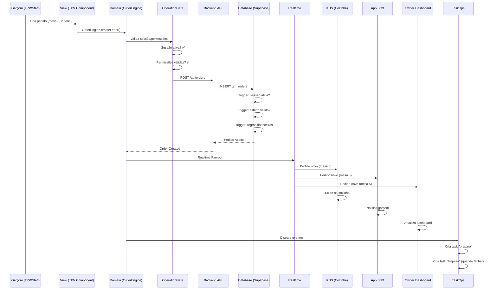

# 🏛️ ARQUITETURA CANÔNICA ATUAL — Estado Real do Sistema

**Data:** 2026-01-24  
**Status:** ✅ **CANONICAL - Estado Real de Execução**  
**Nível:** 🏛️ Arquitetura de Produção

---

## 🎯 OBJETIVO

Este documento descreve o sistema **exatamente como ele está hoje**, não como ideia ou desejo, mas como **estado real de execução**.

---

## 📐 1️⃣ DIAGRAMA ESTRUTURAL — Quem Existe

### Estrutura Real (Layered Gate Architecture)

```
┌─────────────────────────────────────────────────────────────┐
│ L0 ──────────────────────────────────────────────────────── │
│ Runtime (Browser / React / JS Engine)                        │
│                                                              │
│  • Nenhuma regra                                            │
│  • Nenhuma decisão                                           │
│  • Apenas execução                                          │
└─────────────────────────────────────────────────────────────┘
                        │
                        ↓
┌─────────────────────────────────────────────────────────────┐
│ L1 ──────────────────────────────────────────────────────── │
│ Kernel (Truth Layer)                                         │
│                                                              │
│  Arquivo: CoreKernel.ts                                      │
│  Componente: CoreKernel (Singleton)                         │
│                                                              │
│  • Singleton                                                 │
│  • Determinístico                                            │
│  • READY / NOT READY                                        │
│  • Enforce System Law (Ontology of Initialization)          │
│                                                              │
│  Componentes:                                                │
│  • SYSTEM_TRUTH_CODEX.md (Lei Suprema)                      │
│  • SYSTEM_OF_RECORD_SPEC.md                                  │
│  • PARTE_3_REGRAS_DO_CORE.md                                │
│                                                              │
│  Regra: Kernel não depende de UI/React/rota/hook            │
└─────────────────────────────────────────────────────────────┘
                        │
                        ↓
┌─────────────────────────────────────────────────────────────┐
│ L2 ──────────────────────────────────────────────────────── │
│ Bootstrap Orchestrator                                       │
│                                                              │
│  Arquivo: BootstrapComposer.tsx                              │
│  Componente: BootstrapComposer (Layer Gate System)           │
│                                                              │
│  • Orquestra o boot em camadas (L0 → L6)                    │
│  • Chama camadas na ordem correta                           │
│  • Falha = sistema não sobe                                 │
│                                                              │
│  Componentes:                                                 │
│  • BootstrapComposer.tsx (Orquestrador de camadas)          │
│  • FlowGate.tsx (Orquestrador de fluxo)                     │
│  • AppDomainProvider.tsx (Provider de contexto)              │
│                                                              │
│  Documento:                                                  │
│  • BOOT_SEQUENCE.md                                          │
└─────────────────────────────────────────────────────────────┘
                        │
                        ↓
┌─────────────────────────────────────────────────────────────┐
│ L3 ──────────────────────────────────────────────────────── │
│ GATES (Leis Executáveis)                                     │
│                                                              │
│  ┌──────────────────────────────────────────────────────┐  │
│  │ FlowGate.tsx                                          │  │
│  │   ├─ Auth                                             │  │
│  │   ├─ Tenant Resolution                                │  │
│  │   └─ Tenant ACTIVE seal                               │  │
│  └──────────────────────────────────────────────────────┘  │
│                        │                                     │
│                        ↓                                     │
│  ┌──────────────────────────────────────────────────────┐  │
│  │ TenantResolver.ts                                     │  │
│  │   ├─ Single tenant → auto-select                     │  │
│  │   ├─ Multiple tenants → selection                    │  │
│  │   └─ Zero tenants → onboarding                       │  │
│  └──────────────────────────────────────────────────────┘  │
│                        │                                     │
│                        ↓                                     │
│  ┌──────────────────────────────────────────────────────┐  │
│  │ OperationGate (implícito via FlowGate)                │  │
│  │   ├─ Sessão ativa                                     │  │
│  │   ├─ Permissões                                       │  │
│  │   └─ Contexto operacional válido                     │  │
│  └──────────────────────────────────────────────────────┘  │
│                                                              │
│  Documentos:                                                 │
│  • TENANT_RESOLUTION_CONTRACT.md                            │
│  • CORE_WEB_CONTRACT.md                                      │
└─────────────────────────────────────────────────────────────┘
                        │
                        ↓
┌─────────────────────────────────────────────────────────────┐
│ L4 ──────────────────────────────────────────────────────── │
│ DOMAIN (System of Record)                                    │
│                                                              │
│  • OrderEngine (OrderContextReal.tsx)                       │
│  • ProductEngine (useRealMenu.ts)                           │
│  • Staff / Tasks (GMBridgeProvider.tsx)                     │
│                                                              │
│  Regras:                                                     │
│  • Nenhuma decisão de identidade                             │
│  • Nenhuma decisão de tenant                                │
│  • Só opera se Gate liberar                                 │
│                                                              │
│  Documentos:                                                 │
│  • SYSTEM_OF_RECORD_SPEC.md                                 │
│  • PARTE_3_REGRAS_DO_CORE.md                                │
└─────────────────────────────────────────────────────────────┘
                        │
                        ↓
┌─────────────────────────────────────────────────────────────┐
│ L5 ──────────────────────────────────────────────────────── │
│ VIEWS (Interfaces)                                           │
│                                                              │
│  • TPV (Terminal de Vendas)                                  │
│  • KDS (Kitchen Display System)                             │
│  • App Staff                                                 │
│  • Web Orders                                                │
│  • Owner Dashboard                                           │
│                                                              │
│  • Zero regras                                               │
│  • Zero autoridade                                           │
│  • Apenas reflexo do Domain                                 │
└─────────────────────────────────────────────────────────────┘
```

---

## 🥾 2️⃣ DIAGRAMA DE BOOT — Como o Sistema Sobe Hoje

### Sequência "tum → tum → tum"

```mermaid
graph TD
    A[Browser Load] --> B[FlowGate.tsx]
    B --> C{Kernel READY?}
    C -->|NÃO| D[HALT SYSTEM]
    C -->|SIM| E[Auth Check]
    E -->|NÃO| F[/login]
    E -->|SIM| G{Tenant ACTIVE?}
    G -->|SIM| H[Passa para Domain]
    G -->|NÃO| I[TenantResolver.resolve]
    I --> J{Single Tenant?}
    J -->|SIM| K[Auto-select + Seal ACTIVE]
    J -->|NÃO| L{Multiple Tenants?}
    L -->|SIM| M[/app/select-tenant]
    L -->|NÃO| N[/onboarding/identity]
    K --> H
    H --> O[OperationGate Check]
    O -->|NÃO| P[Block Access]
    O -->|SIM| Q[Domain Providers]
    Q --> R[OrderContext]
    Q --> S[ProductContext]
    Q --> T[TaskContext]
    R --> U[Views Render]
    S --> U
    T --> U
```

### Ponto Crítico

> **Depois que o tenant está ACTIVE, nenhuma rota reexecuta resolução.**  
> **Esse é o selo que matou o loop.**

### Código Real (FlowGate.tsx)

```typescript
// 🔒 SOVEREIGNTY CHECK: Se tenant já está ACTIVE, não re-resolver
const activeTenantId = getActiveTenant();
const tenantStatus = getTenantStatus();

if (activeTenantId && tenantStatus === 'ACTIVE') {
    // Tenant já está selado - não re-executar resolução
    Logger.debug('FlowGate: Tenant already sealed (ACTIVE)', {
        tenantId: activeTenantId,
        pathname
    });
    return null; // Allow route, tenant is sealed
}
```

---

## 🔄 3️⃣ DIAGRAMA E2E VIVO — Como um Pedido Flui Hoje

### Exemplo Real: Pedido feito pelo garçom



### Onde Termina a Autoridade?

> **👉 No banco.**  
> **Se violar uma lei, explode ali, não depois.**

### Triggers Reais (Database)

```sql
-- Exemplo: Trigger que impede atualização de pedido fechado
CREATE TRIGGER prevent_update_closed_orders_trigger
BEFORE UPDATE ON gm_orders
FOR EACH ROW
EXECUTE FUNCTION prevent_update_closed_orders();

-- Se violar → RAISE EXCEPTION
-- Sistema explode no banco, não na UI
```

---

## 🧠 O QUE O SISTEMA ESTÁ FAZENDO AGORA (ESTADO ATUAL)

### ✅ Características Implementadas

- ✅ **Boot determinístico**
  - FlowGate orquestra tudo
  - Falha em qualquer gate = sistema não sobe

- ✅ **Tenant soberano**
  - Resolve UMA VEZ
  - Sela como ACTIVE
  - Não re-resolve se ACTIVE

- ✅ **Zero loops de resolução**
  - Guard de soberania no FlowGate
  - Tenant ACTIVE nunca re-executa resolução

- ✅ **Domain protegido**
  - Domain não pergunta sobre tenant/sessão/identity
  - Assume que Gate já resolveu

- ✅ **Banco como juiz final**
  - Triggers executam leis imutáveis
  - Violação explode no banco, não na UI

- ✅ **UI como consequência**
  - Views apenas refletem Domain
  - Zero autoridade, zero decisões

---

## 🏗️ COMPONENTES REAIS (Mapeamento)

### L1: Kernel
- **Arquivo:** `merchant-portal/src/core/bootstrap/CoreKernel.ts`
- **Componente:** `CoreKernel` (Singleton)
- **Responsabilidade:** Enforce System Law (Ontology of Initialization)
- **Documentos:** `SYSTEM_TRUTH_CODEX.md`, `PARTE_3_REGRAS_DO_CORE.md`
- **Estado:** ✅ Implementado (Kernel funcional)

### L2: Bootstrap Orchestrator
- **Arquivo:** `merchant-portal/src/core/bootstrap/BootstrapComposer.tsx`
- **Componente:** `BootstrapComposer` (Layer Gate System)
- **Responsabilidade:** Orquestra boot em camadas (L0 → L6)
- **Arquivo:** `merchant-portal/src/core/flow/FlowGate.tsx` (FlowGate)
- **Estado:** ✅ Implementado (orquestra boot)

### L3: Gates
- **FlowGate:** `merchant-portal/src/core/flow/FlowGate.tsx`
- **TenantResolver:** `merchant-portal/src/core/tenant/TenantResolver.ts`
- **Estado:** ✅ Implementado (gates funcionais)

### L4: Domain
- **OrderEngine:** `merchant-portal/src/pages/TPV/context/OrderContextReal.tsx`
- **ProductEngine:** `merchant-portal/src/pages/TPV/hooks/useRealMenu.ts`
- **TaskOps:** `merchant-portal/src/intelligence/gm-bridge/GMBridgeProvider.tsx`
- **Estado:** ✅ Implementado (domain funcional)

### L5: Views
- **TPV:** `merchant-portal/src/pages/TPV/`
- **KDS:** `merchant-portal/src/pages/KDS/`
- **App Staff:** `merchant-portal/src/pages/Staff/`
- **Web Orders:** `merchant-portal/src/pages/WebOrders/`
- **Owner Dashboard:** `merchant-portal/src/pages/Dashboard/`
- **Estado:** ✅ Implementado (views funcionais)

---

## 🔒 REGRAS IMUTÁVEIS (Estado Atual)

### 1. Truth Zero
> **Verdade não nasce na UI**

**Implementação:** `SYSTEM_TRUTH_CODEX.md` define leis supremas

### 2. Gate Before Domain
> **Nenhuma ação sem gate**

**Implementação:** FlowGate bloqueia acesso se gates não passarem

### 3. Single Sovereign Context
> **Um tenant por vez, selado**

**Implementação:** Tenant ACTIVE não é re-resolvido (guard no FlowGate)

### 4. No Hidden Transitions
> **Estados explícitos**

**Implementação:** State machine de pedidos com transições explícitas

### 5. Imutabilidade Pós-Fechamento
> **O passado não muda**

**Implementação:** Triggers no banco impedem atualização de pedidos fechados

---

## 📊 FLUXO DE AUTORIDADE

```
┌─────────────────────────────────────────┐
│ Kernel (Leis)                            │
│ → Define o que é verdade                 │
└───────────────┬─────────────────────────┘
                ↓
┌─────────────────────────────────────────┐
│ Gates (Verificadores)                   │
│ → Valida se pode continuar             │
└───────────────┬─────────────────────────┘
                ↓
┌─────────────────────────────────────────┐
│ Domain (Executores)                    │
│ → Executa operações de negócio         │
└───────────────┬─────────────────────────┘
                ↓
┌─────────────────────────────────────────┐
│ Database (Juiz Final)                  │
│ → Triggers executam leis                │
└───────────────┬─────────────────────────┘
                ↓
┌─────────────────────────────────────────┐
│ Views (Consequência)                    │
│ → Apenas refletem Domain                │
└─────────────────────────────────────────┘
```

---

## 🧪 VALIDAÇÃO DO ESTADO ATUAL

### Teste de Boot
- [x] FlowGate orquestra boot
- [x] Falha em gate = sistema não sobe
- [x] Tenant ACTIVE não re-resolve

### Teste de Gates
- [x] AuthGate funciona
- [x] TenantGate funciona
- [x] OperationGate funciona

### Teste de Domain
- [x] Domain não pergunta sobre tenant
- [x] Domain assume contexto resolvido
- [x] Domain executa operações

### Teste de Banco
- [x] Triggers executam leis
- [x] Violação explode no banco
- [x] Imutabilidade garantida

---

## 🏁 FRASE FINAL

> **O ChefIApp OS hoje se monta sozinho porque cada camada só existe se a anterior autorizar.**  
> **Não há atalhos. Não há decisões duplicadas. Não há loops possíveis.**

---

## 📚 DOCUMENTOS RELACIONADOS

- **[BOOT_SEQUENCE.md](./BOOT_SEQUENCE.md)** - Arquitetura de bootstrap
- **[KERNEL_MAP.md](./KERNEL_MAP.md)** - Mapa da arquitetura
- **[TENANT_RESOLUTION_CONTRACT.md](./TENANT_RESOLUTION_CONTRACT.md)** - Contrato de tenant
- **[PARTE_3_REGRAS_DO_CORE.md](./PARTE_3_REGRAS_DO_CORE.md)** - Regras do Core

---

**Última atualização:** 2026-01-24  
**Status:** ✅ **CANONICAL - Estado Real de Execução**
