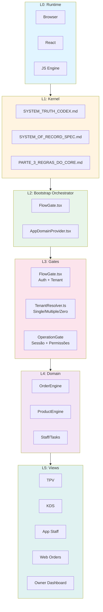
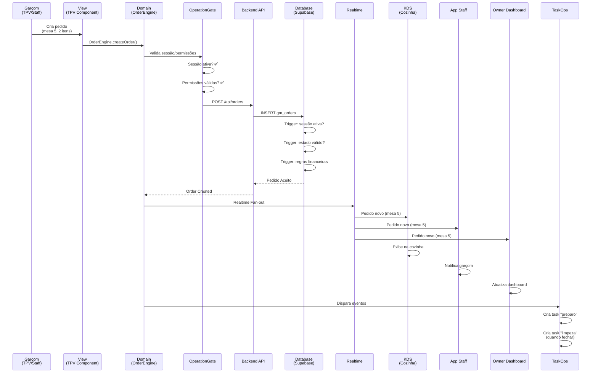
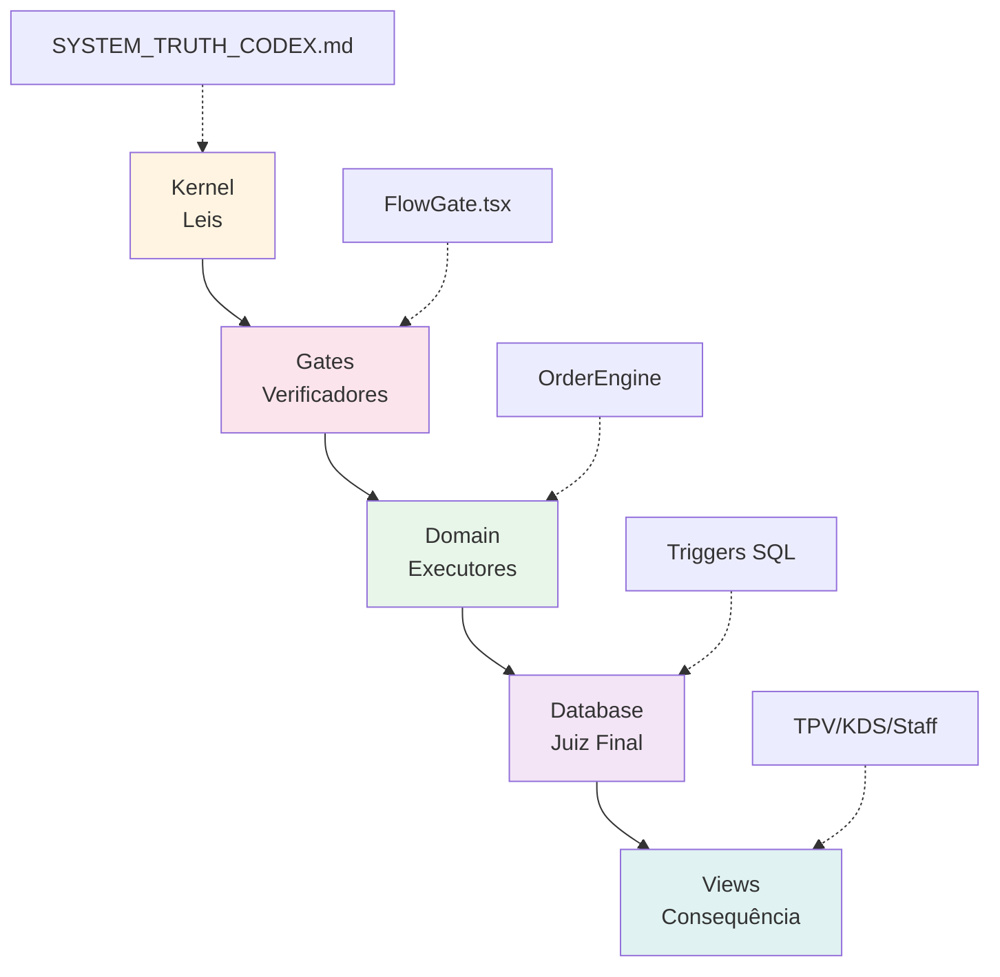
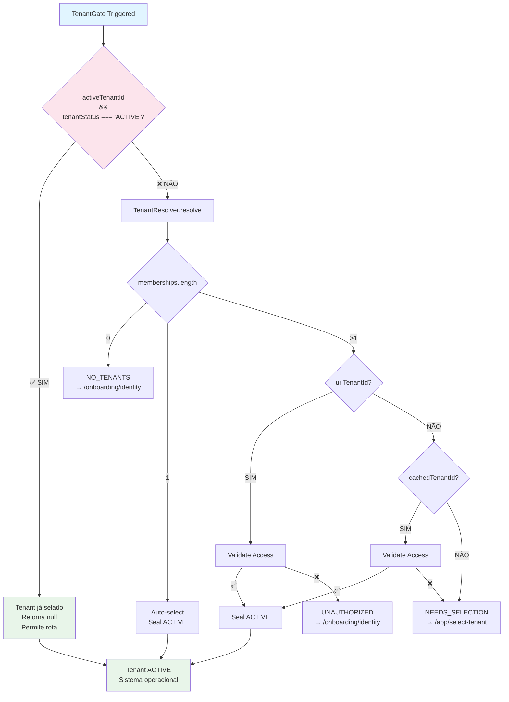
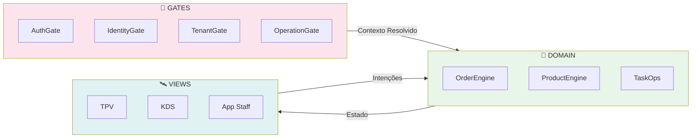
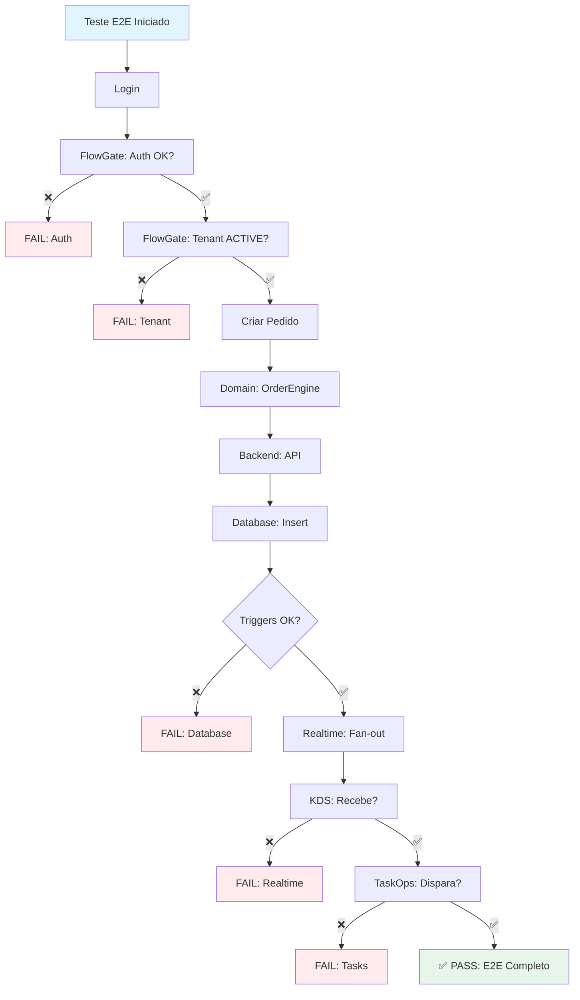

# 📊 DIAGRAMAS MERMAID — Visualização da Arquitetura

**Data:** 2026-01-24  
**Status:** ✅ **CANONICAL - Diagramas de Referência**

---

## 🎯 OBJETIVO

Este documento contém os diagramas Mermaid que visualizam a arquitetura canônica atual do sistema.

---

## 📐 1️⃣ DIAGRAMA ESTRUTURAL — Camadas



---

## 🥾 2️⃣ DIAGRAMA DE BOOT — Sequência de Inicialização

```mermaid
graph TD
    A[Browser Load] --> B[FlowGate.tsx]
    B --> C{Kernel READY?}
    C -->|NÃO| D[HALT SYSTEM]
    C -->|SIM| E[Auth Check]
    E -->|NÃO| F[/login]
    E -->|SIM| G{Tenant ACTIVE?}
    G -->|SIM| H[Passa para Domain]
    G -->|NÃO| I[TenantResolver.resolve]
    I --> J{Single Tenant?}
    J -->|SIM| K[Auto-select + Seal ACTIVE]
    J -->|NÃO| L{Multiple Tenants?}
    L -->|SIM| M[/app/select-tenant]
    L -->|NÃO| N[/onboarding/identity]
    K --> H
    H --> O[OperationGate Check]
    O -->|NÃO| P[Block Access]
    O -->|SIM| Q[Domain Providers]
    Q --> R[OrderContext]
    Q --> S[ProductContext]
    Q --> T[TaskContext]
    R --> U[Views Render]
    S --> U
    T --> U
    
    style A fill:#e1f5ff
    style B fill:#fff4e1
    style G fill:#fce4ec
    style H fill:#e8f5e9
    style Q fill:#f3e5f5
    style U fill:#e0f2f1
```

---

## 🔄 3️⃣ DIAGRAMA E2E — Fluxo de um Pedido



---

## 🔐 4️⃣ DIAGRAMA DE GATES — Fluxo de Decisão

```mermaid
graph LR
    A[Request] --> B[AuthGate]
    B -->|❌ Não| C[/login]
    B -->|✅ Sim| D[IdentityGate]
    D -->|❌ Não| E[/onboarding/identity]
    D -->|✅ Sim| F[TenantGate]
    F -->|❌ No tenants| E
    F -->|⚠️ Multiple| G[/app/select-tenant]
    F -->|✅ ACTIVE| H[DomainGate]
    H -->|❌ Não| I[Block Access]
    H -->|✅ Sim| J[Domain]
    J --> K[Views]
    
    style A fill:#e1f5ff
    style B fill:#fff4e1
    style D fill:#fff4e1
    style F fill:#fce4ec
    style H fill:#fff4e1
    style J fill:#e8f5e9
    style K fill:#e0f2f1
```

---

## 🏗️ 5️⃣ DIAGRAMA DE AUTORIDADE — Hierarquia de Decisão



---

## 🔄 6️⃣ DIAGRAMA DE TENANT RESOLUTION — Fluxo de Resolução



---

## 📊 7️⃣ DIAGRAMA DE DOMAIN — Separação de Responsabilidades



---

## 🧪 8️⃣ DIAGRAMA DE VALIDAÇÃO — Teste E2E



---

## 📚 COMO USAR ESTES DIAGRAMAS

### 1. Visualização Online
- Copie o código Mermaid
- Cole em [Mermaid Live Editor](https://mermaid.live/)
- Visualize e exporte como SVG/PNG

### 2. Integração em Documentos
- Use em Markdown (GitHub, GitLab, etc.)
- Renderiza automaticamente

### 3. Documentação Institucional
- Exporte como SVG
- Inclua em apresentações
- Use em documentação oficial

---

**Última atualização:** 2026-01-24  
**Status:** ✅ **CANONICAL - Diagramas de Referência**
