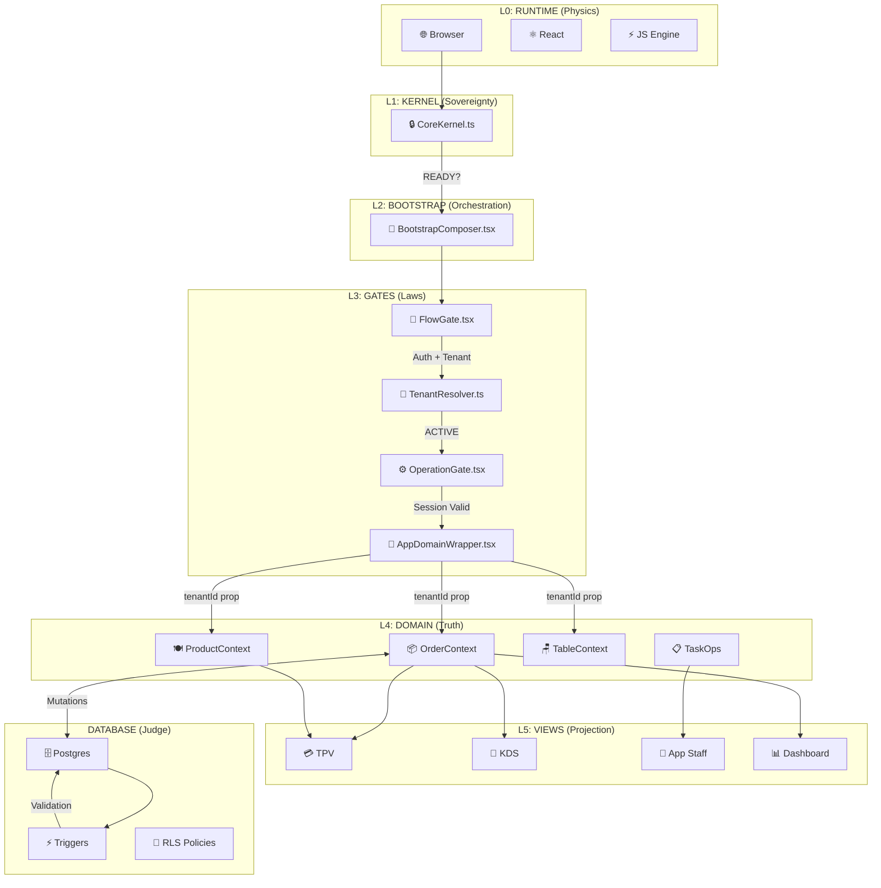
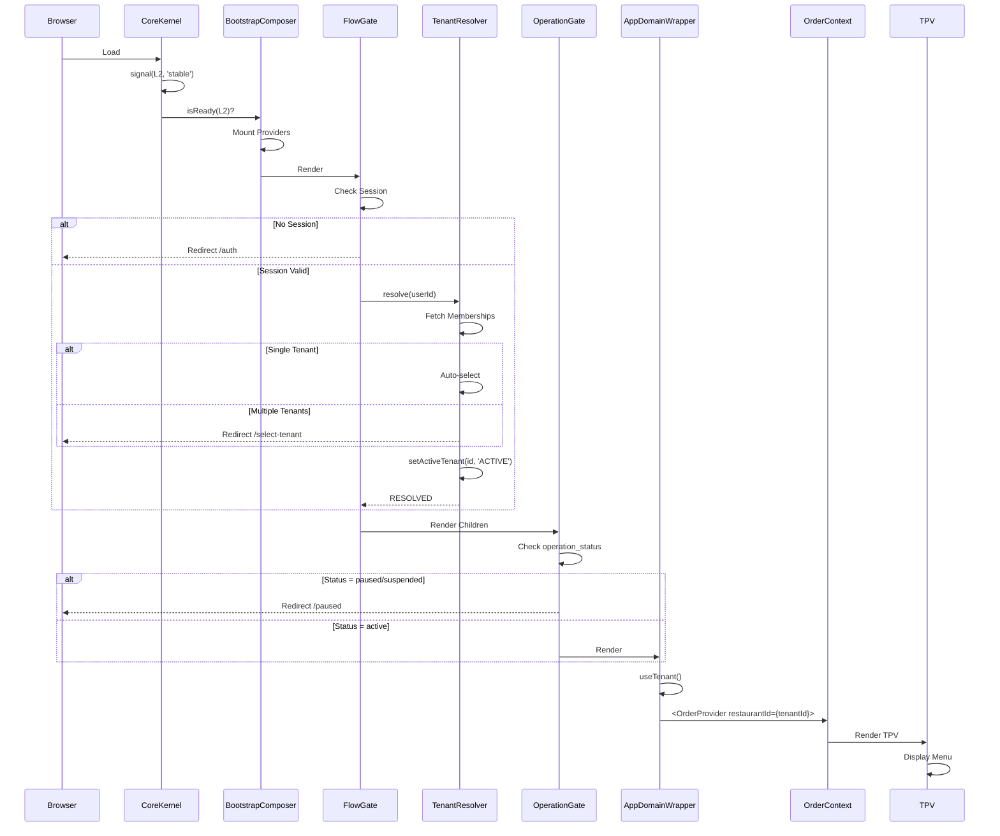
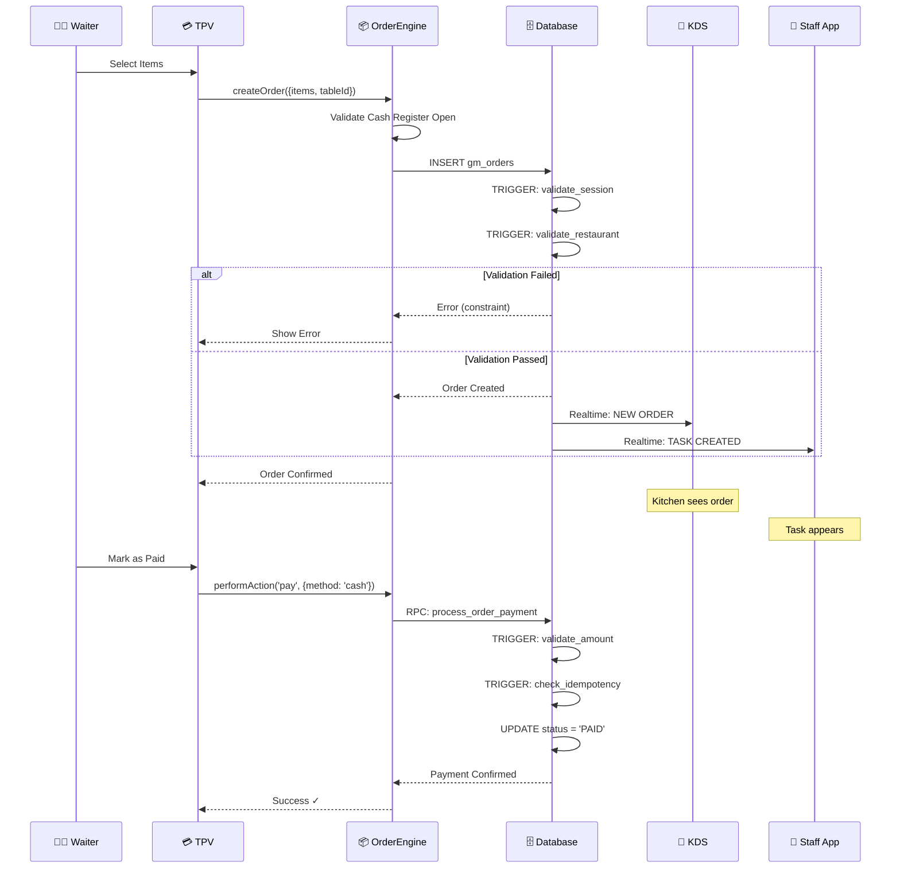

# ChefIApp OS — Canonical Architecture Diagram

## The Layered Gate Architecture

---

## 🏛️ STRUCTURAL VIEW



---

## 🥾 BOOT SEQUENCE



---

## 🔄 ORDER FLOW (E2E)



---

## 🧭 GATE DECISION TREE

```mermaid
flowchart TD
    START([Request to /app/*]) --> FG{FlowGate}
    
    FG -->|No Session| AUTH[/auth]
    FG -->|Session Valid| CHECK_TENANT{Tenant Status?}
    
    CHECK_TENANT -->|ACTIVE| PASS[✓ Continue]
    CHECK_TENANT -->|UNSELECTED| RESOLVE{Resolve Tenant}
    
    RESOLVE -->|No Tenants| ONBOARD[/onboarding/identity]
    RESOLVE -->|Single Tenant| AUTO[Auto-select + SEAL]
    RESOLVE -->|Multiple| SELECT[/app/select-tenant]
    
    AUTO --> PASS
    SELECT -->|User Selects| SEAL[setActiveTenant + SEAL]
    SEAL --> PASS
    
    PASS --> OG{OperationGate}
    
    OG -->|active| DOMAIN[Domain Layer]
    OG -->|paused| PAUSED[/app/paused]
    OG -->|suspended| SUSPENDED[/app/suspended]
    
    DOMAIN --> VIEW[View Renders]
```

---

## 📊 LAYER RESPONSIBILITIES

| Layer | Component | Responsibility | Never Does |
|-------|-----------|----------------|------------|
| L0 | Runtime | Execute code | Make decisions |
| L1 | Kernel | Assert causality | Render UI |
| L2 | Bootstrap | Orchestrate boot | Know domain |
| L3 | Gates | Validate identity/context | Store data |
| L4 | Domain | Business logic | Resolve tenant |
| L5 | Views | Display state | Mutate truth |
| DB | Postgres | Judge final | Trust frontend |

---

## 🏁 THE LAW

> **ChefIApp OS is not assembled by components.**  
> **It is assembled by TRUTH → GATES → CONTRACTS → EXECUTION.**

If a layer violates its boundary, the system is in an illegal state.
