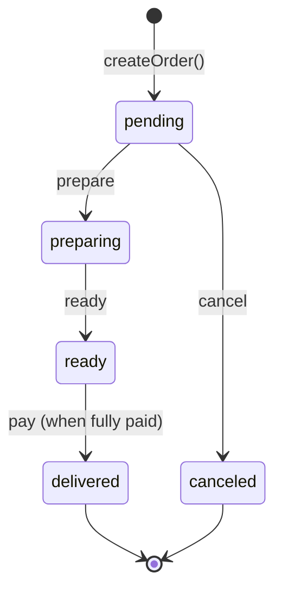
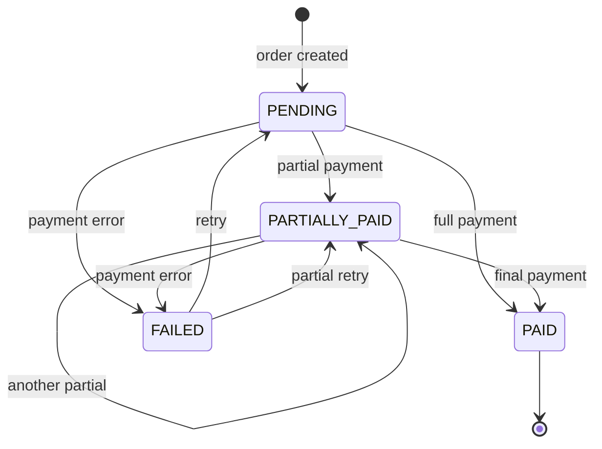

# DOMAIN STATE MACHINE

## Canonical States and Allowed Transitions

> **Status:** LOCKED  
> **Enforcement:** audit:domain + Database Triggers

---

## 🛒 ORDER STATE MACHINE

### States

```typescript
type OrderStatus = 'pending' | 'preparing' | 'ready' | 'delivered' | 'canceled';
```

| State | Description | Terminal? |
|-------|-------------|-----------|
| `pending` | Order created, can be modified | No |
| `preparing` | Sent to kitchen (KDS) | No |
| `ready` | Kitchen finished | No |
| `delivered` | Customer received + Paid | **Yes** |
| `canceled` | Order cancelled | **Yes** |

### Allowed Transitions



### Transition Matrix

| From | To | Action | Precondition |
|------|-----|--------|--------------|
| - | `pending` | `createOrder()` | Cash register open (TPV) |
| `pending` | `preparing` | `prepare` | Has items |
| `pending` | `canceled` | `cancel` | - |
| `preparing` | `ready` | `ready` | - |
| `ready` | `delivered` | `pay` | PaymentStatus = PAID |

### ❌ FORBIDDEN Transitions

| From | To | Why |
|------|-----|-----|
| `delivered` | * | Terminal state |
| `canceled` | * | Terminal state |
| `ready` | `pending` | Cannot un-cook |
| `preparing` | `pending` | Cannot un-send |

---

## 💳 PAYMENT STATE MACHINE

### States

```typescript
type PaymentStatus = 'PENDING' | 'PARTIALLY_PAID' | 'PAID' | 'FAILED';
```

| State | Description | Terminal? |
|-------|-------------|-----------|
| `PENDING` | No payment yet | No |
| `PARTIALLY_PAID` | Split bill in progress | No |
| `PAID` | Fully paid | **Yes** |
| `FAILED` | Payment failed | No |

### Allowed Transitions



### ❌ FORBIDDEN Transitions

| From | To | Why |
|------|-----|-----|
| `PAID` | * | Terminal state (irreversible) |

---

## 🔗 ORDER × PAYMENT COUPLING

When `PaymentStatus` changes, `OrderStatus` may change:

| Payment Event | Order Effect |
|---------------|--------------|
| `PAID` | Order → `delivered` |
| `PARTIALLY_PAID` | Order stays current |
| `FAILED` | Order stays current |

---

## 🏛️ ENFORCEMENT

### Domain Layer

All transitions via `performOrderAction(orderId, action)`:

- `prepare` → `pending` → `preparing`
- `ready` → `preparing` → `ready`
- `pay` → via PaymentEngine RPC
- `cancel` → `pending` → `canceled`

### Database Layer

Triggers validate:

- No state can transition to an invalid next state
- Terminal states (`delivered`, `canceled`, `PAID`) are immutable
- Payment amounts must match order total

### Audit

Every transition logged to `gm_audit_logs` with:

- `old_status`
- `new_status`
- `operator_id`
- `timestamp`
