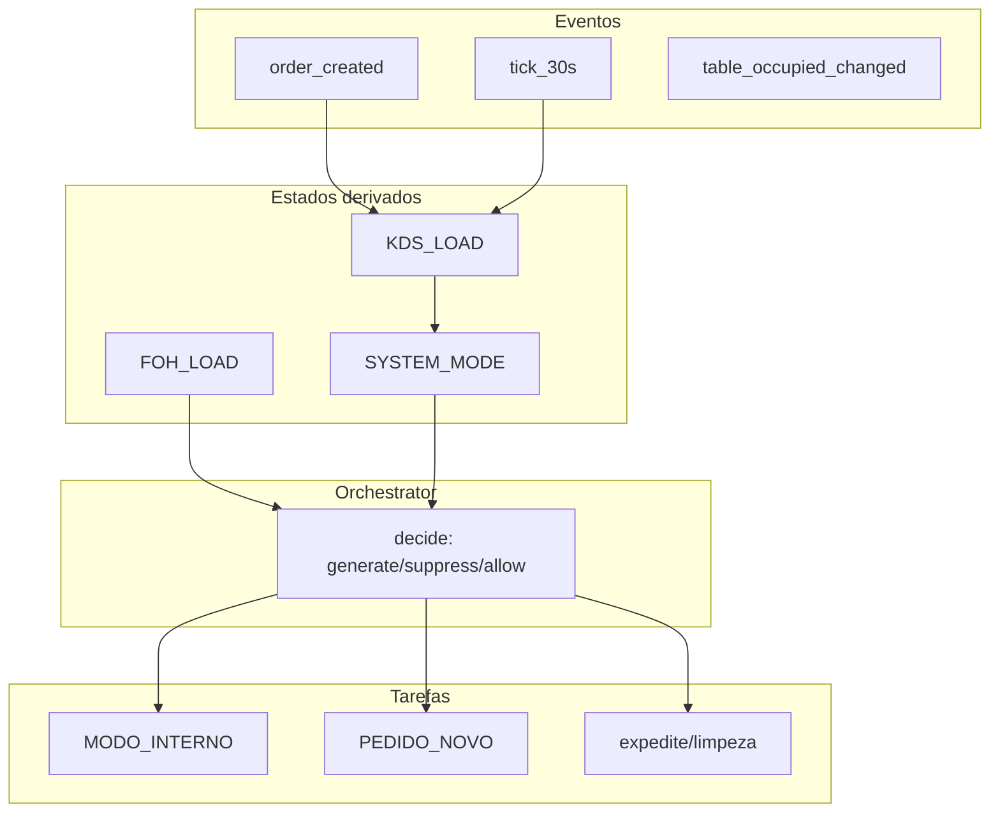

# Fluxo KDS ↔ Tarefas ↔ Mesas

**Propósito:** Especificação canónica do fluxo operacional que liga o KDS (Kitchen Display System), o sistema de tarefas e o modelo de mesas/zonas. Este documento consolida e estende os contratos existentes para alinhar o time na implementação.

**Subordinado a:** Canon, APPSTAFF_LAUNCHER_CONTRACT, LEI_DO_TURNO, regras do projeto.

**Referências:**

- [OPERATIONAL_ORCHESTRATOR_CONTRACT.md](contracts/OPERATIONAL_ORCHESTRATOR_CONTRACT.md) — decisões generate/suppress/allow; KDS Task Board Mode
- [CONTRATO_DE_ATIVIDADE_OPERACIONAL.md](contracts/CONTRATO_DE_ATIVIDADE_OPERACIONAL.md) — estados IDLE/SERVING/CLOSING; RESTAURANT_IDLE; MODO_INTERNO
- [EVENTS_AND_STREAMS.md](contracts/EVENTS_AND_STREAMS.md) — nomenclatura de eventos

---

## 1. Entidades (mínimas)

| Conceito | Tabela / Core existente | Lacuna |
|----------|-------------------------|--------|
| **Order** | `gm_orders` | Status já inclui OPEN, PREPARING, IN_PREP, READY, CLOSED, CANCELLED |
| **Table** | `gm_tables` | `occupied`, `active_order_id`, `zone_id` — `gm_tables` não tem `zone_id`; `gm_restaurant_tables` tem `zone_id` |
| **Zone** | `gm_restaurant_zones` | Existente (BAR, KITCHEN, PASS, SERVICE, CASHIER, etc.) |
| **Staff** | — | Nova entidade: role, zone_id, shift_active, busy_state (fase posterior) |
| **Task** | `gm_tasks` | Falta MODO_INTERNO, PEDIDO_NOVO em task_type; falta zone_id; `station` pode mapear para zone |

O gap entre o modelo ideal e o atual deve ser resolvido em fases: primeiro consolidar regras (este doc), depois schema (Opção 2 do plano de entrega).

---

## 2. Estados que importam (“cérebro”)

| Estado | Significado | Fonte no Core |
|--------|-------------|---------------|
| **KDS_LOAD** | Pedidos ativos na cozinha | `count(gm_orders WHERE status IN (OPEN, PREPARING, IN_PREP, READY))` |
| **FOH_LOAD** | Mesas ocupadas por zona | count(gm_tables ocupadas) + zone via gm_restaurant_tables ou extensão |
| **STAFF_AVAIL** | Staff em turno e livre | Futuro (tabela staff) |
| **SYSTEM_MODE** | SERVICE_MODE vs MAINTENANCE_MODE | Derivado: KDS_LOAD >= X → SERVICE; KDS_LOAD == 0 por N min → MAINTENANCE |

**Mapeamento para OrchestratorState existente:**

| OrchestratorState | Equivalente |
|-------------------|-------------|
| `activeOrdersCount` | KDS_LOAD |
| `idleMinutesSinceLastOrder` | Tempo desde último pedido |
| `occupiedTablesCount` | FOH_LOAD (por zona ou global) |
| `shiftOpen` | Caixa aberta em `gm_cash_registers` |

---

## 3. Eventos que disparam o Orchestrator

### Pedido

| Evento | Em EVENTS_AND_STREAMS | Fase |
|--------|-----------------------|------|
| order_created | ORDER_CREATED (implícito) | Implementado |
| order_status_changed | — | Novo (fase posterior) |
| order_closed | ORDER_CLOSED | Existente |
| order_cancelled | ORDER_CANCELED | Existente |

### Mesa

| Evento | Em EVENTS_AND_STREAMS | Fase |
|--------|-----------------------|------|
| table_occupied_changed | — | Novo (fase posterior) |
| table_assigned_zone_changed | — | Novo (fase posterior) |

### Staff

| Evento | Em EVENTS_AND_STREAMS | Fase |
|--------|-----------------------|------|
| staff_checkin | — | Fase posterior |
| staff_checkout | — | Fase posterior |
| staff_zone_changed | — | Fase posterior |
| staff_busy_state_changed | — | Fase posterior |

### Temporizador

| Evento | Descrição | Fase |
|--------|-----------|------|
| tick_30s / tick_60s | Reavaliar fila e tarefas; polling periódico | Implementado via EventMonitor.checkIdle |

---

## 4. Regras (A, B, C, D)

### Regra A — KDS cheio → sem tarefas operacionais “extra”

Quando **KDS_LOAD >= X** (ex.: 3 pedidos ativos):

- Sistema entra em **SERVICE_MODE**
- Tarefas geradas são **apenas**:
  - expedite
  - organizar pass
  - repor item crítico
  - limpeza de estação
- **Não** gerar: inventário, deep cleaning, tarefas de manutenção

### Regra B — KDS vazio → tarefas automáticas

Quando **KDS_LOAD == 0** por **N minutos** (ex.: 5):

- Sistema entra em **MAINTENANCE_MODE**
- Gera tarefas por zona e role:
  - **Salão:** limpar mesas, alinhar cadeiras, repor guardanapos
  - **Bar:** mise en place, gelo, frutas, garrafas
  - **Cozinha:** prep leve, etiquetar, organizar mise
- **Anti-spam:** tarefas idempotentes por janela (ex.: não gerar a mesma em 20 min)

### Regra C — Zona ocupada → sem tarefas de manutenção para essa zona

Se `zone.occupied_tables > 0`:

- Assignees dessa zona **não** recebem tarefas de manutenção
- Apenas tarefas relacionadas ao atendimento/fluxo

### Regra D — KDS Task Board Mode

Quando **KDS_LOAD == 0**:

- KDS troca de “Orders View” para **“Tasks View”**
- Mostra:
  - tarefas da cozinha (primeiro)
  - tarefas globais de operação (se a cozinha estiver livre)

### Tabela de decisão (alinhada ao OPERATIONAL_ORCHESTRATOR_CONTRACT)

| Condição | Decisão | Regra |
|----------|---------|-------|
| KDS_LOAD > 0 | suppress MODO_INTERNO | Regra A |
| KDS_LOAD === 0 && idleMinutes >= N && shiftOpen | generate RESTAURANT_IDLE | Regra B |
| zone.occupied_tables > 0 | suppress tarefas manutenção para essa zona | Regra C |
| KDS_LOAD === 0 | UI: Task Board Mode | Regra D |
| order_created, order_delayed, table_unattended | allow | Sempre permitir |

---

## 5. Diagrama de fluxo



### Cenário operacional: 19:10 — sem pedidos

```
1. tick detecta KDS_LOAD=0 por 5 min
2. Gera:
   - cozinha: "Preparar mise de guarnições"
   - bar: "Repor gelo"
   - salão zona A: "Checar mesas / limpar"
3. KDS muda para Tasks View
4. Funcionário inicia tarefa → fica "busy"
5. 19:14 entra pedido Uber Eats
6. order_created → KDS_LOAD=1 → volta para Orders View
7. Tarefas "não críticas" são pausadas/ocultadas (ou mantidas sem push)
```

---

## 6. UI/UX por tela

| Tela | Com pedidos (SERVICE) | Sem pedidos (MAINTENANCE) |
|------|------------------------|----------------------------|
| **KDS** | Lista de tickets normal | Task Board: tarefas cozinha, botões Iniciar/Concluir, cronómetro, XP (opcional) |
| **TPV / FOH** | Mesa ocupada = foco em atendimento | Mesa vazia + KDS vazio = tarefas na sidebar/painel "Agora" |
| **AppStaff** | "Minha zona", "Minhas tarefas" | "Status da casa" (calmo / médio / pico), sugestão "agora faça X" |

---

## 7. Backend vs Frontend

### O que tem de ser no Backend (Core)

- Geração e atribuição de tarefas “oficiais”
- Idempotência de tarefas (evitar duplicação)
- Regras de elegibilidade por zona/role
- Histórico e auditoria (quem fez o quê)

### O que pode ser no Frontend

- UI do modo tarefas no KDS
- Timers locais com sync periódico
- Sugestões não críticas
- Cache de “tarefas recomendadas”

### Arquitetura

> Backend decide, frontend renderiza. Core publica TaskQueue; clientes exibem e executam.

---

## 8. Integrações delivery (Uber Eats e outros)

Uber Eats não é plug-and-play universal. Três níveis:

| Nível | Descrição | Pros | Contras |
|-------|-----------|------|---------|
| **1 — Manual assistido** | Tablet Uber Eats + staff clica "Importar pedido" no ChefIApp (1 clique ou digita item rápido) | Funciona sem aprovação de API; adequado para MVP comercial | Manual |
| **2 — Agregador** | Deliverect / Otter / Chowly — integra uma vez e recebe pedidos de várias plataformas | Rápido para vender "como empresa" | Custo mensal do agregador |
| **3 — API direta** | Parceria oficial, compliance, contratos | Mais poderoso | Lento e burocrático; APIs fechadas em muitos países |

**Recomendação estratégica:** Vender com nível 1; preparar nível 2.

**Referência técnica:** [DELIVERY_AIR_GAP.md](integrations/DELIVERY_AIR_GAP.md) — proxy, vault de secrets, tabela `integration_orders`.

---

## 9. Estrutura página de vendas (referência para Opção 3)

Estrutura para landing que converte:

1. **Hero:** "ChefIApp OS — POS + Orquestração de Equipe"
2. **Vídeo curto / demo loop**
3. **3 pilares:** POS rápido; KDS inteligente; Tarefas automáticas quando a casa está calma
4. **Módulos (cards):** POS, KDS, Staff Orchestrator, Analytics
5. **Integrações:** "Delivery: modo manual assistido hoje"; "Agregadores: em roadmap"
6. **Pricing:** 3 planos
7. **FAQ:** delivery, hardware, offline
8. **CTA:** "Agendar demo" + WhatsApp + formulário

**Referência:** [LANDING_REFINAMENTOS.md](LANDING_REFINAMENTOS.md) — estrutura já implementada (CTAs, FAQ, prova social).

---

## 10. Próximos passos

| Opção | Descrição |
|-------|-----------|
| **Opção 2 — Schema + RPCs** | Migrations para `gm_tasks` (novos task_type, zone_id se necessário); RPCs `generate_tasks_if_idle`, `claim_task`, `complete_task`; job `task_rules_engine` |
| **Opção 3 — Landing v1** | Implementar landing com a estrutura da secção 9 |
| **Fase posterior** | Staff, `occupied` em mesas, `zone_id` em gm_tables se unificarmos modelo; eventos mesa/staff |
