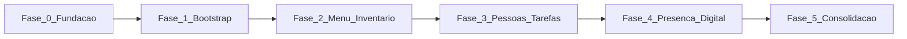

# Roadmap pós-fundação — Chefiapp

Documento oficial: por que parte do escopo não estava na arquitetura e roadmap executável em fases (FASE 0 a FASE 5).

---

## Índice

- [Parte 1 — Por que não estava na arquitetura](#parte-1--por-que-não-estava-na-arquitetura)
- [Parte 2 — Roadmap em fases](#parte-2--roadmap-em-fases)
  - [FASE 0 — Fundação (FECHADA)](#fase-0--fundação-fechada)
- [FASE 1 — Bootstrap do Restaurante (DONO ONLY)](#fase-1--bootstrap-do-restaurante-dono-only)
- [FASE 2 — Menu, Inventário e Estoque (TUDO LIGADO)](#fase-2--menu-inventário-e-estoque-tudo-ligado)
- [FASE 3 — Pessoas e Tarefas (APP STAFF, NÃO CORE)](#fase-3--pessoas-e-tarefas-app-staff-não-core)
- [FASE 4 — Presença Digital (ONDA DE VALOR)](#fase-4--presença-digital-onda-de-valor)
- [FASE 5 — Consolidação (SÓ DEPOIS DO €79)](#fase-5--consolidação-só-depois-do-79)
- [Resumo final](#resumo-final)
- [Ordem de execução](#ordem-de-execução)

---

## Parte 1 — Por que não estava na arquitetura

### Verdade curta

Não foi esquecimento. Foi uma decisão implícita que nunca foi explicitada. Decisões implícitas voltam como fricção — é exatamente o que se sente agora.

### O que a arquitetura cobria (corretamente)

- Fluxo do produto até "Agora vejo."
- Separação demo / app / providers
- Contrato do Dono (Ecrã Zero)
- Stripe, domínio, Supabase, piloto
- Onda 4/5 (operação e controlo)
- Robustez estrutural (não crasha, não mente, não loopa)

Era a arquitetura do **produto enquanto sistema**, não da empresa enquanto organismo completo.

### O que ficou fora (intencionalmente, mas não documentado)

Três macro-blocos, agora nomeados:

1. **Bootstrap completo do restaurante** — Criar restaurante "de verdade"; instalar TPV; instalar KDS; ligar módulos.
2. **Sistema humano (pessoas + tarefas)** — Staff; permissões; tarefas ligadas à operação.
3. **Presença digital** — Menu público; identidade online; aquilo que a Glória Food faz.

Estes blocos não são fundação técnica, são fundação de negócio. Como não foram nomeados como "fora de escopo agora", pareciam "esquecidos".

### O erro real (corrigível)

- Não foi "esquecer features".
- Não foi "arquitetura incompleta".
- Foi não escrever explicitamente: _"Neste momento, apenas o Dono existe. Gerente e Staff não fazem parte do bootstrap. Presença digital entra numa onda posterior de valor."_

Isso está agora explícito neste documento. É sinal de maturidade do produto.

---

## Parte 2 — Roadmap em fases

Cada fase tem: objetivo, princípio, passos um a um, critério de conclusão.

---

### FASE 0 — Fundação (FECHADA)

**Objetivo:** Produto não mente, não quebra, humano entende.

- Demo funcional
- CTA → Auth → App
- Ecrã Zero definido
- Arquitetura estável
- Stripe preparado
- Supabase conscientemente OFF

**Status:** FECHADA. Nada a fazer aqui.

---

### FASE 1 — Bootstrap do Restaurante (DONO ONLY)

**Princípio:** Só existe Dono. Não existe gerente. Não existe staff. Não existe permissões complexas.

**Objetivo:** Permitir que uma pessoa crie um restaurante operacional básico, sozinha.

**Passos (um a um):**

1. Criar restaurante — Nome; tipo; país/moeda; timezone.
2. Instalar módulos — TPV; KDS (checkbox simples: ativo / não ativo).
3. Configuração mínima — Método de pagamento (dinheiro, cartão); impressão/ecrã; cozinha ligada ao TPV.
4. Abrir primeiro turno — Caixa inicial; turno ativo.

**Critério de conclusão:** "Consigo criar um restaurante, abrir o TPV e vender algo."

---

### FASE 2 — Menu, Inventário e Estoque (TUDO LIGADO)

**Princípio:** Menu ≠ inventário ≠ estoque, mas têm que conversar.

**Objetivo:** Evitar sistemas soltos.

**Passos:**

1. Criar produtos (menu) — Nome; categoria; preço.
2. Criar ingredientes — Unidade (kg, l, unidade); custo.
3. Ligar produto → ingredientes — Receita simples.
4. Estoque — Quantidade atual; alerta baixo.
5. Efeito no TPV — Vender produto ↓ estoque; alertar se crítico.

**Critério de conclusão:** "Vendo algo e sei se estou a ficar sem isso."

---

### FASE 3 — Pessoas e Tarefas (APP STAFF, NÃO CORE)

**Princípio:** Gerente e Staff NÃO participam do bootstrap. Entram depois, como operação viva.

**Objetivo:** Transformar o produto em sistema humano, não só máquina.

**Passos:**

1. Criar pessoas — Nome; função (staff/gerente); código ou QR.
2. Sistema de tarefas — Tarefas ligadas a turnos; checklists.
3. Gamificação — Pontos; feedback.
4. Permissões — Staff: executa; Gerente: acompanha; Dono: vê tudo.

**Critério de conclusão:** "O sistema instrui pessoas sem eu estar lá."

---

### FASE 4 — Presença Digital (ONDA DE VALOR)

**Princípio:** Presença digital não é fundação, é aceleração.

**Objetivo:** Gerar valor fora do restaurante.

**Passos:**

1. Página pública do restaurante — Menu online; horários; localização.
2. QR Code — Mesa; menu; promoções.
3. Integração futura — Reviews; SEO local; fidelização.

**Critério de conclusão:** "O restaurante existe fora da porta."

---

### FASE 5 — Consolidação (SÓ DEPOIS DO €79)

- Supabase ON
- Dados reais
- Alertas avançados
- Relatórios

---

## Resumo final

- Não esquecemos coisas.
- Não errámos a arquitetura.
- Faltou nomear explicitamente as fases humanas e de negócio.

Agora está nomeado. Agora há caminho. Agora dá para executar sem ansiedade.

---

## Ordem de execução

1. Executar FASE 1 usando a checklist técnica (`docs/implementation/FASE_1_BOOTSTRAP_RESTAURANTE_CHECKLIST.md`).
2. Executar FASE 2 usando a checklist técnica (`docs/implementation/FASE_2_MENU_INVENTARIO_ESTOQUE_CHECKLIST.md`).
3. Executar FASE 3 usando a checklist técnica (`docs/implementation/FASE_3_PESSOAS_TAREFAS_CHECKLIST.md`).
4. Executar FASE 4 usando a checklist técnica (`docs/implementation/FASE_4_PRESENCA_DIGITAL_CHECKLIST.md`).
5. Executar FASE 5 usando a checklist técnica (`docs/implementation/FASE_5_CONSOLIDACAO_CHECKLIST.md`) — condicionada a pós-€79.

**Índice de todas as checklists e status:** [docs/implementation/INDEX.md](implementation/INDEX.md).

Este documento é a referência única do roadmap pós-fundação.
