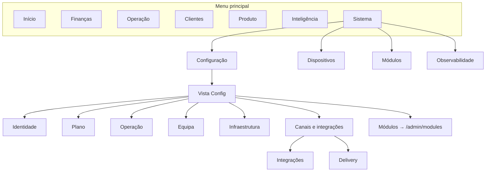

# Contrato de domínios do Admin (Comando Central)

**Objetivo:** Definir domínios canónicos e regras para a navegação do Admin. Cada funcionalidade tem **um** lugar canónico.  
**Ref:** [ADMIN_NAVIGATION_MAP.md](ADMIN_NAVIGATION_MAP.md), plano Reorganizar-admin-por-dominios.

---

## 1. Domínios canónicos

| Domínio | Descrição | Tipo | Entrada única no menu |
|---------|-----------|------|------------------------|
| **Identidade** | Nome, localizações, entidades legais, marcas | Configuração | Config → Identidade (Geral, Localizações, Entidades Legais, Marcas) |
| **Plano** | Assinatura, faturação, trial | Configuração | Config → Plano (Assinatura) |
| **Operação** | Website, reservas, software TPV | Config + uso diário | Menu: Reservas, Promoções; Config → Operação (Website, Reservas, Software TPV) |
| **Equipa** | Administradores, funcionários | Configuração | Config → Equipa (Administradores, Funcionários) |
| **Infraestrutura** | Dispositivos, impressoras | Configuração | Menu: Dispositivos; Config → Infraestrutura (Gestão de dispositivos, Impressoras) |
| **Canais e integrações** | Integrações (payments, WhatsApp, webhooks), delivery | Configuração | Config → Canais e integrações (Integrações, Delivery) — **Delivery num único sítio** |
| **Módulos** | Ativar e configurar módulos | Configuração | **Uma entrada:** Sistema → Módulos (/admin/modules). Remover duplicata em Config. |
| **Finanças** | Transações, reembolsos, fechos | Uso diário | Menu → Finanças |
| **Clientes** | Diretório de clientes | Uso diário | Menu → Clientes |
| **Produto** | Catálogo | Uso diário | Menu → Produto |
| **Inteligência** | Relatórios | Uso diário | Menu → Inteligência |
| **Sistema** | Configuração, Dispositivos, Módulos, Observabilidade | Config + ops | Menu → Sistema |

---

## 2. Regras

1. **Um sítio por funcionalidade**  
   Delivery não aparece em dois sítios: fica apenas em Config → Canais e integrações → Delivery. O hub Integrações pode ter uma subpágina "Delivery" para integrações de delivery (ex.: API), mas a **configuração operacional de delivery** (horários, zonas, etc.) é uma única página acessível por Config → Canais e integrações → Delivery.

2. **Módulos: uma entrada**  
   Acesso canónico: Menu principal → Sistema → Módulos (/admin/modules). Na vista Config, a secção "Módulos" tem um único item que leva a /admin/modules (sem criar segunda entrada conceptual).

3. **Configuração vs operação**  
   - Itens de **configuração** (alterados raramente): sob Config (Identidade, Plano, Operação, Equipa, Infraestrutura, Canais e integrações).  
   - Itens de **uso diário**: no menu principal (Finanças, Operação reservas/promoções, Clientes, Produto, Inteligência).  
   - "Configuração" no menu principal leva à vista Config (secções acima).

4. **Idioma**  
   Todos os textos do Admin (menus, secções, botões) em português (PT). Glossário: Plano, Assinatura, Integrações, Canais, Operação, Equipa, Infraestrutura, Módulos, Configuração.

5. **Estados de módulo**  
   Estados possíveis: não disponível, disponível para ativar, ativo, em beta, bloqueado por plano. Exibidos com badge/indicador (ModuleStatusDot) nos itens de Config que dependem de módulos. Fonte: Core (useConfigModuleStates).

---

## 3. Estrutura do menu (proposta)

### 3.1 Menu principal (igual ao atual, com termos PT)

- Início → /admin/home  
- Finanças: Transações, Reembolsos, Fechos  
- Operação: Reservas, Promoções  
- Clientes: Diretório  
- Produto: Catálogo  
- Inteligência: Relatórios  
- Sistema: Configuração, Dispositivos, Módulos, Observabilidade  

### 3.2 Vista Config (secções)

- **Identidade:** Geral, Localizações, Entidades Legais, Marcas  
- **Plano:** Assinatura  
- **Operação:** Website, Reservas, Software TPV  
- **Equipa:** Administradores, Funcionários  
- **Infraestrutura:** Gestão de dispositivos, Impressoras  
- **Canais e integrações:** Integrações (hub), Delivery  
- **Módulos:** um item que leva a /admin/modules (label "Módulos")  

### 3.3 Diagrama (depois)

---

## 4. Consolidação Delivery

- **Página canónica de configuração delivery:** `/admin/config/delivery` (DeliveryConfigPage).  
- **Hub Integrações:** `/admin/config/integrations` com subrotas (payments, whatsapp, webhooks, delivery, other). A subrota `integrations/delivery` (IntegrationsDeliveryPage) deve tratar **integrações de delivery** (APIs, parceiros). Se o conteúdo se sobrepuser à página `config/delivery`, unificar: uma única página "Delivery" em Config → Canais e integrações, com tabs ou secções "Configuração" e "Integrações", ou redirecionar `integrations/delivery` para `config/delivery` e manter uma única página.  
- **Decisão de implementação:** manter `/admin/config/delivery` como entrada no menu Config (Canais e integrações). Remover "Delivery" como item separado do hub Integrações no menu da sidebar, ou manter no hub como sublink para a mesma página/configuração conforme o conteúdo real das duas páginas.

---

## 5. Referências

- Implementação sidebar: [AdminSidebar.tsx](../../merchant-portal/src/features/admin/dashboard/components/AdminSidebar.tsx)  
- Rotas: [OperationalRoutes.tsx](../../merchant-portal/src/routes/OperationalRoutes.tsx)  
- Locale: [pt-PT/sidebar.json](../../merchant-portal/src/locales/pt-PT/sidebar.json)
