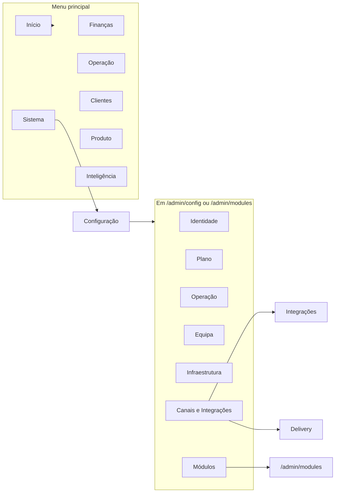

# Mapa de navegação Admin (Comando Central)

**Objetivo:** Fonte de verdade da estrutura atual do Admin e da proposta de domínios canónicos.  
**Ref:** Plano Reorganizar-admin-por-dominios.

---

## 1. Estado atual (antes da reorganização)

### 1.1 Fonte da verdade

- **Sidebar Admin:** [merchant-portal/src/features/admin/dashboard/components/AdminSidebar.tsx](../../merchant-portal/src/features/admin/dashboard/components/AdminSidebar.tsx)
- **Rotas:** [merchant-portal/src/routes/OperationalRoutes.tsx](../../merchant-portal/src/routes/OperationalRoutes.tsx) (prefixo `/admin` e `/admin/config/*`)
- **Traduções:** [merchant-portal/src/locales/pt-PT/sidebar.json](../../merchant-portal/src/locales/pt-PT/sidebar.json) (namespace `sidebar`)

Quando o utilizador está em `/admin/config/*` ou em `/admin/modules`, a sidebar mostra o **menu de Configuração** (CONFIG_SECTIONS). Caso contrário, mostra o **menu principal** (NAV_GROUPS) com link "Configuração" para `/admin/config`.

### 1.2 Menu principal (NAV_GROUPS)

| Grupo (id) | titleKey | Rotas |
|------------|----------|--------|
| finanzas | groups.financas | /admin/payments, /admin/payments/refunds, /admin/closures |
| operacion | groups.operacao | /admin/reservations, /admin/promotions |
| clientes | groups.clientes | /admin/customers |
| producto | groups.produto | /admin/catalog |
| inteligencia | groups.inteligencia | /admin/reports |
| sistema | groups.sistema | /admin/config, /admin/devices, /admin/modules, /admin/observability |

### 1.3 Menu de Configuração (CONFIG_SECTIONS)

| Secção (sectionKey) | Itens (path / labelKey) | Rota canónica |
|--------------------|-------------------------|----------------|
| configSections.identity | general, locations, legal-entities, brands | /admin/config/general, .../locations, .../legal-entities, .../brands |
| configSections.plan | subscription | /admin/config/subscription |
| configSections.operations | website, reservations, pos-software | /admin/config/website, .../reservations, .../pos-software |
| configSections.team | users, employees | /admin/config/users, .../employees |
| configSections.infrastructure | devices, printers | /admin/config/devices, .../printers |
| configSections.channels | integraciones (→/admin/config/integrations), delivery | /admin/config/integrations, .../delivery |
| ~~configSections.modules~~ | *(removido: acesso só via Menu principal → Sistema → Módulos)* | /admin/modules |

### 1.4 Rotas /admin/config/* (detalhe)

- **general** → GeneralConfigPage
- **subscription** → SuscripcionConfigPage (Assinatura)
- **locations**, **locations/address**, **locations/tables** → UbicacionesConfigPage
- **legal-entities** → EntidadesLegalesConfigPage
- **brands** → MarcasConfigPage
- **users** → UsuariosConfigPage
- **employees**, **employees/list**, **employees/roles** → EmpleadosConfigPage
- **devices** → DispositivosConfigPage
- **printers** → ImpresorasConfigPage
- **integrations** → IntegrationsHubLayout (hub com subrotas: index, payments, whatsapp, webhooks, **delivery**, other)
- **delivery**, **delivery/floor-plan**, **delivery/schedule**, **delivery/qr** → DeliveryConfigPage
- **pos-software**, **pos-software/config**, **pos-software/quick-mode** → SoftwareTpvConfigPage
- **reservations**, **reservations/availability**, **reservations/guarantee**, **reservations/shifts**, **reservations/messages** → ReservasConfigPage
- **website** → TiendaOnlineConfigPage
- **productos** → redirect to /admin/modules

### 1.5 Duplicações identificadas

| Domínio | Onde aparece 1 | Onde aparece 2 | Nota |
|---------|----------------|----------------|------|
| **Delivery** | Config → Canais & Integrações → "Delivery" (/admin/config/delivery) | Config → Integrações → sub-rota "delivery" (/admin/config/integrations/delivery) | Duas páginas distintas: DeliveryConfigPage vs IntegrationsDeliveryPage |
| **Módulos** | Menu principal → Sistema → "Módulos" (/admin/modules) | Config → Secção Módulos → "Módulos" (link para /admin/modules) | Mesma rota; duas entradas de menu |
| **Integrações** | Config → Canais & Integrações → "Integrações" | — | Única entrada; hub com subpáginas (payments, whatsapp, webhooks, delivery, other) |

### 1.6 Outros componentes de navegação

- **ConfigSidebar** ([merchant-portal/src/components/config/ConfigSidebar.tsx](../../merchant-portal/src/components/config/ConfigSidebar.tsx)): árvore alternativa com paths como `/config/general`, `/admin/config/locations`, `/admin/modules`. Usado em **ConfigLayout**. O layout **ConfigLayout** não está atualmente usado nas rotas `/admin/*` (o canónico é DashboardLayout + AdminSidebar). Rotas `/config` e `/config/*` redirecionam para `/admin/config`.
- **SidebarContextBanner**: banner contextual (setup, trial, active, suspended) acima do menu; definido em useSidebarBanner.

### 1.7 Diagrama atual (menu principal + config)

---

## 2. Classificação de domínios (atual)

| Domínio lógico | Uso | Entradas no Admin |
|----------------|-----|--------------------|
| **Identidade** | Configuração esporádica | Config: Geral, Localizações, Entidades Legais, Marcas |
| **Plano** | Configuração esporádica | Config: Assinatura |
| **Operação** | Uso diário + config | Menu: Reservas, Promoções; Config: Website, Reservas, Software TPV |
| **Equipa / Pessoas** | Configuração esporádica | Config: Administradores, Funcionários |
| **Infraestrutura** | Configuração esporádica | Menu: Dispositivos; Config: Gestão de dispositivos, Impressoras |
| **Canais / Integrações** | Configuração esporádica | Config: Integrações (hub), Delivery |
| **Módulos** | Configuração esporádica | Menu: Módulos; Config: Módulos (link) |
| **Finanças** | Uso diário | Menu: Transações, Reembolsos, Fechos |
| **Clientes** | Uso diário | Menu: Diretório |
| **Produto** | Uso diário | Menu: Catálogo |
| **Inteligência** | Uso diário | Menu: Relatórios |
| **Observabilidade** | Configuração / ops | Menu: Observabilidade |

---

## 3. Proposta (depois da reorganização)

Ver [ADMIN_DOMAINS_CONTRACT.md](ADMIN_DOMAINS_CONTRACT.md) para a estrutura canónica e regras. O diagrama "depois" será atualizado nesse contrato e aqui após implementação.
