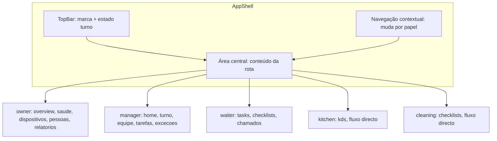

# Mapa completo do AppShell

**Status:** CANONICAL  
**Tipo:** Mapa do AppShell — estrutura, áreas e navegação por papel.  
**Subordinado a:** [APPSTAFF_ROUTE_MAP.md](./APPSTAFF_ROUTE_MAP.md), [TASK_SYSTEM_MATRIX_AND_RITUAL.md](./TASK_SYSTEM_MATRIX_AND_RITUAL.md), [STAFF_SESSION_LOCATION_CONTRACT.md](./STAFF_SESSION_LOCATION_CONTRACT.md), [DEVICE_TURN_SHIFT_TASK_CONTRACT.md](./DEVICE_TURN_SHIFT_TASK_CONTRACT.md).

---

## 1. O que é o App ChefIApp

- **Um único aplicativo** (não vários apps separados).
- **Múltiplos modos, múltiplos papéis;** o operador muda e o app reconfigura-se.
- **Raiz operacional:** `/app` (portal); **área Staff:** `/app/staff` (prefixo do AppShell).

**Regra:** Mesmo código, mesmo runtime, mesmo contrato. Layouts, rotas e permissões variam por papel.

---

## 2. Estrutura canónica do AppShell

O AppShell é a casca fixa que envolve todo o conteúdo operacional em `/app/staff`.

### 2.1 Shell fixo (sempre presente)

| Elemento | Descrição |
|----------|-----------|
| **TopBar** | Marca ChefIApp + papel activo + nome do restaurante + estado do turno (Aberto / Sem turno). |
| **Área central** | Conteúdo da rota actual (`<Outlet />`); TPV e KDS em largura cheia (sem padding). |
| **Sidebar** | Só navegação (links); ordem canónica manager: Visão operacional, Turno, Equipe, Tarefas, Exceções, TPV, KDS, Perfil, Histórico (+ Notificações, Ajuda). Nenhum botão operacional na sidebar. |

**Regra:** Mesmo app, menus diferentes conforme o papel. Uma tela = uma responsabilidade.

---

## 3. Áreas comuns (todos os papéis)

Estas áreas são partilhadas por todos os operadores, independentemente do papel.

| Área | Path proposto | Conteúdo (resumo) |
|------|----------------|-------------------|
| Perfil | `/app/staff/profile` | Dados do operador, papel actual, turno/localização. |
| Notificações | `/app/staff/notifications` | Alertas e notificações para o operador. |
| Estado do sistema | `/app/staff/help` ou `/app/staff/status` | Resumo do estado (não técnico); ligação conceptual a [DEVICE_TURN_SHIFT_TASK_CONTRACT.md](./DEVICE_TURN_SHIFT_TASK_CONTRACT.md) e saúde. |
| Meu histórico | `/app/staff/history` | Tarefas, turnos e acções do operador. |

Estes paths coincidem ou estendem os definidos em [APPSTAFF_ROUTE_MAP.md](./APPSTAFF_ROUTE_MAP.md) secção 3.

---

## 4. Áreas por papel (o que muda)

Cada papel tem uma sub-árvore sob `/app/staff/<role>`. O que aparece na navegação muda conforme o papel.

### 4.1 Dono (owner)

- **Sub-rota base:** `/app/staff/owner`
- **Páginas / ecrãs:** Visão Geral; Saúde do Sistema; Dispositivos & Turnos; Pessoas & Papéis; Relatórios.

Paths de exemplo: `/app/staff/owner/overview`, `/app/staff/owner/saude-sistema`, `/app/staff/owner/dispositivos-turnos`, `/app/staff/owner/pessoas`, `/app/staff/owner/relatorios`.

### 4.2 Gerente (manager)

- **Sub-rota base:** `/app/staff/manager`
- **Páginas / ecrãs:** Turno actual; Equipe em turno; Tarefas críticas; Exceções. A tela actual "Maestro View" (ManagerDashboard) passa a ser uma página — ver secção 5.

Paths de exemplo: `/app/staff/manager/home` (Visão Operacional / Status do Turno), `/app/staff/manager/turno`, `/app/staff/manager/equipe`, `/app/staff/manager/tarefas`, `/app/staff/manager/excecoes`.

### 4.3 Staff (waiter / worker)

- **Sub-rota base:** `/app/staff/waiter` (ou papel genérico)
- **Páginas / ecrãs:** Minhas tarefas; Checklists do turno; Chamados / exceções.

Paths de exemplo: `/app/staff/waiter/tasks`, `/app/staff/waiter/checklists`, `/app/staff/waiter/chamados`.

### 4.4 Cozinha / Limpeza (kitchen, cleaning)

- **Sub-rota base:** `/app/staff/kitchen`, `/app/staff/cleaning`
- **Comportamento:** Fluxo directo; zero distracção; só o que importa agora (KDS, checklists, etc.).

Paths de exemplo: `/app/staff/kitchen/kds`, `/app/staff/cleaning/checklists`.

Alinhamento com [APPSTAFF_ROUTE_MAP.md](./APPSTAFF_ROUTE_MAP.md) secção 4.

---

## 5. O que acontece à tela actual (Master View)

A tela actual (ManagerDashboard / "Maestro View") **não é descartada**.

- Passa a ser **uma página** dentro do app, por exemplo:
  - **Visão Operacional**, ou
  - **Status do Turno**
- Fica sob a sub-árvore do Gerente (ex.: `/app/staff/manager/home` ou `/app/staff/manager/status-turno`).
- **Deixa de ser o app inteiro;** o app passa a ser o Shell + navegação por papel.

---

## 6. Rotas e regras de navegação

Resumo; detalhe em [APPSTAFF_ROUTE_MAP.md](./APPSTAFF_ROUTE_MAP.md).

| Regra | Comportamento |
|-------|---------------|
| Redirect ao entrar em `/app/staff` | Redirecionar para o home do papel actual (ex.: manager → `/app/staff/manager/home`). |
| Acesso por papel | Cada papel só acede à sua sub-árvore. |
| Sem permissão para path | Redirecionar para o home do papel ou para `/app/staff/home`. |
| Gate Location | Mantém-se antes de qualquer modo: sem `activeLocation` não se entra em rotas operacionais (ver [STAFF_SESSION_LOCATION_CONTRACT.md](./STAFF_SESSION_LOCATION_CONTRACT.md)). |

### Resumo rota → papel

| Sub-rota base | Papel | Descrição |
|---------------|-------|-----------|
| `/app/staff/owner` | Dono | Visão geral, saúde, dispositivos, pessoas, relatórios. |
| `/app/staff/manager` | Gerente | Turno, equipe, tarefas críticas, exceções; inclui Visão Operacional (Master View actual). |
| `/app/staff/waiter` | Garçom / Staff | Minhas tarefas, checklists, chamados. |
| `/app/staff/kitchen` | Cozinha | KDS, preparação, alertas; fluxo directo. |
| `/app/staff/cleaning` | Limpeza | Checklists, alertas; fluxo directo. |

---

## 7. Alinhamento aos contratos

Este mapa materializa em "estrutura de produto" o que está definido nos contratos:

- **[APPSTAFF_ROUTE_MAP.md](./APPSTAFF_ROUTE_MAP.md)** — rotas e paths por papel.
- **[TASK_SYSTEM_MATRIX_AND_RITUAL.md](./TASK_SYSTEM_MATRIX_AND_RITUAL.md)** — tarefas por papel e momento do turno.
- **[STAFF_SESSION_LOCATION_CONTRACT.md](./STAFF_SESSION_LOCATION_CONTRACT.md)** — gate Location antes de operação.
- **[DEVICE_TURN_SHIFT_TASK_CONTRACT.md](./DEVICE_TURN_SHIFT_TASK_CONTRACT.md)** — dispositivos, turno, operador, tarefas; saúde e bloqueios.

Nenhuma lógica nova; só organização da UI e navegação. Implementações futuras (B: refatorar telas em módulos navegáveis; C: Perfil unificado) referenciam este mapa.

---

## 8. Diagrama de alto nível

