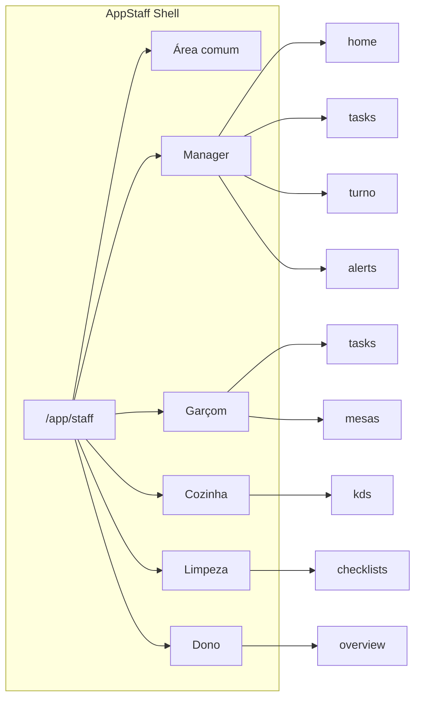

# Mapa definitivo de rotas do AppStaff (por papel)

**Status:** CANONICAL  
**Tipo:** Índice — sub-rotas e modos do AppStaff; referência para AppShell e wireframes.  
**Subordinado a:** [ROTAS_E_CONTRATOS.md](./ROTAS_E_CONTRATOS.md), [STAFF_SESSION_LOCATION_CONTRACT.md](./STAFF_SESSION_LOCATION_CONTRACT.md), [APPSTAFF_RUNTIME_MODEL.md](./APPSTAFF_RUNTIME_MODEL.md).

---

## 0. Entrypoint real e árvore de renderização

**Modelo único:** o AppStaff operacional (web) é **Shell + rotas**. Não usar o componente legado `AppStaff.tsx` (routing por role num único tree).

| Conceito | Valor |
|----------|--------|
| **Entrypoint de rota** | `AppStaffWrapper` — montado em [App.tsx](../merchant-portal/src/App.tsx) como `Route path="/app/staff" element={<AppStaffWrapper />}`. |
| **Launcher visível** | Em `/app/staff/home`: **StaffLauncherPage** → **AppStaffHome**. Alterações ao "launcher" fazem-se em [AppStaffHome.tsx](../merchant-portal/src/pages/AppStaff/AppStaffHome.tsx) e [StaffLauncherPage.tsx](../merchant-portal/src/pages/AppStaff/pages/StaffLauncherPage.tsx). |
| **Cadeia real** | AppStaffWrapper → StaffModule (StaffProvider, OperatorSessionProvider) → StaffAppGate → StaffAppShellLayout → Outlet (páginas) → ex. StaffLauncherPage → AppStaffHome. |
| **Redirect índice** | `/app/staff` → `/app/staff/home` ([StaffIndexRedirect.tsx](../merchant-portal/src/pages/AppStaff/routing/StaffIndexRedirect.tsx)). |
| **Legado (não usar)** | [AppStaff.tsx](../merchant-portal/src/pages/AppStaff/AppStaff.tsx): componente por role nunca montado em rotas; não importar para novas funcionalidades. |

---

## 1. Regra

**AppStaff = um aplicativo que muda de forma conforme o operador.** Mesmo código, mesmo runtime, mesmo contrato. Layouts, rotas e permissões variam por papel. Toda a área operador vive sob o prefixo `/app/staff`.

---

## 2. AppStaff como shell

| Conceito | Valor |
|----------|--------|
| Prefixo | `/app/staff` |
| Entrada | Uma rota em [App.tsx](../merchant-portal/src/App.tsx): `<Route path="/app/staff" element={<AppStaffWrapper />} />` com sub-rotas sob `StaffAppGate` e `StaffAppShellLayout`. |
| Shell | [StaffAppShellLayout.tsx](../merchant-portal/src/pages/AppStaff/routing/StaffAppShellLayout.tsx): TopBar (marca, papel, local, estado turno) + sidebar só navegação + área central (`<Outlet />`). |
| Redirect índice | [StaffIndexRedirect.tsx](../merchant-portal/src/pages/AppStaff/routing/StaffIndexRedirect.tsx): `/app/staff` → `/app/staff/home`. |

Tudo o que é "app operador" vive sob este prefixo. As sub-rotas estão implementadas; navegação por URL por papel. A definição completa do Shell está em [APPSTAFF_APPSHELL_MAP.md](./APPSTAFF_APPSHELL_MAP.md).

---

## 3. Área comum (todos os papéis)

Rotas partilhadas, independentes do papel. Implementadas em [App.tsx](../merchant-portal/src/App.tsx) sob `/app/staff`:

| Path | Descrição | Componente |
|------|-----------|------------|
| `/app/staff/profile` | Perfil do operador (dados, papel, sessão, terminar sessão). | `StaffProfilePage` |
| `/app/staff/notifications` | Notificações. | `StaffNotificationsPage` |
| `/app/staff/help` | Ajuda. | `StaffHelpPage` |
| `/app/staff/history` | Meu histórico. | `StaffHistoryPage` |

O índice `/app/staff` redireciona para `/app/staff/home` (secção 0).

---

## 4. Modos por papel (sub-rotas implementadas)

Estrutura de sub-rotas por papel. Cada papel tem uma sub-árvore sob `/app/staff`; a sidebar vem de [staffNavConfig.ts](../merchant-portal/src/pages/AppStaff/routing/staffNavConfig.ts).

| Papel | Sub-rota base | Ecrãs (paths relativos; implementados) |
|-------|----------------|----------------------------------------|
| Manager | `manager/` | home (Visão Operacional), turno, equipe, tarefas, excecoes; + tpv, kds partilhados |
| Garçom | `waiter/` | tasks, checklists, chamados |
| Cozinha | `kitchen/` | kds, preparacao, alerts |
| Limpeza | `cleaning/` | checklists, alerts |
| Dono | `owner/` | overview, saude-sistema, dispositivos-turnos, pessoas, relatorios |

Paths completos (manager, implementados):

- `/app/staff/manager/home` — Visão Operacional (estado turno, saúde, atalhos TPV/KDS/Tarefas)
- `/app/staff/manager/turno` — Abrir/fechar turno, ritual, exportar PDF, linha do tempo
- `/app/staff/manager/equipe` — Equipa em turno (LiveRosterWidget)
- `/app/staff/manager/tarefas` — Tarefas críticas + Nova Tarefa
- `/app/staff/manager/excecoes` — Falhas, dispositivos offline, bloqueios
- `/app/staff/tpv`, `/app/staff/kds` — TPV e KDS em tela cheia (partilhados entre papéis com permissão)

---

## 5. Mapeamento rota → componente (implementado)

Rotas sob `/app/staff` em [App.tsx](../merchant-portal/src/App.tsx). Gates em [StaffAppGate.tsx](../merchant-portal/src/pages/AppStaff/routing/StaffAppGate.tsx).

| Rota / gate | Componente | Nota |
|-------------|------------|------|
| (gate Location) | `LocationSelectView`, `NoLocationsView` | STAFF_SESSION_LOCATION_CONTRACT. |
| (sem contrato) | `AppStaffLanding` | Criar/assumir contrato. |
| (sem worker) | `WorkerCheckInView` | Check-in antes de ferramentas. |
| `/app/staff/home` | `StaffLauncherPage` → `AppStaffHome` | **Launcher operacional** (APPSTAFF_LAUNCHER_CONTRACT). |
| `manager/home` | `ManagerDashboard` | Visão Operacional: estado turno, saúde, Abrir TPV/KDS/Ver Tarefas. |
| `manager/turno` | `ManagerTurnoPage` | Ritual, abrir turno, Exportar PDF, linha do tempo. |
| `manager/equipe` | `ManagerEquipePage` | Equipa em turno (LiveRosterWidget). |
| `manager/tarefas` | `ManagerTarefasPage` | Tarefas críticas + Nova Tarefa (QuickTaskModal). |
| `manager/excecoes` | `ManagerExcecoesPage` | Falhas, dispositivos offline, bloqueios. |
| `tpv` | `TPVMinimal` | TPV em tela cheia (padding 0 no main). |
| `kds` | `KitchenDisplay` | KDS em tela cheia. |
| `owner/overview` | `OwnerDashboard` (variant="app") | Visão do dono. |
| `waiter/tasks` | `WorkerTaskStream` | Minhas tarefas. |
| `waiter/checklists` | `StaffWaiterChecklistsPage` | Checklists. |
| `kitchen/kds` | `KitchenDisplay` | KDS. |
| `cleaning/checklists` | `StaffCleaningPage` | Checklists limpeza. |
| `profile`, `notifications`, `help`, `history` | `StaffProfilePage`, etc. | Área comum. |

Para referência histórica de fluxos por dominantTool num único componente (não usado em rotas), ver [AppStaff.tsx](../merchant-portal/src/pages/AppStaff/AppStaff.tsx) — **LEGADO**; não usar para alterações.

---

## 6. Regras de navegação (implementadas)

| Regra | Comportamento |
|-------|---------------|
| Acesso por papel | Cada papel só acede à sua sub-árvore (ex.: manager → `/app/staff/manager/*`). |
| Redirect ao entrar em `/app/staff` | Redirecionar para `/app/staff/home` (StaffIndexRedirect). |
| Sem permissão para path | Redirecionar para o home do papel ou para `/app/staff/home`. |
| Gate Location | Mantém-se antes de qualquer modo: sem `activeLocation` não se entra em rotas operacionais (ver [STAFF_SESSION_LOCATION_CONTRACT.md](./STAFF_SESSION_LOCATION_CONTRACT.md)). |

Alinhamento: [STAFF_SESSION_LOCATION_CONTRACT.md](./STAFF_SESSION_LOCATION_CONTRACT.md), [ROTAS_E_CONTRATOS.md](./ROTAS_E_CONTRATOS.md).

---

## 7. Diagrama de alto nível (conceitual)

---

## 8. Índice de referência

| Documento | Uso |
|-----------|-----|
| [ROTAS_E_CONTRATOS.md](./ROTAS_E_CONTRATOS.md) | Índice global; entrada `/app/staff` referencia este mapa. |
| [STAFF_SESSION_LOCATION_CONTRACT.md](./STAFF_SESSION_LOCATION_CONTRACT.md) | Gate Location; ordem de gates antes de modos. |
| [APPSTAFF_RUNTIME_MODEL.md](./APPSTAFF_RUNTIME_MODEL.md) | Runtime autónomo; papel e contrato. |
| [APPSTAFF_UI_SURGERY_SUMMARY.md](./APPSTAFF_UI_SURGERY_SUMMARY.md) | Resumo da refatoração layout (uma tela = uma responsabilidade). |

Este documento não altera comportamento nem código; define a estrutura de rotas para o AppShell e para wireframes por papel.
