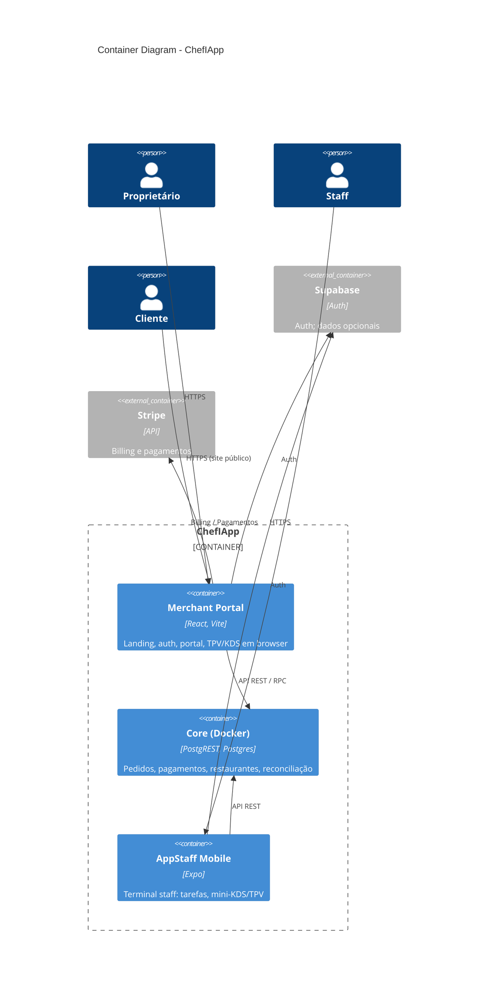

# C4 Model — Container (Nível 2)

**Propósito:** Diagrama C4 **Container** do ChefIApp — grandes blocos (containers) dentro do sistema e como se relacionam.  
**Público:** Dev, arquitetura.  
**Referência:** [C4_CONTEXT.md](./C4_CONTEXT.md) · [ARCHITECTURE_OVERVIEW](../ARCHITECTURE_OVERVIEW.md) · [CORE_SYSTEM_OVERVIEW](./CORE_SYSTEM_OVERVIEW.md)

---

## 1. Descrição do nível Container

O nível Container mostra os **containers** (aplicações ou armazenamentos de dados) que compõem o ChefIApp. Cada container é uma unidade de deploy ou execução com responsabilidade clara.

---

## 2. Containers principais

| Container | Responsabilidade | Tecnologia / Local |
|-----------|------------------|---------------------|
| **Merchant Portal** | Landing, auth, portal de gestão, TPV/KDS em browser; boundary para Core. | React, Vite; merchant-portal |
| **Core (Docker)** | Fonte de verdade: pedidos, pagamentos, restaurantes, módulos, reconciliação. | PostgREST, Postgres; docker-core |
| **AppStaff (Mobile)** | Terminal staff: login, check-in, tarefas, mini-KDS/TPV (leitura). | Expo, iOS/Android; mobile-app |
| **Supabase** | Auth; opcionalmente dados (não Core soberano). | Supabase (externo) |
| **Stripe** | Billing SaaS; pagamentos restaurante. | Stripe (externo) |

---

## 3. Diagrama C4 Container (Mermaid)

---

## 4. Regras de comunicação

- **Merchant Portal** fala com **Core** via boundary (RuntimeReader, RuntimeWriter, RPC); nunca contorna.
- **AppStaff** fala apenas com **Core** (e Auth); terminais não falam entre si.
- **Core** é a única fonte de verdade financeira e operacional; Supabase não é Core.
- **Stripe** é usado pelo portal (e futuramente Core) para billing e pagamentos.

---

## 5. Próximo nível

O nível **Component** detalha componentes significativos dentro de um container: ver [C4_COMPONENT.md](./C4_COMPONENT.md).

---

*Documento vivo. Novos containers (ex.: serviço de impressão, worker) devem ser reflectidos aqui.*
