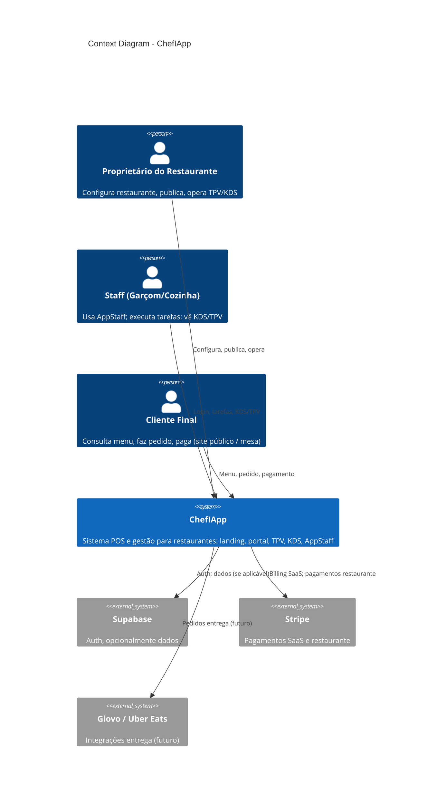

# C4 Model — Context (Nível 1)

**Propósito:** Diagrama C4 **Context** do ChefIApp — sistema no seu ambiente: utilizadores e sistemas externos.  
**Público:** Dev, produto, stakeholders.  
**Referência:** [ARCHITECTURE_OVERVIEW](../ARCHITECTURE_OVERVIEW.md) · [CORE_SYSTEM_OVERVIEW](./CORE_SYSTEM_OVERVIEW.md)

---

## 1. Descrição do nível Context

O nível Context mostra **o sistema** (ChefIApp) como uma caixa única e as interacções com **pessoas** e **sistemas externos**. Não mostra componentes internos.

---

## 2. Diagrama C4 Context (Mermaid)

---

## 3. Elementos (texto)

| Elemento | Tipo | Descrição |
|----------|------|-----------|
| **Proprietário** | Pessoa | Configura restaurante, publica, opera TPV/KDS via portal. |
| **Staff** | Pessoa | Usa AppStaff (mobile); executa tarefas; vê KDS/TPV. |
| **Cliente final** | Pessoa | Consulta menu, faz pedido, paga (site público / mesa). |
| **ChefIApp** | Sistema | POS e gestão: landing, portal, TPV, KDS, AppStaff; Core soberano (Docker). |
| **Supabase** | Sistema externo | Auth; dados quando não Docker Core. |
| **Stripe** | Sistema externo | Billing SaaS; pagamentos no restaurante. |
| **Glovo / Uber Eats** | Sistema externo | Integrações entrega (futuro). |

---

## 4. Relações resumidas

- **Proprietário → ChefIApp:** Configura, publica, opera (portal + TPV/KDS).
- **Staff → ChefIApp:** Login, tarefas, visualização KDS/TPV (AppStaff).
- **Cliente → ChefIApp:** Menu, pedido, pagamento (site público / mesa).
- **ChefIApp → Supabase:** Auth; dados (conforme arquitectura).
- **ChefIApp → Stripe:** Billing e pagamentos.
- **ChefIApp → Glovo/Uber Eats:** Pedidos entrega (futuro).

---

## 5. Próximo nível

O nível **Container** descreve os grandes blocos dentro do ChefIApp: ver [C4_CONTAINER.md](./C4_CONTAINER.md).

---

*Documento vivo. Novos actores ou sistemas externos devem ser reflectidos aqui e no C4_CONTAINER.*
