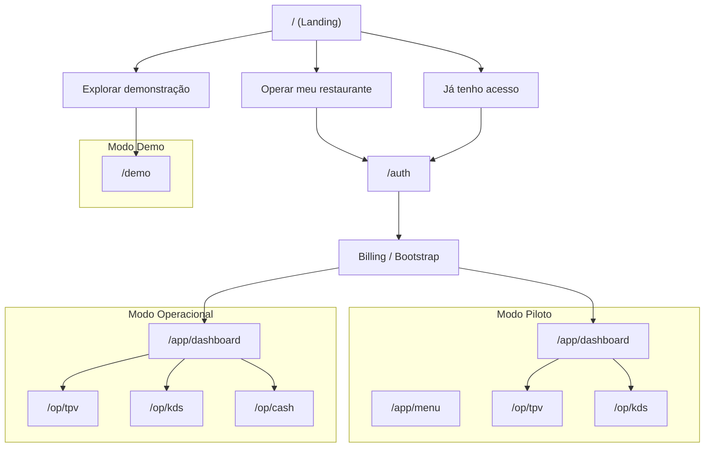

# Mapa canónico de rotas por modo (Demo / Piloto / Operacional)

## Lei do sistema

**Toda rota pública ou pós-auth está atribuída a um modo (Demo, Piloto ou Operacional). Alterações de rotas por modo devem manter este mapa actualizado.**

Este documento é referência canónica para "que rotas pertencem a que modo?" e "como se entra em cada modo a partir da landing?". Subordinado a [LANDING_STATE_ROUTING_CONTRACT.md](./LANDING_STATE_ROUTING_CONTRACT.md) e [ROTAS_E_CONTRATOS.md](./ROTAS_E_CONTRATOS.md). Referência: [CORE_CONTRACT_INDEX.md](./CORE_CONTRACT_INDEX.md) secção 0d2.

---

## 1. Modo → Entrada → Rotas

| Modo | Entrada na landing | Rotas no modo | Core/Runtime? |
|------|--------------------|---------------|---------------|
| **Demo** | "Explorar demonstração" → `/demo` | `/`, `/demo` (e só; sem `/app`, `/op` com dados reais) | Não (PUBLIC) |
| **Piloto** | "Entrar em operação" ou "Já tenho acesso" → `/auth` → portal com modo Piloto activo | `/app/*` (dashboard, menu, etc.) com `productMode === 'pilot'`; `/op/tpv`, `/op/kds` em modo piloto conforme [PILOT_MODE_RUNTIME_CONTRACT.md](./PILOT_MODE_RUNTIME_CONTRACT.md) | Sim (MANAGEMENT / OPERATIONAL) |
| **Operacional** | Idem → auth + billing + publicado | `/app/*`, `/op/tpv`, `/op/kds`, `/op/cash` com dados reais e gates (published, operational) | Sim |

**Nota:** "Já tenho acesso" resolve último contexto (último modo/rota) e redireciona para o mesmo modo (Piloto ou Operacional).

---

## 2. Diagrama: Landing → três portais → modos

---

## 3. Rota → Modo (inversa)

| Rota | Modo(s) | Nota |
|------|---------|------|
| `/` | Demo | Landing pública; entrada para os três portais |
| `/demo` | Demo | Estado Demo; sem Core; dados fake |
| `/auth` | — | Ponto de decisão; não é modo; leva a Piloto ou Operacional |
| `/app/dashboard`, `/app/*` | Piloto ou Operacional | Semântica conforme runtime: `productMode === 'pilot'` vs publicado/billing |
| `/op/tpv`, `/op/kds` | Piloto ou Operacional | Idem; gates (published) e modo piloto conforme [OPERATIONAL_GATES_CONTRACT.md](./OPERATIONAL_GATES_CONTRACT.md) e [PILOT_MODE_RUNTIME_CONTRACT.md](./PILOT_MODE_RUNTIME_CONTRACT.md) |
| `/op/cash` | Operacional | Exige turno aberto (operational === true) |
| `/owner/dashboard` | Piloto ou Operacional | Web: home do dono. **App:** acesso secundário (Visão do Dono / toggle / PIN), não home. Ver [COGNITIVE_MODES_OWNER_DASHBOARD.md](./COGNITIVE_MODES_OWNER_DASHBOARD.md). |
| `/admin/config`, `/admin/config/*` | Piloto ou Operacional | Configuração estilo Last.app; árvore completa em [CONFIGURATION_MAP_V1.md](./CONFIGURATION_MAP_V1.md) secção 5. |

---

## Referências

- [LANDING_STATE_ROUTING_CONTRACT.md](./LANDING_STATE_ROUTING_CONTRACT.md) — botões como portais de estado; três caminhos na landing
- [ROTAS_E_CONTRATOS.md](./ROTAS_E_CONTRATOS.md) — índice rota → contrato MD
- [ROUTES_AND_BOOT_DIAGRAM.md](./ROUTES_AND_BOOT_DIAGRAM.md) — mapa por mundos (Público / Auth / Portal / Operação)
- [APPLICATION_BOOT_CONTRACT.md](./APPLICATION_BOOT_CONTRACT.md) — boot modes (PUBLIC, AUTH, MANAGEMENT, OPERATIONAL)
- [PILOT_MODE_RUNTIME_CONTRACT.md](./PILOT_MODE_RUNTIME_CONTRACT.md) — modo piloto: não escreve no Core
- [CORE_CONTRACT_INDEX.md](./CORE_CONTRACT_INDEX.md) — índice de contratos
- [COGNITIVE_MODES_OWNER_DASHBOARD.md](./COGNITIVE_MODES_OWNER_DASHBOARD.md) — modos Operação vs Consciência; Owner Dashboard na Web (home) vs App (acesso secundário)
