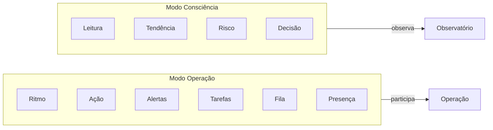

# Modos cognitivos e colocação do Owner Dashboard

**Status:** Contrato de produto  
**Referência rápida:** [TWO_DASHBOARDS_REFERENCE.md](./TWO_DASHBOARDS_REFERENCE.md) — leitura em 60 segundos.  
**Relacionado:** [OWNER_DASHBOARD_WIREFRAME.md](./OWNER_DASHBOARD_WIREFRAME.md), [ENTRADA_TELEFONE_DASHBOARD.md](./ENTRADA_TELEFONE_DASHBOARD.md), [CANONICAL_ROUTES_BY_MODE.md](./CANONICAL_ROUTES_BY_MODE.md), [EVENTS_CONTRACT_V1.md](./EVENTS_CONTRACT_V1.md)

Este documento define os dois modos cognitivos do ChefIApp (Operação vs Consciência), onde o Owner Dashboard vive em Web e App, e as regras de design por superfície. Objetivo: eliminar dissonância entre "Command Center" e "Gestão viva" dando a cada modo o seu lugar e a sua narrativa visual.

---

## 1. Decisão de produto

- **Uma tela** (a mesma função: resumo vivo + porta para relatórios).
- **Web + App** (ambos podem mostrar essa tela).
- **Não a mesma experiência:** Modo Operação (Staff/Manager) vs Modo Consciência (Owner/Direção) têm identidade visual e narrativa distintas.

**Frase-chave:** O ChefIApp não é um TPV. É um sistema com consciência operacional. Esta tela é a consciência; o resto é o corpo em movimento.

---

## 2. Onde o Owner Dashboard vive

| Superfície | Papel | Acesso |
|------------|--------|--------|
| **Web** | Home do dono. Ponto de entrada estratégico. Observatório. | `/owner/dashboard` — destino principal após login owner (ou quando o dono escolhe "Owner"). |
| **App (mobile)** | Não é home. É "olhar de cima" sob demanda. | Secundário: botão "Visão do Dono", toggle "Operação ↔ Visão", ou acesso protegido (PIN/biometria). |

No app, o dono entra no Modo Consciência por escolha explícita; o dia-a-dia do app continua a ser Modo Operação (ritmo, ação, fila, tarefas).

---

## 3. Dois modos cognitivos (definição)

- **Modo 1 — Operação (Staff / Manager)**  
  App mobile prioritário. Participa da operação. Visual: mais cor, movimento, feedback imediato. Ex.: "Mesa em atraso", "Pedido pronto", "Turno ativo".

- **Modo 2 — Consciência (Owner / Direção)**  
  Web prioritário; app como "espelho reduzido". Observa a operação. Visual: mais silêncio, contraste, menos elementos, mais significado por pixel. Ex.: estado do dia, quatro eixos, tendência, risco.

---

## 4. Regras de design por superfície (mesma verdade, duas narrativas)

| Critério | App (Modo Consciência quando ativo) | Web (Owner Dashboard) |
|----------|-------------------------------------|------------------------|
| Densidade | Menor: cards maiores, menos texto. | Maior: mais comparações, histórico, drill-down. |
| Números | Menos absolutos; mais estado (ok / atenção / risco). | Números absolutos + contexto; links para relatórios. |
| Movimento | Evitar animações pesadas na vista "Visão do Dono". | Estável; scroll e links suficientes. |
| Objetivo | "Como está o dia em 10 segundos?" sem ler tabelas. | "Como está o dia?" + "Onde aprofundar?" (CTAs). |

Implementação futura: variantes de layout/componentes (ex.: OwnerDashboardWeb vs OwnerDashboardApp) ou props de "modo" (density, showAbsoluteNumbers) alimentadas por viewport/rota, sem duplicar lógica de dados.

---

## 5. Implicações (resumo)

- **Web:** `/owner/dashboard` é a página principal do dono; a experiência "observatório" (densa, com CTAs para relatórios) é a referência do wireframe.
- **App:** O Owner Dashboard no app não é a home; é acedido via "Visão do Dono" / toggle / PIN. A variante App segue as regras da tabela acima (cards maiores, menos texto, mais estado).
- **Navegação:** No app, o dashboard principal do dia-a-dia continua a ser o fluxo operacional (Staff/Manager); o Owner Dashboard no app é um modo alternado.
