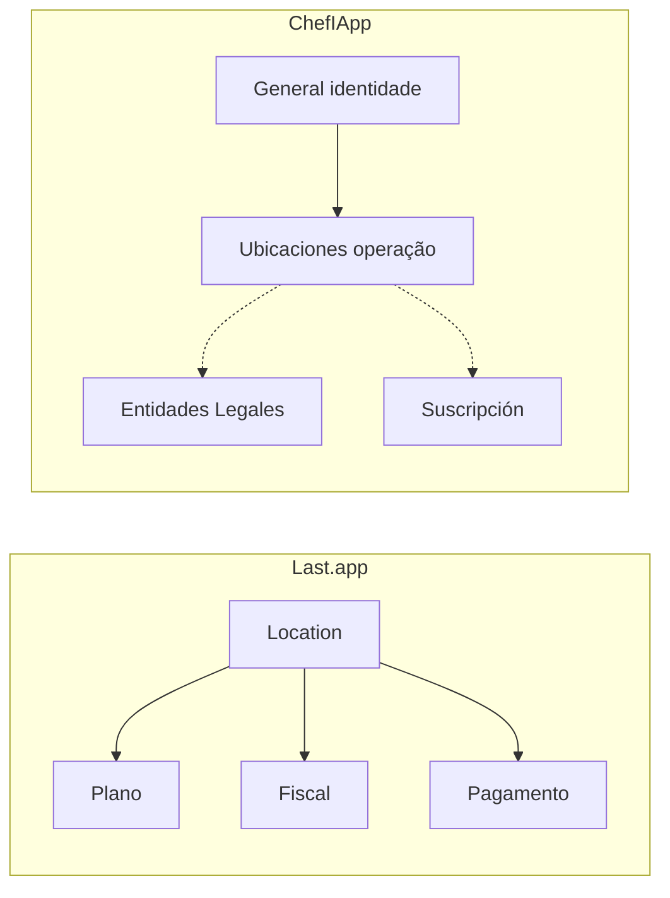

# Configuración — Location como contexto operacional (não como unidade de contrato)

**Decisão:** No ChefIApp, Location é contexto operacional; contrato (legal + faturação) está separado do local. Não copiar o wizard Last.app em `/locations/create`.

---

## 1. Por que o Last.app tem o wizard em /locations/create

No Last.app, **Location** é a unidade de negócio faturável. Preço, plano, TPV, reservas, fiscal, limites e integrações são “por local”. O wizard em `/locations/create` mistura em sequência:

1. Detalles de la ubicación (nome, endereço, contacto, instalación temporal)
2. Suscripción (plano)
3. Información fiscal
4. Confirmación

Ou seja: **criar location = criar contrato ativo**. Location = produto, contrato, faturamento e limite técnico ao mesmo tempo.

---

## 2. Modelo mental Last.app

```
Conta (Owner)
 └── Entidad legal
      └── Location (unidade ativa)
           ├── Plano
           ├── TPV
           ├── Reservas
           ├── Fiscal
           ├── Pagamento
           └── Limites
```

Tudo acontece “por local”. O fluxo mistura tempos mentais diferentes (identidade, operação, financeiro, legal, contrato) num único wizard — funciona para SaaS financeiro, mas é cognitivamente pesado para quem pensa em restaurante real.

---

## 3. Modelo ChefIApp

No ChefIApp o centro não é a Location; é a **operação viva** (Staff App, Owner Dashboard, eventos, estados, risco, disciplina). Por isso:

- **Location = contexto operacional** (“onde operamos”).
- **Contrato ≠ Local** — legal e faturação são camada separada.
- **Produto ≠ Endereço** — criar local não obriga plano nem cobrança imediata.

---

## 4. Três camadas conscientes (ChefIApp)

Separar em camadas conscientes, não em wizards comerciais:

| Camada | Rota | Conteúdo |
|--------|------|----------|
| **1. Identidade** | Configuración → General | Nome, endereço, idioma, moeda, timezone. “Quem somos no mundo”. |
| **2. Operação** | Configuración → Ubicaciones | Locais, grupos, mesas, zonas, turnos, capacidade, temporário vs permanente. “Onde operamos”. |
| **3. Contrato** | Configuración → Entidades Legales + Suscripción | Entidade legal, fiscal, plano, pagamento. “Como pagamos e somos cobrados”. |

Isso não precisa estar colado ao ato de criar o local. Criar ubicación pode ser feito sem ativar cobrança; ativar cobrança é passo consciente (Suscripción / Entidades Legales).

---

## 5. Regra de decisão

**Não adicionar** um wizard “criar local” que obrigue plano, fiscal ou pagamento no mesmo fluxo.

- Criar ubicación: nome, endereço, cidade, país, timezone, moeda, ativo, principal — sem plano nem fiscal.
- Plano e cobrança: em Configuración → Suscripción.
- Entidade fiscal: em Configuración → Entidades Legales.

Isso reduz fricção, aumenta confiança, diferencia do Last.app e alinha com o conceito de sistema operacional do restaurante.

---

## 6. Diagrama (modelo mental)



No ChefIApp, Ubicaciones não “contém” Legal nem Suscripción; são secções separadas na sidebar. As setas tracejadas indicam que contrato é camada distinta, acessível por Configuración, não dentro do fluxo de criar local.

---

## 7. Referências

- [CONFIG_GENERAL_WIREFRAME.md](./CONFIG_GENERAL_WIREFRAME.md) — Configuración > General (identidade).
- [TWO_DASHBOARDS_REFERENCE.md](./TWO_DASHBOARDS_REFERENCE.md) — Um dashboard real; sidebar = mapa.
- [CHEFIAPP_PRICING_AND_POSITIONING.md](./CHEFIAPP_PRICING_AND_POSITIONING.md) — Plano único + upsells; não copiar modelo fragmentado por local.

---

**Última atualização:** 2026-02-05
