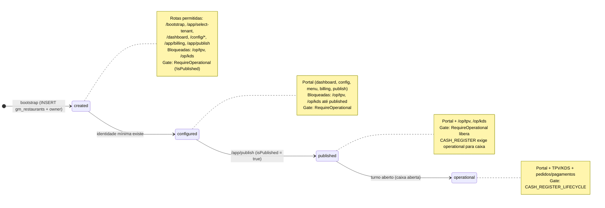
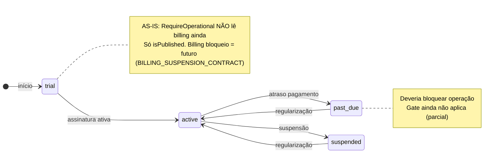
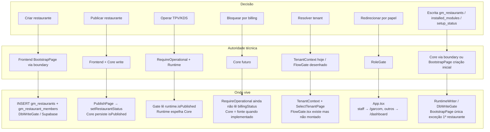
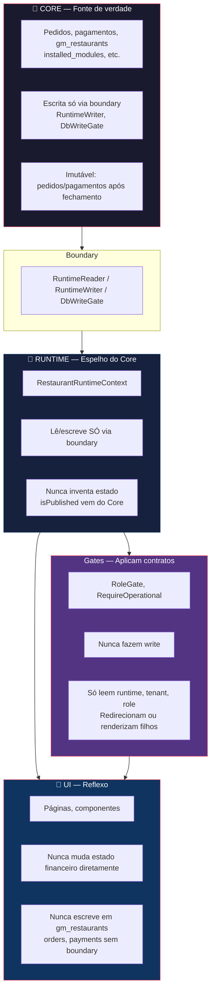

# Diagramas Soberanos — ChefIApp (AS-IS)

**Status:** VISUAL CANÓNICO — derivado do [ARQUITETURA_GERAL_CHEFIAPP_AS_IS.md](./ARQUITETURA_GERAL_CHEFIAPP_AS_IS.md)  
**Propósito:** Tornar explícito em forma visual o que já governa: estados, autoridade e fronteiras. Não altera o sistema; apenas compila o AS-IS.  
**Formato:** Mermaid (texto-versionável, rastreável).  
**Última atualização:** 2026-01-31

---

## 1. State Machine soberana (lifecycle + billing)

Estados formais do restaurante que governam rotas e gates. Secção 9 do ARQUITETURA_GERAL_CHEFIAPP_AS_IS.md.

### Billing (governa operação quando aplicado)

---

## 2. Autoridade por decisão (quem decide o quê, onde vive)

Quem tem autoridade final sobre cada decisão. Secção 10 do ARQUITETURA_GERAL_CHEFIAPP_AS_IS.md.

---

## 3. Fronteira Core / Runtime / UI (hard lines, sem exceções)

Regras que nenhum dev nem IA pode violar. Secção 12 do ARQUITETURA_GERAL_CHEFIAPP_AS_IS.md.

### Regras explícitas (texto)

| Camada | Regra |
|--------|--------|
| **CORE** | Nada no frontend sobrepõe o Core. Escrita só via boundary. |
| **Runtime** | Nunca inventa estado. isPublished, lifecycle, setup_status vêm do Core. |
| **UI** | Nunca muda estado financeiro. Nunca escreve em gm_restaurants, orders, payments sem boundary. |
| **Gates** | Nunca fazem write. Só leem e redirecionam ou renderizam filhos. |

---

## Referências

- [ARQUITETURA_GERAL_CHEFIAPP_AS_IS.md](./ARQUITETURA_GERAL_CHEFIAPP_AS_IS.md) — fonte única; secções 9, 10, 12
- [RESTAURANT_LIFECYCLE_CONTRACT.md](./RESTAURANT_LIFECYCLE_CONTRACT.md) — lifecycle configured / published / operational
- [BILLING_SUSPENSION_CONTRACT.md](./BILLING_SUSPENSION_CONTRACT.md) — billing trial / active / past_due / suspended

**Exportar:** Estes diagramas Mermaid podem ser renderizados em GitHub, GitLab, VS Code (extensão Mermaid) ou exportados para Excalidraw/PlantUML sem alterar o conteúdo.
