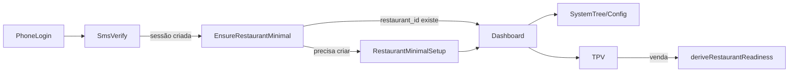

## Modelo de entrada por telefone → Dashboard

Este documento descreve o modelo definitivo de entrada no ChefIApp quando o
utilizador autentica por telefone (ou outro identificador forte), alinhado com
o padrão **config-first** (estilo GloriaFood / Last) e com a remoção total do
onboarding como wizard.

---

## 1. Princípios

- **Telefone é chave de identidade, não um fluxo.**
- O **restaurante nasce incompleto** e vai sendo completado progressivamente.
- A **primeira tela pós-login é sempre o Dashboard**.
- O que antes era \"onboarding\" passa a ser **estado do sistema** exposto via:
  - `runtime.setup_status` (núcleos de configuração),
  - `deriveRestaurantReadiness` (configuração vs operação),
  - SystemTree (sidebar) com estados 🔴🟡🟢.

> **Frase-âncora:**
> O onboarding não é um lugar.
> É o estado atual do sistema refletido no dashboard.

---

## 2. Fluxo de alto nível



- **PhoneLogin / SmsVerify**: fluxo de auth que termina numa sessão válida
  (fora do escopo deste doc).
- **EnsureRestaurantMinimal**:
  - Garantido pelo `CoreFlow`/`LifecycleState` + `FlowGate`.
  - Se não existir `restaurant_id`/organização → redireciona para
    `/setup/restaurant-minimal`.
- **RestaurantMinimalSetup**:
  - Implementado em `RestaurantMinimalSetupPage` reutilizando `BootstrapPage`.
  - Formulário mínimo (nome + país/moeda).
  - Ao concluir → sempre `redirect /dashboard`.
- **Dashboard**:
  - Usa `deriveRestaurantReadiness` + `runtime.setup_status` +
    `deriveSystemTreeState` para mostrar:
    - se a **Configuração** está pronta ou incompleta,
    - estado de **Operação** (turno aberto/fechado/preview).
  - CTA **“Ver o que falta”** leva à primeira Config Section em falta.
- **SystemTree**:
  - Sidebar com nós de configuração e operação, com estados 🔴🟡🟢.
- **TPV**:
  - Usa apenas `useOperationalReadiness("TPV")` + readiness para bloquear ou
    permitir venda.

### 2.1. Dono no app: acesso ao Owner Dashboard

No **app (mobile)**, a entrada no Owner Dashboard (`/owner/dashboard`) **não é a home**. O dono chega primeiro ao Dashboard operacional (config + estado de operação). O Modo Consciência (Owner Command Center) é um **acesso secundário**: botão "Visão do Dono", toggle "Operação ↔ Visão", ou acesso protegido (PIN/biometria). Contrato: [COGNITIVE_MODES_OWNER_DASHBOARD.md](./COGNITIVE_MODES_OWNER_DASHBOARD.md).

---

## 3. Modelo de `setup_status`

### 3.1. Tipos (TypeScript)

- Definidos em `RestaurantRuntimeContext`:

  ```ts
  export type CriticalSetupNode = "identity" | "location" | "menu" | "publish";

  export type SetupStatusValue = "INCOMPLETE" | "PARTIAL" | "COMPLETE";

  // Estado bruto vindo do Core (restaurant_setup_status)
  export type SetupStatus = Record<string, boolean>;
  ```

- O Core expõe hoje um `restaurant_setup_status` com flags booleanas por
  secção (`identity`, `location`, `schedule`, `people`, `payments`, `publish`,
  etc.).
- A UI mapeia essas flags para estados conceituais 🔴🟡🟢:
  - `missing` (🔴) quando a flag não existe/é falsa,
  - `incomplete` (🟡) quando parte da configuração existe,
  - `ready` (🟢) quando o nó está completo.

### 3.2. Integração com SystemTree

- Em `core/dashboard/systemTreeState.ts`:
  - `identity` é derivado de `preflight.hasIdentity`.
  - `location_currency` usa `setup.location` + `setup.schedule`.
  - `menu` usa `MenuState` (LIVE/EMPTY/…).
  - Outros nós (mesas, pagamentos, equipa, TPV, faturação) usam combinações de
    `setup_status`, `readiness` e billing.
- Resultado: `SystemTreeStateMap` com `NodeVisualState` para cada `NodeId`,
  incluindo `state` + `icon` + `tooltip`.

---

## 4. Guard de existência mínima (`EnsureRestaurantMinimal`)

### 4.1. CoreFlow

- Em `core/flow/CoreFlow.ts`, o **BOOTSTRAP GATE** foi ajustado:

  ```ts
  if (!hasOrganization) {
    if (
      currentPath === "/bootstrap" ||
      currentPath === "/setup/restaurant-minimal"
    )
      return { type: "ALLOW" };
    // ...
    return {
      type: "REDIRECT",
      to: "/setup/restaurant-minimal",
      reason:
        "No org → setup mínimo (telefone/identidade) antes do Dashboard",
    };
  }
  ```

- Resultado: qualquer utilizador autenticado sem organização passa primeiro por
  `/setup/restaurant-minimal`, nunca diretamente por `/dashboard`.

### 4.2. LifecycleState

- Em `core/lifecycle/LifecycleState.ts`:
  - `BOOTSTRAP_ALLOWED_ROUTES` inclui agora:
    - `/bootstrap`, `/auth`, `/setup/restaurant-minimal`.
  - Destino canónico:

    ```ts
    const CANONICAL_DESTINATION = {
      VISITOR: "/",
      BOOTSTRAP_REQUIRED: "/setup/restaurant-minimal",
      BOOTSTRAP_IN_PROGRESS: "/setup/restaurant-minimal",
      READY_TO_OPERATE: "/dashboard",
    };
    ```

- Isto garante que, mesmo em falhas de sessão/tenant, o sistema converge para
  o setup mínimo antes do Dashboard.

### 4.3. Rota e página

- Em `App.tsx`:

  ```tsx
  <Route
    path="/setup/restaurant-minimal"
    element={<RestaurantMinimalSetupPage />}
  />
  ```

- Em `pages/Setup/RestaurantMinimalSetupPage.tsx`:

  ```tsx
  export function RestaurantMinimalSetupPage() {
    return <BootstrapPage successNextPath="/dashboard" />;
  }
  ```

- A UI de `BootstrapPage` já implementa o formulário mínimo:
  - Nome,
  - Tipo,
  - País / Moeda,
  - Contacto (opcional).
- Ao criar, persiste o restaurante no Core (via `DbWriteGate`), cria membership
  e redireciona para o Dashboard.

---

## 5. Dashboard config-first

### 5.1. Entrada única pós-login

- `CoreFlow.resolveNextRoute` mantém a regra:
  - `/auth` `/` `/app` → redirect para `/app/dashboard`.
- Em `App.tsx`:
  - `/app/dashboard` é sempre redirecionado para `/dashboard`.
- Resultado: **qualquer entrada autenticada saudável** converge para
  `/dashboard` — nunca para `/onboarding/*`.

### 5.2. Estado do restaurante + CTA \"Ver o que falta\"

- Em `DashboardPortalContent`:
  - `restaurantReadiness = deriveRestaurantReadiness({ preflight, runtimeRestaurantId })`.
  - `systemTreeState = deriveSystemTreeState({ readiness, preflight, runtime, menuState })`.
- Secção \"Estado do restaurante\":
  - Mostra:
    - `Configuração: Pronto para vender` ou `Incompleta`.
    - `Operação: Turno aberto / fechado / só preview`.
  - Quando `configStatus === "incomplete"` é mostrado o CTA:

    ```ts
    const getFirstMissingConfigPath = (): string => {
      const candidates = [
        { nodeId: "identity", path: "/config/identity" },
        { nodeId: "location_currency", path: "/config/location" },
        { nodeId: "menu", path: "/menu-builder" },
      ];
      // Priorizar missing (🔴), depois incomplete (🟡)
    };
    ```

    - O botão **“Ver o que falta”** leva à primeira secção crítica em falta,
      sem impor sequência rígida — apenas pelo estado do nó.

### 5.3. Operação como primeira dobra (OPERATIONAL_OS)

- Em modo `OPERATIONAL_OS`, a primeira dobra do Dashboard é:
  - **Card Operação** (`OperacaoCard`) com:
    - Estado `Pronto` / `Bloqueado`,
    - Lista de blockers (`preflight.blockers`),
    - CTA \"Abrir TPV\".
  - Botão \"Ver TPV em preview\" leva agora a `/op/tpv?mode=demo` (sem
    qualquer rota de onboarding).

---

## 6. SystemTree como onboarding distribuído

- A SystemTree (sidebar do Dashboard) organiza o restaurante em blocos:
  - **Começar**: Configurar restaurante, Cardápio, Publicar, Instalar.
  - **Operar**: TPV, KDS, alertas, saúde.
  - **Equipa**, **Gestão**, **Crescimento** (em evolução).
- Cada item de configuração é ligado a um `NodeId` lógico e a um
  `NodeVisualState` com:
  - `state: "missing" | "incomplete" | "ready"` → 🔴 / 🟡 / 🟢.
  - `tooltip` orientado a ação.
- Não existe qualquer ordem rígida:
  - O utilizador pode entrar em qualquer secção a qualquer momento.
  - O \"guia\" é fornecido exclusivamente pelo estado visual dos nós e pelos
    guards operacionais (TPV/KDS).

---

## 7. Guards do TPV e venda

- `useOperationalReadiness("TPV")` atua como motor único de bloqueios:
  - `RESTAURANT_NOT_FOUND` → redirect para `/app/install` ou `/`.
  - `CORE_OFFLINE` → `BlockingScreen` com copy orientado a Core.
  - `BOOTSTRAP_INCOMPLETE` → redirect para `/app/dashboard` (Dashboard resolve).
  - `NOT_PUBLISHED` → `BlockingScreen` com mensagens orientadas a menu e
    publicação.
  - `NO_OPEN_CASH_REGISTER` / `SHIFT_NOT_STARTED` → bloqueio por turno/caixa.
  - `MODULE_NOT_ENABLED` → redirect para `/config/modules`.
- `TPVMinimal`:
  - Respeita `useOperationalReadiness("TPV")` e `bootstrap`/`shift`.
  - Bloqueia venda real quando:
    - Core offline,
    - Restaurante não publicado / menu não LIVE,
    - Turno/caixa fechados.
  - Permite preview (simulação) sem side effects quando `mode="preview"`.

> Nenhum guard depende de `onboarding_completed_at` ou flags de wizard.
> Tudo é decidido por:
> - existência de `restaurant_id`,
> - `setup_status` / MenuState / publicação,
> - estados operacionais (turno, caixa, Core, billing, módulos).

---

## 8. Limpeza conceptual

- Todas as rotas `/onboarding/*` foram removidas da árvore principal.
- Componentes e funções legadas de onboarding foram marcados como LEGACY ou
  esvaziados (por exemplo `onboarding5minState`, `onboardingFlowFlag`).
- O vocabulário interno deverá, daqui em diante, usar:
  - **setup**, **configuração**, **readiness**, **estado do sistema**,
  - nunca mais \"onboarding\" como fluxo linear.

