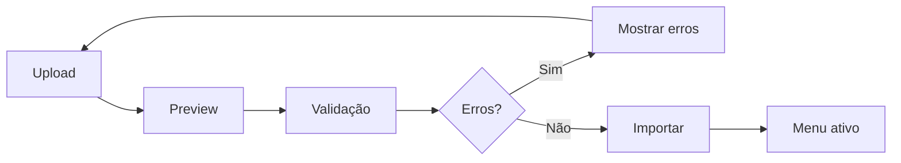
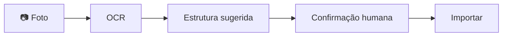
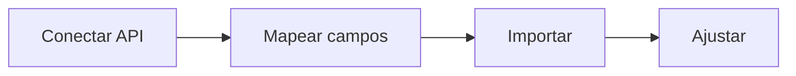
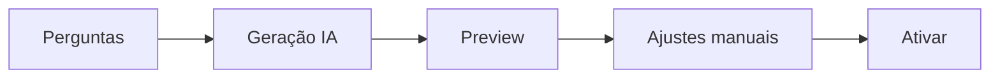
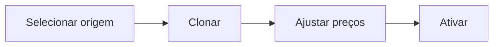

# Menu Creation Methods - ChefIApp

> **Princípio**: O restaurante não pode sofrer para começar.  
> Criar menu precisa ser rápido, tolerante a imperfeições e evolutivo.

---

## Overview

| Método | Velocidade | Complexidade | Target MVP |
|--------|-----------|--------------|------------|
| Manual | 🐢 Lento | ⭐ Baixa | ✅ Existe |
| CSV/Excel | ⚡ Rápido | ⭐⭐ Média | 🎯 MVP+ |
| OCR/Foto | ⚡⚡ Muito rápido | ⭐⭐⭐ Alta | 📋 Futuro |
| Integração Externa | ⚡ Rápido | ⭐⭐⭐⭐ Muito Alta | 📋 Futuro |
| IA Assistida | ⚡⚡ Muito rápido | ⭐⭐ Média | 🎯 MVP+ |
| Clone Menu | ⚡⚡ Muito rápido | ⭐ Baixa | 📋 Multi-Location |
| Importação QR/Web | ⚡ Rápido | ⭐⭐⭐ Alta | 📋 Complementar |

---

## 1. Criação Manual (Base atual)

**Status**: ✅ Implementado

| Aspecto | Valor |
|---------|-------|
| Superfície | Painel `/app/menu` |
| Velocidade | Lenta |
| Controle | Total |

**Serve para**:

- Restaurantes pequenos
- Ajustes finos
- Pós-importação

---

## 2. Importação por Arquivo (CSV/Excel)

**Status**: 🎯 Prioridade MVP+

### Campos típicos

```csv
Categoria,Produto,Preço,IVA,Ativo,Descrição
Bebidas,Coca-Cola 33cl,2.50,23,true,Lata gelada
Entradas,Azeitonas,3.00,23,true,Mistas temperadas
```

### Fluxo



### Vantagens

- ⚡ Muito rápido
- 📊 Familiar (Excel)
- ✏️ Fácil de corrigir
- 📈 Escala bem

### Superfície

- Painel → Cardápio → **Importar**

---

## 3. OCR / Foto do Cardápio

**Status**: 📋 Acelerador futuro

### Fluxo



### Limitações
>
> [!WARNING]
> Sempre exige confirmação humana - pode errar em cardápios manuscritos ou mal formatados.

---

## 4. Importação de Sistema Externo

**Status**: 📋 Estratégico (competitivo)

### Fluxo



### Integrações previstas

- LastApp
- Glovo
- Uber Eats
- TheFork

### Superfície

- **Integrações** (não Menu editor direto)

---

## 5. Menu Gerado por IA

**Status**: 🎯 Ideal para MVP+ / Onboarding

### Inputs

- Tipo de restaurante
- Nº de pratos
- Faixa de preço
- Estilo (tradicional, moderno, bar, etc.)

### Fluxo



### Vantagens

- 🎯 Reduz "página em branco"
- 🚀 Perfeito para primeiro dia
- 👶 Ajuda iniciantes

---

## 6. Clone de Menu Existente

**Status**: 📋 Multi-Location

### Casos de uso

- Franquias
- Redes
- Múltiplas localizações

### Fluxo



---

## 7. Importação via QR / Web Pública

**Status**: 📋 Complementar

> [!NOTE]
> Serve como referência/ajuda, nunca como fonte final.

---

## Regra de Ouro

```
┌─────────────────────────────────────────┐
│  Não importa como o menu NASCE.         │
│  Só importa onde ele é GOVERNADO.       │
│                                         │
│  O Painel é:                            │
│    • o editor                           │
│    • o validador                        │
│    • a fonte de verdade                 │
│                                         │
│  Outras superfícies:                    │
│    • consomem                           │
│    • executam                           │
│    • exibem                             │
└─────────────────────────────────────────┘
```

---

## Mapa de Superfícies

| Método | Superfície |
|--------|-----------|
| Manual | Painel `/app/menu` |
| CSV/Excel | Painel `/app/menu` |
| OCR/Foto | Painel `/app/menu` |
| Integração externa | Integrations |
| IA Assistida | Onboarding / Menu |
| Clone | Painel / Multi-Location |

---

## Próximos Passos

- [ ] Definir métodos MVP (Manual + CSV + IA?)
- [ ] Criar `MENU_IMPORT_CONTRACT.md` (CSV validations)
- [ ] Desenhar fluxo de onboarding com menu
- [ ] Ligar menu à disponibilidade por superfície (salão, delivery, QR)
