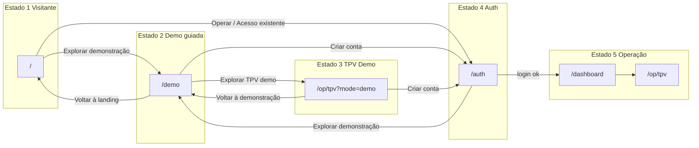

# Contrato de Navegação Operacional

## Lei do sistema

**Visitante nunca entra em `/op/*` sem `?mode=demo`. Demo passa sempre por `/demo`. TPV só é acessado com `?mode=demo` ou sessão válida. Landing nunca é fallback de erro.**

Este documento é contrato formal no Core. Referência: [CORE_CONTRACT_INDEX.md](./CORE_CONTRACT_INDEX.md). Agrega o mapa de estados do utilizador e as regras de transição que evitam teletransporte cognitivo. Subordinado a [LANDING_STATE_ROUTING_CONTRACT.md](./LANDING_STATE_ROUTING_CONTRACT.md) e [TRIAL_MODE_CONTRACT.md](./TRIAL_MODE_CONTRACT.md).

---

## 1. Modelo de 5 estados

### Estado 1 — Visitante (sem conta)

| Aspecto               | Especificação                                                                                                         |
| --------------------- | --------------------------------------------------------------------------------------------------------------------- |
| **Objetivo**          | Entender e decidir                                                                                                    |
| **Rota**              | `/`                                                                                                                   |
| **Botões permitidos** | Entrar em operação → `/auth`; Explorar demonstração → `/demo`; Fale no WhatsApp (externo); Acesso existente → `/auth` |
| **Proibido**          | Qualquer link direto para `/op/*` (sem `?mode=demo`)                                                                  |

---

### Estado 2 — Demonstração guiada

| Aspecto      | Especificação                                                                                                |
| ------------ | ------------------------------------------------------------------------------------------------------------ |
| **Objetivo** | Aprender o sistema                                                                                           |
| **Rota**     | `/demo`                                                                                                      |
| **Conteúdo** | Como funciona; o que é TPV, KDS, Dashboard; sem dados reais; sem escrita no Core                             |
| **Botões**   | Explorar TPV (demo) → `/op/tpv?mode=demo`; Criar conta e operar de verdade → `/auth`; Voltar à landing → `/` |

---

### Estado 3 — TPV Demo (contextualizado)

| Aspecto      | Especificação                                                              |
| ------------ | -------------------------------------------------------------------------- |
| **Objetivo** | Experimentar sabendo que é demo                                            |
| **Rota**     | `/op/tpv?mode=demo`                                                        |
| **Regras**   | Banner fixo "Modo Demonstração"; dados fake; nenhuma escrita no Core       |
| **Botões**   | Criar conta e operar de verdade → `/auth`; Voltar à demonstração → `/demo` |
| **Proibido** | "Voltar à landing" ou qualquer link direto para `/`                        |

---

### Estado 4 — Autenticação

| Aspecto                                 | Especificação                                                                          |
| --------------------------------------- | -------------------------------------------------------------------------------------- |
| **Objetivo**                            | Identidade e billing                                                                   |
| **Rota**                                | `/auth`                                                                                |
| **Após login**                          | Se sem restaurante → `/onboarding`; se com restaurante → `/dashboard`                  |
| **Quando não há registo (ex.: Docker)** | Oferta "Explorar demonstração" → `/demo` e "Voltar à landing" → `/` (hierarquia clara) |

---

### Estado 5 — Operação real

| Aspecto      | Especificação                                              |
| ------------ | ---------------------------------------------------------- |
| **Objetivo** | Trabalhar                                                  |
| **Rotas**    | `/dashboard`, `/op/tpv`, `/op/kds`                         |
| **Regra**    | Não existem links para demo nem landing no fluxo principal |

---

## 2. Regras de enforcement

1. **Visitante nunca em `/op/*`** exceto com `?mode=demo`.
2. **Demo sempre passa por `/demo`** — entrada em modo demo é sempre via "Explorar demonstração" → `/demo`.
3. **TPV acessível só com** `?mode=demo` (visitante) ou sessão válida (operacional).
4. **Landing nunca como fallback de erro** — nenhuma tela de erro ou "sem registo" deve usar `/` como único escape; oferecer "Explorar demonstração" → `/demo` quando aplicável.

---

## 3. Diagrama de estados

---

## 4. Referências

- [LANDING_STATE_ROUTING_CONTRACT.md](./LANDING_STATE_ROUTING_CONTRACT.md) — botões como portais de estado; três caminhos na landing
- [TRIAL_MODE_CONTRACT.md](./TRIAL_MODE_CONTRACT.md) — modo Trial; nunca Core; fluxo Trial → TPV trial → /trial-guide (nunca landing)
- [CANONICAL_ROUTES_BY_MODE.md](./CANONICAL_ROUTES_BY_MODE.md) — mapa rota → modo
- [SESSION_RESUME_CONTRACT.md](./SESSION_RESUME_CONTRACT.md) — retoma de sessão para "Já tenho acesso"

**Violação:** Visitante em `/op/*` sem `?mode=demo`; TPV demo com link "Voltar à landing"; landing como único fallback de erro — regressão arquitectural.
