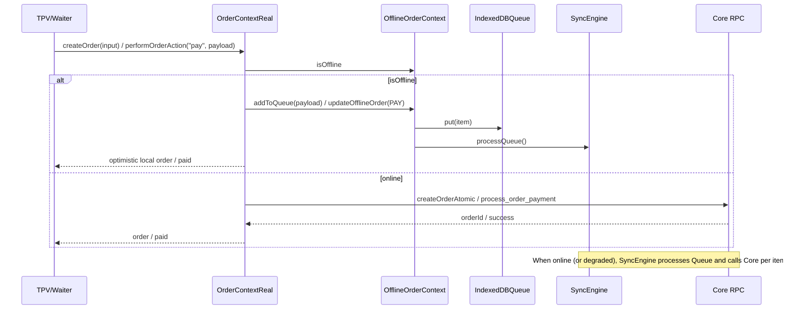

# Estratégia Offline e Fallback — ChefIApp

**Propósito:** Documento canónico que consolida a estratégia de **offline e fallback**: menu (B1), TPV (B2), KDS (B4) e [MENU_FALLBACK_CONTRACT](./MENU_FALLBACK_CONTRACT.md). Garante continuidade do fluxo quando o Core não responde, sem promover dados locais a Core.  
**Público:** Dev, arquitetura.  
**Referência:** [CORE_FINANCIAL_SOVEREIGNTY_CONTRACT](./CORE_FINANCIAL_SOVEREIGNTY_CONTRACT.md) · [OPERATIONAL_UI_RESILIENCE_CONTRACT](./OPERATIONAL_UI_RESILIENCE_CONTRACT.md)

---

## 1. Princípio

- **Core primeiro:** Toda leitura/escrita tenta o Core antes de qualquer fallback.
- **Fallback em falha de rede:** Quando o Core não responde (ex.: "Failed to fetch"), a UI pode usar dados locais (localStorage) ou estado degradado para não bloquear o utilizador.
- **Nunca promover local a Core:** Dados em fallback não são enviados ao Core sem fluxo explícito e autorizado (ex.: acção "Sincronizar" futura).
- **Nunca usar fallback se o Core responder:** Se o Core responder com sucesso, só os dados do Core são usados.

---

## 2. Consolidação por superfície (B1, B2, B4 + contrato)

### 2.1 Menu (B1 + MENU_FALLBACK_CONTRACT)

| Aspecto | Regra |
|---------|--------|
| **Leitura** | ProductReader / RestaurantReader tentam Core; em falha de rede leem `chefiapp_menu_pilot_{restaurantId}` (localStorage). |
| **Escrita** | MenuWriter tenta Core; em falha grava em `chefiapp_menu_pilot_{restaurantId}` e devolve sucesso sintético. |
| **Categorias** | Se readMenuCategories falhar, UI usa lista vazia (produto sem categoria). |
| **Promoção** | Nunca automática; sync explícito quando existir. |

Ref.: [MENU_FALLBACK_CONTRACT](./MENU_FALLBACK_CONTRACT.md), [docs/product/B1_MENU_CONTENCAO.md](../product/B1_MENU_CONTENCAO.md).

### 2.2 TPV (B2)

| Aspecto | Regra |
|---------|--------|
| **Entrada** | ErrorBoundary em /op/tpv com fallback neutro ("TPV temporariamente indisponível..."). |
| **Produtos** | Se fetch falhar: usar produtos B1 (localStorage) ou lista mínima fake; nunca "Failed to fetch". |
| **Criar pedido** | Se createOrder falhar: mensagem neutra ("Não foi possível registar o pedido. Tente novamente."); opcional em piloto guardar em localStorage. |
| **UX** | Zero stack, zero "Failed to fetch", zero RPC/URL visíveis. |

Ref.: [OPERATIONAL_UI_RESILIENCE_CONTRACT](./OPERATIONAL_UI_RESILIENCE_CONTRACT.md), [docs/product/B2_TPV_CONTENCAO.md](../product/B2_TPV_CONTENCAO.md).

### 2.3 KDS (B4)

| Aspecto | Regra |
|---------|--------|
| **Entrada** | ErrorBoundary em /op/kds com fallback neutro. |
| **Pedidos** | Se readActiveOrders falhar: lista vazia + "Sem pedidos por agora" ou 1 pedido mock em piloto. |
| **Guards** | restaurantId = runtime?.restaurant_id ?? DEFAULT_RESTAURANT_ID. |
| **Mensagens** | toUserMessage; nunca Docker/Supabase/stack. |

Ref.: [OPERATIONAL_UI_RESILIENCE_CONTRACT](./OPERATIONAL_UI_RESILIENCE_CONTRACT.md), [docs/product/B4_KDS_CONTENCAO.md](../product/B4_KDS_CONTENCAO.md).

---

## 3. Contratos formais resumidos

| Contrato | Uma linha |
|----------|-----------|
| **MENU_FALLBACK_CONTRACT** | UI tenta Core sempre primeiro; em erro de rede pode ler/escrever local; fallback nunca promovido a Core nem usado quando Core responde. |
| **OPERATIONAL_UI_RESILIENCE_CONTRACT** | /op/ com ErrorBoundary; mensagens neutras; nunca ecrã branco. |
| **PILOT_MODE_RUNTIME_CONTRACT** | Modo piloto: não escreve no Core; pode persistir em localStorage; invisível ao Core. |
| **ORDER_ORIGIN_CLASSIFICATION** | order_origin pilot \| real; Core pode filtrar/reportar. |

---

## 4. O que não fazemos (anti-padrões)

- Não promover dados de localStorage a Core sem fluxo explícito.
- Não usar fallback quando o Core responde com sucesso.
- Não mostrar mensagens técnicas (Failed to fetch, stack, RPC) ao utilizador.
- Não tratar falha crítica como aceitável para "não assustar"; ver [CORE_FAILURE_MODEL](./CORE_FAILURE_MODEL.md) e [EDGE_CASES](./EDGE_CASES.md).

---

## 5. Referências

- [CORE_OFFLINE_CONTRACT](./CORE_OFFLINE_CONTRACT.md) — Offline como contrato (fila, sync).
- [CORE_PRINT_CONTRACT](./CORE_PRINT_CONTRACT.md) — Impressão e falha.
- [EDGE_CASES.md](./EDGE_CASES.md) — Edge cases e modelo de falha consolidados.

---

## 6. Fila offline POS PWA (TPV / Waiter / KDS)

Fluxo consolidado: UI → OrderContext → Fila IndexedDB → SyncEngine → Core.

### 6.1 Diagrama do fluxo

### 6.2 Regras: fila vs chamada direta

| Condição | Comportamento |
|----------|----------------|
| **Online** (`connectivity === 'online'`) | Chamada direta ao Core (createOrderAtomic, process_order_payment, etc.). |
| **Offline** (`connectivity === 'offline'`) | Escrita enfileirada em IndexedDB (ORDER_CREATE, ORDER_PAY, ORDER_UPDATE, etc.); UI otimista. |
| **Degradado** (`connectivity === 'degraded'`) | SyncEngine continua a tentar processar a fila (heartbeat ao Core falhou mas navegador diz online). |

### 6.3 Conectividade (heartbeat)

- **Sinal rápido:** `navigator.onLine` (offline → não processar fila).
- **Heartbeat opcional ao Core:** `HEAD CORE_URL/rest/v1/` (configurável: `VITE_OFFLINE_HEARTBEAT_ENABLED`, intervalo, N falhas para considerar "degraded").
- **Estado composto:** `connectivity: 'online' | 'offline' | 'degraded'`; `isOffline` na UI = offline ou degradado quando se quer mostrar "Modo Offline".

### 6.4 Pagamento em modo offline

- **Permitido offline:** apenas método **dinheiro** (cash/manual). Cartão e PIX exigem rede.
- **Fluxo:** Utilizador confirma pagamento em dinheiro → `performOrderAction("pay", { method: "cash" })` → se `isOffline`, `updateOfflineOrder(orderId, 'PAY', { amountCents, method, restaurantId, cashRegisterId, ... })` → item ORDER_PAY na fila → quando online, SyncEngine chama `PaymentEngine.processPayment` com o payload.

### 6.5 Impressão em modo offline (spooler)

- **Store:** IndexedDB `chefiapp_print_queue` (jobs com id, type, orderId, restaurantId, payload, status: pending | sent | failed, createdAt, attempts, lastError).
- **Enfileirar:** Quando a UI pede "imprimir comanda" e `isOffline` é true → `PrintQueue.put(job)` com type `kitchen_ticket` e payload (snapshot do pedido para browser print); toast "Impressão em fila; será enviada quando a ligação voltar."
- **Enviar:** Quando a rede está disponível, o SyncEngine após processar a fila de pedidos chama `processPrintQueue()`: para cada job pendente, chama `request_print` (RPC Core); se status `sent` e type `kitchen_ticket`, aciona `FiscalPrinter.printKitchenTicket(payload)` (browser print).
- **Reprint:** "Reimprimir comanda" usa o mesmo fluxo: em offline adiciona novo job à fila.
- **Integração:** Core `request_print` (p_restaurant_id, p_type, p_order_id, p_payload); UI não chama gateway em offline.

---

*Documento vivo. Alterações em B1/B2/B4 ou em MENU_FALLBACK / OPERATIONAL_UI_RESILIENCE devem ser reflectidas aqui.*
