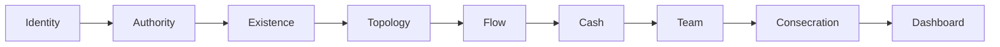
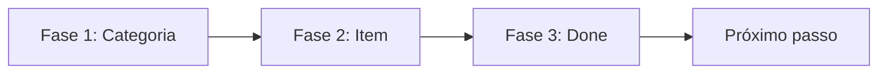
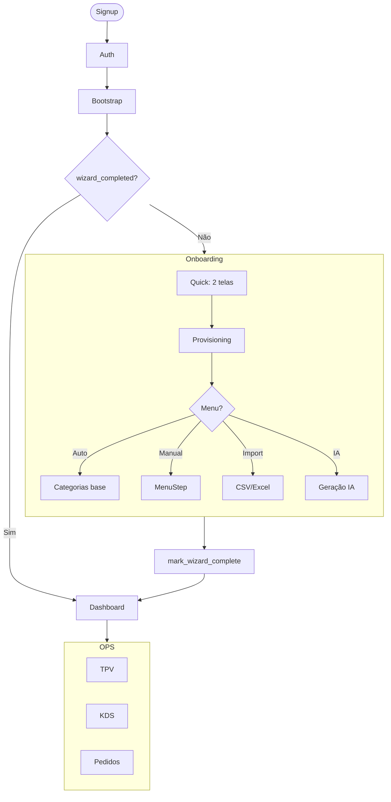

# Onboarding Flow — Arquitetura Completa

> **Princípio**: O restaurante precisa operar no primeiro dia.  
> Onboarding deve ser rápido, tolerante a imperfeições, e evolutivo.

---

## Overview dos Fluxos

| Fluxo | Telas | Tempo | Target |
|-------|-------|-------|--------|
| **Quick** | 2 | ~2min | ✅ MVP (produção) |
| **Full Wizard** | 8 | ~10min | Completo |
| **Skip** | 0 | instant | Dev/testes |

---

## 1. Fluxo Quick (MVP Atual)

**Arquivo**: `OnboardingQuick.tsx`

```mermaid
flowchart TD
    A[Login] --> B{wizard_completed_at?}
    B -->|Sim| D[Dashboard]
    B -->|Não| C[/app/onboarding]
    
    C --> S1[Tela 1: Nome + Tipo]
    S1 --> S2[Tela 2: Modelo Operação]
    S2 --> P[Provisionar]
    P --> D
    
    subgraph Provisioning
        P --> P1[Categorias Base]
        P --> P2[setup_status = quick_done]
    end
```

### Tela 1: Identidade

- Nome do restaurante
- Tipo: `Restaurante | Café | Bar | Food Truck | Lanchonete`

### Tela 2: Operação

- Modo: `Balcão | Mesas | Híbrido`

### Auto-provisioning

O sistema cria categorias base automaticamente:

| Tipo | Categorias |
|------|-----------|
| Restaurante | Entradas, Principais, Bebidas |
| Café | Cafés, Doces, Salgados |
| Bar | Cervejas, Drinks, Petiscos |
| Food Truck | Lanches, Porções, Bebidas |

---

## 2. Fluxo Full Wizard

**Arquivo**: `OnboardingWizard.tsx`



| # | Tela | Propósito |
|---|------|-----------|
| 1 | **Identity** | Localizar no Google Places |
| 2 | **Authority** | Quem manda? (Papel) |
| 3 | **Existence** | Prova de existência (Google Business) |
| 4 | **Topology** | Território físico (mesas, zonas) |
| 5 | **Flow** | Ritmo de operação |
| 6 | **Cash** | Cofre e câmbio |
| 7 | **Team** | Equipe |
| 8 | **Consecration** | O nascimento (ritual final) |

---

## 3. Menu Step (Setup Wizard)

**Arquivo**: `MenuStep.tsx`



### Fase 1: Criar Categoria

- Input: Nome (default: "Destaques")
- CTA único: "Criar categoria"

### Fase 2: Adicionar Item  

- Inputs: Nome, Preço
- CTA único: "Adicionar item"

### Fase 3: Done

- Opção secundária: "Adicionar mais"
- CTA primário: "Continuar"

---

## 4. Diagrama Completo do User Journey



---

## 5. Opções de Menu no Onboarding

### A. Auto-provisioning (atual)

- ✅ Já implementado
- Categorias base por tipo de negócio
- Sem produtos (só estrutura)

### B. Menu Step guiado (atual)

- ✅ Já implementado
- 1 categoria + 1 item
- Princípio "1 pergunta por ecrã"

### C. CSV/Excel Import (MVP+)

- 🎯 Próximo a implementar
- Upload → Preview → Validação → Import
- Ver [MENU_CREATION_METHODS.md](file:///Users/goldmonkey/Projetos/Apps-Proprios/chefiapp-pos-core/docs/architecture/MENU_CREATION_METHODS.md)

### D. IA Assistida (MVP+)

- 🎯 Altamente desejável
- Perguntas → Geração → Ajustes
- Reduz "página em branco"

---

## 6. Database Schema

**Tabela**: `gm_restaurants`

| Campo | Tipo | Propósito |
|-------|------|-----------|
| `wizard_completed_at` | TIMESTAMPTZ | Timestamp de conclusão |
| `setup_status` | ENUM | `not_started | in_progress | quick_done | completed` |
| `wizard_progress` | JSONB | Progresso por passo |

### Estrutura wizard_progress

```json
{
  "identity": { "completed": true, "data": {...} },
  "menu": { "completed": true, "data": { "items_count": 1 } },
  "payments": { "completed": false },
  "design": { "completed": true },
  "publish": { "completed": true }
}
```

---

## 7. Arquivos Relacionados

| Arquivo | Propósito |
|---------|-----------|
| [OnboardingQuick.tsx](file:///Users/goldmonkey/Projetos/Apps-Proprios/chefiapp-pos-core/merchant-portal/src/pages/Onboarding/OnboardingQuick.tsx) | MVP 2-telas |
| [OnboardingWizard.tsx](file:///Users/goldmonkey/Projetos/Apps-Proprios/chefiapp-pos-core/merchant-portal/src/pages/Onboarding/OnboardingWizard.tsx) | Wizard completo |
| [MenuStep.tsx](file:///Users/goldmonkey/Projetos/Apps-Proprios/chefiapp-pos-core/merchant-portal/src/pages/steps/MenuStep.tsx) | Step de menu |
| [BootstrapPage.tsx](file:///Users/goldmonkey/Projetos/Apps-Proprios/chefiapp-pos-core/merchant-portal/src/pages/BootstrapPage.tsx) | Gate de redireção |
| [wizardProgress.ts](file:///Users/goldmonkey/Projetos/Apps-Proprios/chefiapp-pos-core/merchant-portal/src/core/wizardProgress.ts) | Persistência |

---

## 8. Próximos Passos

- [ ] Implementar CSV Import no onboarding
- [ ] Adicionar opção IA Assistida
- [ ] Ligar menu à disponibilidade por superfície
- [ ] Criar tela de confirmação visual do menu
