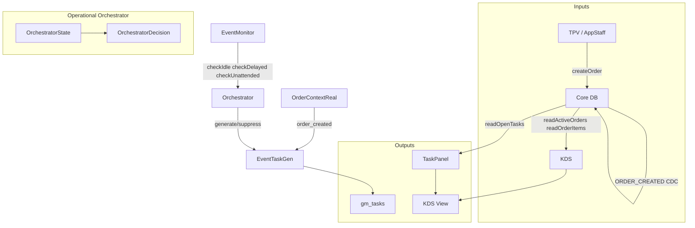

# Orchestrator — Eventos e Fluxo KDS–Tasks–Mesas

**Propósito:** Diagrama e descrição do fluxo entre TPV/KDS, Core, EventMonitor, Operational Orchestrator e gm_tasks.

**Referência:** [OPERATIONAL_ORCHESTRATOR_CONTRACT](../contracts/OPERATIONAL_ORCHESTRATOR_CONTRACT.md), [CONTRATO_DE_ATIVIDADE_OPERACIONAL](../contracts/CONTRATO_DE_ATIVIDADE_OPERACIONAL.md).

---

## 1. Fluxo geral

---

## 2. Eventos (input)

| Evento             | Fonte                                       | Dados                             |
| ------------------ | ------------------------------------------- | --------------------------------- |
| `order_created`    | OrderContextReal (após create_order_atomic) | orderId, orderNumber, tableNumber |
| `order_delayed`    | EventMonitor.checkDelayedOrders             | orderId, delayMinutes             |
| `table_unattended` | EventMonitor.checkUnattendedTables          | tableId, orderId                  |
| `restaurant_idle`  | EventMonitor.checkIdle                      | —                                 |
| `order_ready`      | markItemReady / status READY                | orderId, itemId                   |
| `order_closed`     | process_order_payment / status CLOSED       | orderId                           |

---

## 3. Tarefas geradas (output)

| Tipo tarefa      | Trigger          | Condição                                            |
| ---------------- | ---------------- | --------------------------------------------------- |
| PEDIDO_NOVO      | order_created    | sempre (via OrderContextReal)                       |
| MODO_INTERNO     | restaurant_idle  | activeOrders=0, idleMinutes>=X, Orchestrator generate |
| ATRASO_ITEM      | order_delayed    | item >120% prep_time                                |
| PEDIDO_ESQUECIDO | table_unattended | mesa ocupada, pedido OPEN/IN_PREP, tempo sem update |
| ENTREGA_PENDENTE | order_ready      | (futuro) pedido READY há N min sem entregar         |

**Suppress:** quando `activeOrders > 0`, o Orchestrator retorna `suppress` para `restaurant_idle` — não gera MODO_INTERNO.

---

## 4. KDS — Comportamento por estado

| Estado             | Comportamento                                                   |
| ------------------ | --------------------------------------------------------------- |
| Pedidos ativos     | Lista de pedidos + TaskPanel (tab Cozinha)                      |
| Sem pedidos (idle) | **Task Board Mode**: TaskPanel em destaque (quando tasks > 0)   |
| Sem pedidos, sem tarefas | TPVStateDisplay "Nenhum pedido ativo"                   |
| Transição          | `activeOrders===0` → priorizar TaskPanel; `activeOrders>0` → priorizar fila de pedidos |

---

## 5. Integração EventMonitor ↔ Orchestrator

O EventMonitor consulta o Orchestrator antes de gerar tarefa MODO_INTERNO:

1. `checkIdle` obtém estado: activeOrders, idleMinutes, shiftOpen
2. `operationalOrchestrator.decide(state, "restaurant_idle", { idleMinutesThreshold })`
3. Se `action === "suppress"` → return (não gera)
4. Se `action === "generate"` → idempotência + `eventTaskGenerator.generateFromEvent("restaurant_idle", ...)`

Para `order_delayed` e `table_unattended`, o Orchestrator retorna `allow` — o EventMonitor gera tarefas diretamente via `generateTaskFromEventIfNeeded`.
