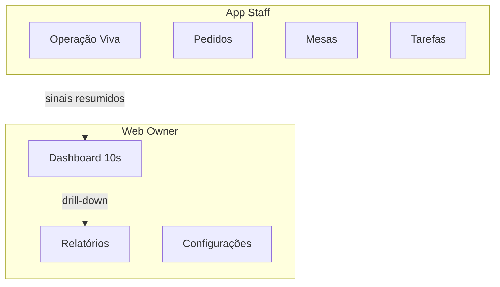

# Wireframe textual: Owner Command Center (`/owner/dashboard`)

**Status:** Contrato de wireframe  
**Rota:** `/owner/dashboard`  
**Objetivo:** Especificar, seção por seção, o que aparece na página, em que posição e com que função, para tradução direta em componentes React e CSS/Tailwind sem ambiguidades.

---

## Modelo de produto: 1 Cérebro · 2 Leituras

O Owner Dashboard de 10 segundos fica **entre** duas leituras do mesmo cérebro: Operação Viva (agora) e Relatórios (análise). Não são dois produtos; é um fluxo cognitivo.

- **Tempo 1 — Agora:** Operação Viva. Onde: App Staff (`/staff` ou equivalente), tablet/desktop, aberta o tempo todo. Tipo de informação: pedidos ativos, ritmo do turno, gargalos, stock crítico, alertas imediatos. Regra: “Se aparece aqui, alguém pode agir AGORA”. A tela vira **sinal**, não relatório.
- **Tempo 2 — Análise:** Relatórios / visão analítica. Onde: Web Owner, desktop, acesso calmo. Tipo de informação: comparações (hoje vs média), tendências, performance por canal/turno/dia, desvios, históricos. Regra: “Aqui não tem pressa. Tem clareza.” A tela mostra **padrão**, não caos.
- **Dashboard de 10 segundos:** fica **entre** os dois. Rota: `/owner/dashboard`. É o “resumo vivo” (mesmos dados de contexto que a operação, mas agregados e em leitura rápida) e a “porta para análise” (CTAs para `/admin/reports/*`). Não é Operação Viva nem tela de Relatório completo.

### Papel do Dashboard de 10 segundos

- **É:** resumo vivo (estado do dia, quatro eixos em números/listas curtas, feed de eventos recentes); porta para Relatórios (links “Ver detalhe” / “Relatório” por painel); resposta às perguntas de 10 segundos do dono (já descritas nas zonas abaixo).
- **NÃO é:** duplicação da Operação Viva (não mostrar fila de pedidos em tempo real como no Staff); nem tela de Relatório (sem gráficos longos, sem comparações hoje vs média, sem históricos pesados na mesma vista). Regra de ouro: *Uma tela viva (Staff) + relatórios analíticos (Web Owner). Conectados por sinais, não duplicados por UI.*

**Aviso (evitar o erro Last.app):** Não construir uma tela única que misture tempo real + histórico + alerta + gráfico longo na mesma vista. Isso gera confusão, fadiga cognitiva e abandono.

### Sinais vs porta para análise (mapeamento no wireframe)

- **Resumo vivo (sinais):** tudo o que neste wireframe é “número grande”, “lista curta”, “estado do dia”, “feed de eventos” — dados de agora ou do dia, agregados. Origem conceptual: os mesmos domínios que a Operação Viva (vendas, turno, pessoas, alertas), mas em formato resumo para leitura em 10 segundos. No documento, corresponde às Zonas 1–3 (conteúdo principal de cada bloco).
- **Porta para análise:** os CTAs “Ver detalhe” / “Relatório” nos quatro painéis (e, se aplicável, em itens do feed) que navegam para `/admin/reports/*`. O dashboard não mostra a análise; só indica que existe e permite ir para lá.

**Estrutura de navegação Owner:** Dashboard ≠ Relatórios. `/owner/dashboard` = resumo vivo (10 segundos). Relatórios (Financeiro, Operação, Pessoas, Risco) = profundidade, sob `/admin/reports/*` ou futuro `/owner/reports/*` conforme decisão de rotas. Configurações = conforme já existente no projeto.

### Modos e superfícies

Contrato de modos cognitivos: [COGNITIVE_MODES_OWNER_DASHBOARD.md](./COGNITIVE_MODES_OWNER_DASHBOARD.md).

- **Experiência Web (referência deste wireframe):** densa, observatório. O layout e as zonas descritas abaixo aplicam-se à página `/owner/dashboard` na Web — home do dono, ponto de entrada estratégico, com mais comparações, histórico e drill-down (CTAs para relatórios).
- **Experiência App:** variante da mesma função (resumo vivo + porta para análise), com regras de design distintas: cards maiores, menos texto, mais estado (ok / atenção / risco), menos números absolutos. No app o Owner Dashboard não é a home; é acedido via "Visão do Dono" / toggle / PIN. As regras detalhadas estão no contrato de modos cognitivos.

---

## 1. Zonas principais do layout

A página `/owner/dashboard` (Owner Command Center) divide-se em **três zonas** dispostas de cima para baixo (ou, em layouts largos, Zona 3 pode ocupar lateral direita).

| Zona | Nome | Posição | Função |
|------|------|---------|--------|
| **Zona 1** | Header de estado | Topo, full-width | Identidade do restaurante, estado geral do dia e mini-métricas de contexto. Resposta imediata: “onde estou e como está o dia?”. |
| **Zona 2** | Grelha principal | Centro, abaixo do header | Quatro painéis em grelha 2×2, um por eixo de poder (Dinheiro agora, Motor da operação, Pessoas & disciplina, Risco & tendência). Resposta às “perguntas de 10 segundos” do dono. |
| **Zona 3** | Feed de eventos | Rodapé full-width ou coluna direita (desktop) | Lista de eventos em tempo real (críticos e contextuais). Resposta: “o que acabou de acontecer e o que exige ação?”. |

**Ordem de leitura sugerida:** Zona 1 → Zona 2 (esquerda→direita, cima→baixo) → Zona 3.

---

## 2. Zona 1 — Header de estado

### 2.1. Elementos e ordem (da esquerda para a direita)

1. **Logo do restaurante** — Imagem ou placeholder (ex.: iniciais). Clique opcional para voltar ao hub do dono ou refrescar contexto.
2. **Identidade**
   - **Nome do restaurante** (texto principal, destaque).
   - **Cidade** (ou localização principal), texto secundário, por baixo ou ao lado do nome.
3. **Separador visual** (opcional: linha vertical ou espaço).
4. **Data e hora atuais** — Formato curto (ex.: “5 fev 2026, 14:32”). Atualização em tempo real (ex.: cada minuto).
5. **Estado do dia** — Um único rótulo de estado geral:
   - **Excelente** — Verde (semáforo).
   - **Estável** — Amarelo/âmbar.
   - **Em risco** — Vermelho.
   O rótulo é texto curto + indicador de cor (badge ou borda), sem múltiplos estados ao mesmo tempo.
6. **Mini-métricas** (opcional, à direita do estado):
   - Número muito curto (ex.: “Vendas hoje”, “Turno”, “Alertas”). Apenas 1–3 valores para não poluir. Cada um com etiqueta curta e número.

### 2.2. Apresentação do estado geral

- **Excelente:** fundo ou borda verde suave, texto “Excelente” (ou equivalente).
- **Estável:** fundo ou borda âmbar, texto “Estável”.
- **Em risco:** fundo ou borda vermelha suave, texto “Em risco”.
- Uma única cor de estado domina o bloco do “Estado do dia”; o resto do header permanece neutro (evitar repetir verde/amarelo/vermelho em vários sítios).

### 2.3. Comportamento

- Header fixo no topo (sticky) em scroll, se o layout for longo.
- Sem dropdowns ou menus dentro do header; ações de navegação ficam na barra de navegação global ou em CTAs da Zona 2/3.

---

## 3. Zona 2 — Grelha 2×2 de painéis

Cada célula da grelha é um **painel** correspondente a um eixo. Layout: 2 colunas × 2 linhas (em mobile pode empilhar em 1 coluna).

### 3.1. Painel 1 — Dinheiro agora

- **Nome:** “Dinheiro agora”.
- **Ícone:** Moeda ou caixa (ex.: ícone de dinheiro/cash).
- **Subtítulo:** Uma frase curta, ex.: “Vendas, caixa e liquidez do dia”.
- **Blocos internos (de cima para baixo):**
  1. **Número grande:** Valor principal (ex.: “Vendas hoje” ou “Caixa atual”). Uma única métrica dominante.
  2. **Linha ou lista curta:** 2–3 itens (ex.: “Faturado hoje”, “Em caixa”, “A receber”). Cada item: etiqueta + valor.
  3. **Mini-gráfico (opcional):** Barras ou linha das últimas horas do dia (ex.: vendas por hora).
- **Pergunta de 10 segundos que responde:** “Quanto entrou e quanto tenho disponível agora?”

### 3.2. Painel 2 — Motor da operação

- **Nome:** “Motor da operação”.
- **Ícone:** Engrenagem ou “play” operacional (ex.: ícone de operação/turno).
- **Subtítulo:** Ex.: “Turno, TPV, KDS e fila”.
- **Blocos internos:**
  1. **Estado do turno:** Texto curto (ex.: “Turno aberto desde 12:00” ou “Turno fechado”) + indicador de cor se aplicável.
  2. **Lista curta:** 2–3 estados (ex.: “TPV ativo”, “KDS ativo”, “Pedidos em fila: N”). Apenas texto ou mini-badges.
  3. **Mini-gráfico ou contador (opcional):** Pedidos na última hora ou fila ao longo do tempo.
- **Pergunta de 10 segundos:** “A operação está a correr? Turno e filas sob controlo?”

### 3.3. Painel 3 — Pessoas & disciplina

- **Nome:** “Pessoas & disciplina”.
- **Ícone:** Pessoas ou equipa.
- **Subtítulo:** Ex.: “Equipa presente e tarefas em dia”.
- **Blocos internos:**
  1. **Número grande ou resumo:** Ex.: “5 presentes” ou “3 turnos ativos”.
  2. **Lista curta:** Nomes ou funções (ex.: “João (sala)”, “Maria (cozinha)”) ou “Tarefas em atraso: 0”.
  3. **Mini-lista ou badge:** Alertas de disciplina (atrasos, faltas) se houver; caso contrário, mensagem neutra (“Tudo em ordem”).
- **Pergunta de 10 segundos:** “Quem está e está tudo em ordem com pessoas e tarefas?”

### 3.4. Painel 4 — Risco & tendência

- **Nome:** “Risco & tendência”.
- **Ícone:** Gráfico de tendência ou alerta (ex.: tendência/risk).
- **Subtítulo:** Ex.: “Alertas e tendência do dia”.
- **Blocos internos:**
  1. **Contador ou estado:** Ex.: “0 alertas críticos” ou “2 avisos”. Cor por severidade (verde/amarelo/vermelho) apenas aqui dentro do painel.
  2. **Lista curta:** Últimos 2–3 alertas ou tendências (ex.: “Stock baixo: Azeite”, “Vendas acima da média”).
  3. **Mini-gráfico (opcional):** Tendência (ex.: comparação com dia anterior ou meta).
- **Pergunta de 10 segundos:** “Há algo a exigir atenção ou a mudar em relação ao esperado?”

### 3.5. Regras comuns da grelha

- Cada painel pode ter um **CTA secundário** (ex.: “Ver detalhe”) que leva ao drill-down (ex.: `/admin/reports/*` ou páginas de configuração), nunca como ação principal do dono no dashboard.
- Tamanhos de fonte: título do painel > subtítulo > blocos internos. Número grande visível à distância.
- Espaçamento consistente entre painéis; bordas ou sombra ligeira para delimitar cada célula.

---

## 4. Zona 3 — Feed de eventos

Contrato de eventos (tipos, severidade, onde aparece): [EVENTS_CONTRACT_V1.md](./EVENTS_CONTRACT_V1.md).

### 4.1. Formato de cada entrada

Cada entrada do feed contém, da esquerda para a direita (ou em coluna em mobile):

1. **Ícone** — Tipo de evento (venda, alerta, turno, pessoa, sistema). Tamanho pequeno, cor opcional por tipo/severidade.
2. **Mensagem** — Texto curto (1–2 linhas), ex.: “Venda concluída — Mesa 3”, “Alerta: stock baixo — Azeite”.
3. **Timestamp** — Relativo preferido (ex.: “há 2 min”) com tooltip ou sufixo com hora absoluta se necessário.
4. **CTA opcional** — Botão ou link apenas quando fizer sentido (ex.: “Ver”, “Resolver”). Muitas entradas sem CTA.

### 4.2. Ordenação e limites

- **Ordenação:** Cronológica inversa (mais recente no topo). Em versões futuras, opção de ordenar por severidade (críticos primeiro) mantendo timestamp como desempate.
- **Quantidade visível:** 5–10 entradas sem scroll; com scroll, limite de carregamento (ex.: 20–30). “Carregar mais” ou scroll infinito opcional.
- **Filtros (opcionais):** Por tipo (vendas, alertas, pessoas) ou por severidade, em controlos discretos acima ou ao lado do feed.

### 4.3. Comportamento

- Atualização em tempo real (WebSocket ou polling) sem recarregar a página.
- Novos eventos aparecem no topo; animação ligeira (ex.: fade-in) para não distrair em excesso.
- Se o feed estiver numa coluna direita em desktop, altura fixa com scroll interno.

---

## 5. Hierarquia visual e prioridades

### 5.1. Ordem de leitura (o que chama atenção primeiro)

1. **Estado do dia** (Zona 1) — Único elemento com cor de semáforo no header; primeiro que o dono deve ver.
2. **Nome do restaurante e data/hora** (Zona 1) — Contexto imediato.
3. **Painel “Dinheiro agora”** (Zona 2) — Normalmente primeiro da grelha (cima-esquerda); número grande domina.
4. **Painel “Em risco”** (Zona 2) — Se houver indicador de problema (ex.: badge “Em risco” ou alertas), este painel pode ter destaque visual ligeiro (borda ou ícone).
5. **Resto dos painéis** (Zona 2) — Leitura natural esquerda→direita, cima→baixo.
6. **Feed de eventos** (Zona 3) — Secundário; consulta quando o dono quer detalhe temporal ou ações pendentes.

### 5.2. O que fica mais discreto

- Mini-métricas do header (se existirem): fonte menor, cor neutra.
- Subtítulos dos painéis: peso de fonte menor que o título do painel.
- Timestamps do feed: cor secundária, tamanho pequeno.
- CTAs “Ver detalhe” nos painéis: estilo secundário (link ou botão outline), não competir com o conteúdo principal.

### 5.3. Uso de cores de estado (verde / amarelo / vermelho)

- **Um único ponto de “estado geral” com cor:** o badge/bloco “Estado do dia” no header. Verde = Excelente, Amarelo = Estável, Vermelho = Em risco.
- **Dentro dos painéis:** cores apenas onde acrescentam informação (ex.: “0 alertas” em verde; “2 avisos” em amarelo; “1 crítico” em vermelho no painel Risco & tendência). Evitar repetir as três cores em todos os painéis.
- **Feed:** ícone ou borda esquerda por severidade/tipo (ex.: vermelho para crítico, amarelo para aviso, cinza para informativo). Texto da mensagem em preto/cinza escuro.
- **Regra:** não usar mais de 2–3 elementos coloridos (verde/amarelo/vermelho) por viewport; o resto neutro.

---

## 6. Relação com rotas e páginas existentes

### 6.1. Papel de `/owner/dashboard`

- **Substitui** a visão mental de “Financeiro overview” como primeira vista do dono: o dono entra no Command Center e vê estado geral + quatro eixos + feed, não uma página só de finanças.
- `/owner/dashboard` é a **página principal do dono** após login (ou após escolha do contexto “Owner” quando houver múltiplos perfis). Não é uma página de relatórios; é uma página de estado e comando.

### 6.2. Relação com `/admin/reports/*`

- **Drill-down apenas:** os relatórios em `/admin/reports/*` (overview, sales, staff, operations, human-performance) são acedidos quando o dono (ou admin) quer **detalhe** a partir do dashboard.
- Exemplos de ligação:
  - Painel “Dinheiro agora” → CTA “Ver detalhe” ou “Relatório” → `/admin/reports/overview` ou `/admin/reports/sales`.
  - Painel “Motor da operação” → `/admin/reports/operations`.
  - Painel “Pessoas & disciplina” → `/admin/reports/staff` ou `/admin/reports/human-performance`.
  - Painel “Risco & tendência” → `/admin/reports/overview` ou página de alertas.
- **Navegação:** o dashboard não duplica o conteúdo dos reportes; mostra resumos e indicadores. O utilizador navega para `/admin/reports/*` apenas quando precisa de análise ou exportação.

### 6.3. Resumo

- **`/owner/dashboard`** = visão de comando (estado + quatro eixos + feed).
- **`/admin/reports/*`** = drill-down de relatórios e análise.
- Implementação: links ou botões “Ver detalhe” / “Relatório” nos painéis da Zona 2 e, se aplicável, em itens do feed (Zona 3), usando `navigate('/admin/reports/...')` ou equivalentes.

---

*Documento pronto para implementação em React e Tailwind: cada seção corresponde a componentes e blocos de layout sem ambiguidade de posição ou função.*
