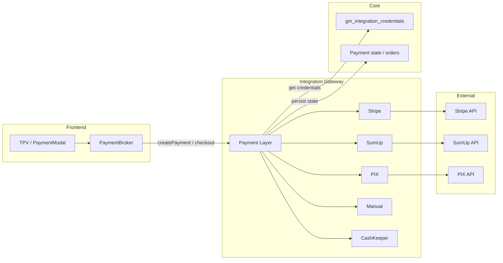

# Payment Layer — Arquitetura

Módulo de pagamento com **interface unificada** e **providers plugáveis** (Stripe, SumUp, PIX, Manual, CashKeeper). O sistema escolhe o provider por método/região e, na evolução, por `restaurant_id` (credenciais por restaurante).

Contrato superior: [CORE_BILLING_AND_PAYMENTS_CONTRACT.md](./CORE_BILLING_AND_PAYMENTS_CONTRACT.md). Posicionamento jurídico: [PAYMENT_AND_POSITIONING.md](../legal/PAYMENT_AND_POSITIONING.md).

---

## 1. Fluxo de alto nível



- **Frontend:** TPV/PaymentModal chama [PaymentBroker](merchant-portal/src/core/payment/PaymentBroker.ts) (createPaymentIntent, createPixCheckout, createSumUpCheckout, etc.).
- **Gateway:** Expõe rotas `/api/v1/payment/*` e `/api/v1/sumup/*`; internamente o Payment Layer escolhe o provider e delega. Obtém credenciais do Core por `restaurant_id` (evolução) e persiste estado no Core.
- **Core:** Fonte de verdade de credenciais (`gm_integration_credentials`) e de estado de pagamento/pedidos. Não processa cartão.

---

## 2. Interface do Payment Layer (contrato)

Cada provider implementa a mesma interface. O gateway regista os providers e escolhe por método (e região/restaurant_id).

```ts
// payment-layer/interface.ts (esboço no gateway)

export interface CreatePaymentParams {
  orderId: string;
  restaurantId: string;
  amount: number;
  currency: string;
  method: "stripe" | "sumup" | "pix" | "manual" | "cashkeeper";
  metadata?: Record<string, string>;
}

export interface CreatePaymentResult {
  provider: string;
  id: string;
  status: string;
  clientSecret?: string;
  url?: string;
  checkoutId?: string;
  raw?: unknown;
}

export interface ConfirmPaymentResult {
  id: string;
  status: "succeeded" | "pending" | "failed" | "canceled";
  raw?: unknown;
}

export interface PaymentProvider {
  readonly name: string;
  createPayment(params: CreatePaymentParams): Promise<CreatePaymentResult>;
  confirmPayment(id: string, params?: { restaurantId: string }): Promise<ConfirmPaymentResult>;
  cancelPayment(id: string, params?: { restaurantId: string }): Promise<void>;
  refundPayment(id: string, amount?: number, params?: { restaurantId: string }): Promise<void>;
}
```

- **createPayment:** Cria intenção/checkout no gateway externo (ou regista “manual”). Retorna id, status e, conforme o caso, clientSecret (Stripe) ou url (SumUp).
- **confirmPayment:** Consulta estado ou confirma (idempotente). Para Manual, apenas persiste “pago”.
- **cancelPayment:** Cancela o checkout/intenção.
- **refundPayment:** Reembolso total ou parcial (quando o provider suportar).

---

## 3. Providers e estado actual vs desejado

| Provider   | Estado actual | Evolução |
|------------|----------------|----------|
| **Stripe** | PaymentBroker chama Core RPC `stripe-payment`; chave plataforma no Core/env. | Core/gateway obtêm chave por `restaurant_id` de `gm_integration_credentials`; gateway ou Core cria PaymentIntent na conta do restaurante. |
| **SumUp**  | PaymentBroker → gateway POST `/api/v1/sumup/checkout`; `SUMUP_ACCESS_TOKEN` no env do gateway. | Gateway recebe `restaurant_id`, busca token SumUp do Core e cria checkout na conta do restaurante. |
| **PIX**    | PaymentBroker → gateway POST `/api/v1/payment/pix/checkout` (SumUp/PIX). | Credencial PIX por restaurante quando houver multi-tenant PIX. |
| **Manual** | Não existe como provider explícito. | Novo adapter: apenas regista “marcado como pago” pelo operador; sem chamada externa. |
| **CashKeeper** | Não existe. | Novo adapter: chamada por IP/API ao dispositivo; envia valor esperado e recebe confirmação de inserção de dinheiro físico. |

---

## 4. Onde vive o Payment Layer

- **Recomendação:** Camada no **integration-gateway** (Node). O gateway já expõe rotas de payment (Stripe billing, SumUp checkout, PIX checkout); o Payment Layer unifica a lógica em cima da interface e delega para adapters.
- **Core:** Usado para (1) ler credenciais por `restaurant_id` (RPC que desencripta `gm_integration_credentials`), (2) persistir estado de pagamento/pedido. O Core não implementa adapters de gateway; permanece fonte de verdade de dados e credenciais.

Fluxo resumido:

1. Frontend chama PaymentBroker (createPaymentIntent / createPixCheckout / createSumUpCheckout).
2. PaymentBroker chama gateway (e, para Stripe, hoje também Core RPC).
3. Gateway (Payment Layer) escolhe o provider, obtém credenciais do Core por `restaurant_id` (quando implementado), chama o adapter (Stripe/SumUp/PIX/Manual/CashKeeper) e persiste estado no Core.
4. Webhooks (Stripe/SumUp/PIX) chegam ao gateway; validados, atualizam estado no Core e notificam o sistema (eventos/Webhooks OUT).

---

## 5. Mapeamento do código actual para a interface

| Operação | Código actual | Equivalente na interface |
|----------|----------------|---------------------------|
| Criar PaymentIntent (cartão) | PaymentBroker.createPaymentIntent → Core RPC `stripe-payment` | PaymentProvider (Stripe).createPayment |
| Criar checkout PIX | PaymentBroker.createPixCheckout → GET gateway `/api/v1/payment/pix/checkout` | PaymentProvider (PIX).createPayment |
| Obter estado PIX | PaymentBroker.getPixCheckoutStatus → GET gateway `/api/v1/payment/sumup/checkout/:id` | PaymentProvider (PIX).confirmPayment ou getStatus |
| Criar checkout SumUp | PaymentBroker.createSumUpCheckout → POST gateway `/api/v1/sumup/checkout` | PaymentProvider (SumUp).createPayment |
| Obter estado SumUp | PaymentBroker.getSumUpCheckoutStatus → GET gateway `/api/v1/sumup/checkout/:id` | PaymentProvider (SumUp).confirmPayment ou getStatus |
| Marcar como pago (manual) | Hoje: UI marca sem provider explícito | PaymentProvider (Manual).confirmPayment |

Ficheiros principais:

- [merchant-portal/src/core/payment/PaymentBroker.ts](merchant-portal/src/core/payment/PaymentBroker.ts) — cliente do Payment Layer (chama gateway e Core).
- [server/integration-gateway.ts](server/integration-gateway.ts) — rotas `/api/v1/payment/*`, `/api/v1/sumup/*`; hoje usa env (STRIPE_SECRET_KEY, SUMUP_ACCESS_TOKEN). Evolução: delegar para Payment Layer e obter credenciais do Core por `restaurant_id`.

---

## 6. Esboço de estrutura no gateway (opcional)

Estrutura sugerida para o módulo Payment Layer no integration-gateway:

```
server/
  integration-gateway.ts          # Rotas; chama payment-layer
  payment-layer/
    index.ts                      # Regista providers; resolve por método/região
    interface.ts                  # CreatePaymentParams, CreatePaymentResult, PaymentProvider
    providers/
      stripe.ts                   # Adapter Stripe (PaymentIntent)
      sumup.ts                    # Adapter SumUp (checkout EUR)
      pix.ts                      # Adapter PIX (checkout via SumUp ou outro)
      manual.ts                   # Adapter Manual (apenas persiste estado)
      cashkeeper.ts               # Adapter CashKeeper (API/IP dispositivo)
```

O `index.ts` exporta um service que recebe método + restaurant_id (e parâmetros de criação), escolhe o provider, obtém credenciais do Core (quando aplicável) e chama o adapter correspondente.

---

## 7. Referências

- [CORE_BILLING_AND_PAYMENTS_CONTRACT.md](./CORE_BILLING_AND_PAYMENTS_CONTRACT.md) — Billing SaaS vs billing restaurante; o que o Core pode/não pode fazer.
- [PAYMENT_AND_POSITIONING.md](../legal/PAYMENT_AND_POSITIONING.md) — Posicionamento jurídico e técnico.
- [PAYMENT_CREDENTIALS_AND_WEBHOOKS.md](../security/PAYMENT_CREDENTIALS_AND_WEBHOOKS.md) — Segurança de credenciais e webhooks; separação SaaS vs transação.
