# Diagrama de Rotas e Boot — Modelo GloriaFood / LastApp

**Propósito:** Mapa mental dos 3 mundos + 5 boot modes. Referência visual para a arquitetura de rotas.

**Contratos:** [APPLICATION_BOOT_CONTRACT.md](./APPLICATION_BOOT_CONTRACT.md), [CORE_CONTRACT_INDEX.md](./CORE_CONTRACT_INDEX.md) secção 0d2.

---

## Fluxo geral (3 mundos, 1 sistema)

```
[ PÚBLICO ] → [ AUTH ] → [ PORTAL DE GESTÃO ] → [ OPERAÇÃO ]
```

Cada mundo tem rotas próprias, boot próprio, contratos próprios; não invade o outro.

---

## Diagrama de rotas (Mermaid)

```mermaid
flowchart LR
  subgraph public [PUBLIC]
    P1["/"]
    P2["/pricing"]
    P3["/features"]
    P4["/demo"]
    P5["/login"]
    P6["/signup"]
  end
  subgraph auth [AUTH]
    A1["/login"]
    A2["/signup"]
    A3["/forgot-password"]
  end
  subgraph management [PORTAL GESTÃO]
    M1["/app/dashboard"]
    M2["/app/restaurant"]
    M3["/app/location"]
    M4["/app/menu"]
  end
  subgraph operational [OPERAÇÃO]
    O1["/op/tpv"]
    O2["/op/kds"]
    O3["/op/cash"]
    O4["/op/staff"]
  end
  public --> auth
  auth --> management
  management --> operational
```



Boot: PUBLIC e AUTH não inicializam Core; MANAGEMENT e OPERATIONAL sim; OPERATIONAL tem gates (published/operational).

---

## Boot modes (resumo)

| Modo           | Bloqueia? | Inicializa Core? |
|----------------|-----------|------------------|
| PUBLIC         | Não       | Não              |
| AUTH           | Não       | Não              |
| MANAGEMENT     | Não       | Sim              |
| OPERATIONAL    | Sim (gates) | Sim            |
| STAFF_MOBILE   | Sim       | Sim              |

---

## Referências

- [APPLICATION_BOOT_CONTRACT.md](./APPLICATION_BOOT_CONTRACT.md) — definição dos 5 modos.
- [CORE_CONTRACT_INDEX.md](./CORE_CONTRACT_INDEX.md) — secção 0d2 (Arquitetura de rotas GloriaFood/LastApp).
- Para mapa por modo (Demo / Piloto / Operacional): [CANONICAL_ROUTES_BY_MODE.md](./CANONICAL_ROUTES_BY_MODE.md).
