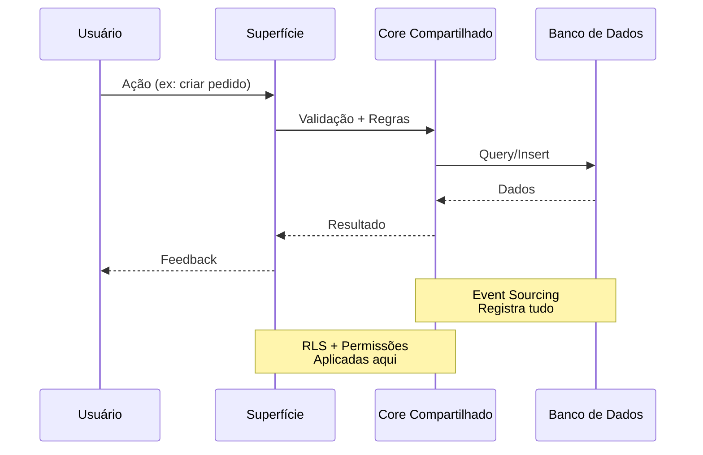
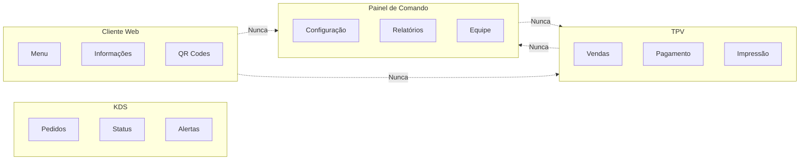

# Arquitetura de Superfícies do ChefIApp

> **ChefIApp POS Core — Sistema Operacional de Restaurante Distribuído**

**Versão:** 1.0 | **Data:** 2026-01-30 | **Status:** Documentação Master

---

## Visão Geral

O ChefIApp não é um único app. É um **ecossistema de superfícies especializadas**, todas governadas por um único **núcleo soberano**.

Cada tipo de usuário = uma superfície própria  
Cada superfície = responsabilidades limitadas

Esta arquitetura é inspirada no modelo do LastApp, onde diferentes "apps" servem diferentes propósitos, mas todos compartilham a mesma base de dados e regras de negócio.

---

## O Core Compartilhado (Invisível ao Usuário)

Antes das superfícies, existe o **Core** — o cérebro do sistema que nunca é UI.

### Componentes do Core

- **Auth (Supabase / IAM)**: Autenticação e autorização
- **Tenant / Restaurant**: Isolamento multi-tenant
- **Kernel**: Regras, eventos, estado operacional
- **Banco de Dados**: Fonte única da verdade
- **Regras Fiscais**: Compliance e auditoria
- **Produtos, Preços, Impostos**: Catálogo centralizado
- **Permissões (RLS)**: Segurança em nível de linha
- **Logs e Auditoria**: Rastreabilidade completa
- **Event Sourcing**: Histórico imutável de eventos

### Localização no Código

- `core-engine/`: Motor de eventos e regras
- `event-log/`: Log de eventos
- `merchant-portal/src/core/`: Contextos e hooks compartilhados
- `supabase/`: Banco de dados e funções

### Regra Fundamental

> **O Core nunca é UI. Ele só existe para servir as superfícies.**

---

## As 8 Superfícies do ChefIApp

### 1️⃣ Painel de Comando (Backoffice / Admin)

**📍 URL:** `chefIApp.com/app`

**👥 Quem usa:**
- Dono do restaurante
- Gerente
- Administrativo

**✅ O que DEVE estar aqui:**

- Configuração do restaurante (nome, endereço, horários)
- Produtos / cardápio (criação, edição, categorias)
- Preços, impostos, categorias
- Funcionários e permissões
- Relatórios e analytics
- Financeiro (resumo, não operação)
- Configuração do site (web presence)
- Configuração do TPV
- Configuração de delivery
- Branding e temas
- Logs de sistema
- Status do sistema

**❌ O que NÃO deve estar aqui:**

- Vendas diretas
- Receber pagamento
- Operar caixa
- Impressão
- Ações em tempo real de operação

**📌 Filosofia:** Painel de comando é cérebro, não mãos.

**🔗 Rotas principais:**
- `/app/dashboard` - Centro de comando
- `/app/menu` - Gerenciamento de cardápio
- `/app/settings` - Configurações
- `/app/team` - Gestão de funcionários
- `/app/web` - Configuração de web presence
- `/app/reports` - Relatórios

**📁 Localização atual:** `merchant-portal/src/pages/` (parcialmente)

---

### 2️⃣ TPV (Caixa / Point of Sale)

**📍 App:** Instalado (Windows / macOS) — *Atualmente web, migração futura para Electron/Tauri*

**👥 Quem usa:**
- Caixa
- Operador de vendas

**✅ O que DEVE estar aqui:**

- Criar pedidos
- Adicionar itens ao pedido
- Cobrar pagamentos
- Imprimir recibos fiscais
- Controlar gaveta de dinheiro
- Modo offline-first
- Reenvio automático quando online
- Performance máxima (zero lag)

**❌ O que NÃO deve estar aqui:**

- Configurações profundas
- Relatórios complexos
- Gestão de funcionários
- Branding
- Site

**📌 Filosofia:** TPV é instrumento cirúrgico.

**🔗 Rotas principais:**
- `/app/tpv` - Interface principal do TPV

**📁 Localização atual:** `merchant-portal/src/pages/TPV/`

**⚠️ Nota importante:** Atualmente roda como web app, mas a arquitetura ideal é um app instalado (Electron ou Tauri) para ter acesso direto a:
- Impressoras térmicas
- Gaveta de dinheiro
- Drivers USB/Serial
- Sistema operacional

---

### 3️⃣ KDS (Kitchen Display System)

**📍 App:** Dedicado (Tablet / TV / Browser locked)

**👥 Quem usa:**
- Cozinha
- Bar
- Preparação

**✅ O que DEVE estar aqui:**

- Pedidos em tempo real
- Status (novo / preparando / pronto)
- Alertas visuais
- Sons de notificação
- Simplicidade brutal
- Atualização automática

**❌ O que NÃO deve estar aqui:**

- Preços
- Pagamentos
- Relatórios
- Configuração

**📌 Filosofia:** KDS é radar, não cockpit.

**🔗 Rotas principais:**
- `/app/kds` - Visão gerencial (dentro do backoffice)
- `/kds/:restaurantId` - Standalone (para TV/tablet)

**📁 Localização atual:** `merchant-portal/src/pages/TPV/KDS/`

**💡 Características:**
- Interface otimizada para telas grandes
- Sem UI chrome (sem navegação, sem menus)
- Fullscreen por padrão
- Auto-refresh contínuo

---

### 4️⃣ AppStaff (Funcionários Mobile)

**📍 App:** Android / iOS (ou PWA)

**👥 Quem usa:**
- Garçons
- Staff operacional

**✅ O que DEVE estar aqui:**

- Ver mesas ativas
- Ver pedidos por mesa
- Atualizar status de pedidos
- Check-in / check-out de turno
- Notificações de chamadas
- Tarefas operacionais
- Ver perfil próprio

**❌ O que NÃO deve estar aqui:**

- Configuração do restaurante
- Pagamento
- Financeiro
- Administração
- Relatórios

**📌 Filosofia:** AppStaff é ferramenta de campo, não escritório.

**🔗 Rotas principais:**
- `/app/staff` - Interface web (gerencial)
- `/join` - Entrada via código de convite

**📁 Localização atual:** 
- `merchant-portal/src/pages/AppStaff/`
- `appstaff-core/`

**💡 Características:**
- Interface mobile-first
- Funciona offline (sincroniza depois)
- Código de acesso rápido (CHEF-XXXX-XX)

---

### 5️⃣ Cliente Web Pública

**📍 URL:** `menu.chefiapp.com/{restaurante}` ou domínio customizado

**👥 Quem usa:**
- Cliente final
- Visitantes do restaurante

**✅ O que DEVE estar aqui:**

- Menu público completo
- Informações do restaurante
- Horários de funcionamento
- Localização e contato
- QR codes para mesas
- Pedidos online (futuro)
- Integração com delivery

**❌ O que NUNCA deve aparecer:**

- Custos internos
- Estoque
- Funcionários
- Dados administrativos
- Preços de custo
- Margens

**📌 Filosofia:** Cliente vê vitrine, não bastidor.

**🔗 Rotas principais:**
- `/public/{slug}` - Página principal
- `/public/{slug}/menu` - Cardápio completo

**📁 Localização atual:** 
- `merchant-portal/src/pages/Public/`
- `merchant-portal/src/pages/Web/`

**🎨 Sub-opções (3 tipos):**

#### A. Página Simples (Automática)
- Gerada automaticamente
- Nome, horários, WhatsApp
- Link para menu
- Zero configuração

#### B. Página com Menu / QR (Operacional)
- Menu completo com produtos
- QR Code para mesas
- Visualização de preços
- URL tipo: `restaurant.chefiapp.com/menu`
- Usa dados do TPV

#### C. Site Completo (Branding)
- Homepage profissional
- Página Sobre
- Menu completo
- Contato e delivery
- Templates personalizáveis
- SEO otimizado

---

### 6️⃣ QR de Mesa

**📍 URL:** `/public/{slug}/mesa/{n}` ou `/mesa/{n}`

**👥 Quem usa:**
- Cliente na mesa

**✅ O que DEVE estar aqui:**

- Ver menu por mesa
- Pedir itens (futuro)
- Chamar garçom
- Pedir conta
- Ver status do pedido

**📌 Filosofia:** QR de mesa é atalho contextual.

**🔗 Rotas principais:**
- `/public/{slug}/mesa/{n}` - Menu específico da mesa

**📁 Localização atual:** Parte de `/public/*`

**💡 Características:**
- Cada mesa tem QR único
- Contexto automático (sabe qual mesa)
- Interface ultra-simples
- Mobile-first

---

### 7️⃣ Delivery (Integrações)

**📍 Componentes:** Adapters e proxies

**👥 Quem usa:**
- Sistema (automático)

**✅ O que DEVE fazer:**

- Receber pedidos externos (iFood, Glovo, UberEats)
- Normalizar dados (formato único)
- Injetar no sistema (KDS, TPV)
- Sincronizar status
- Nunca controla o sistema

**❌ O que NÃO deve fazer:**

- Modificar configurações
- Acessar dados sensíveis
- Controlar operação
- Bypassar regras do sistema

**📌 Filosofia:** Delivery só injeta, não controla.

**📁 Localização atual:**
- `server/integrations/`
- `merchant-portal/src/integrations/`

**💡 Integrações suportadas:**
- Glovo
- UberEats
- iFood (futuro)
- Delivery próprio (futuro)

---

### 8️⃣ Módulos Futuros

**📋 Previsões (não implementados ainda):**

- **Loyalty / Pontos**: Programa de fidelidade
- **CRM**: Gestão de relacionamento com clientes
- **Marketing**: Campanhas e promoções
- **Reservas**: Sistema de reservas de mesa
- **Analytics Avançado**: Business intelligence
- **Multi-local**: Gestão de múltiplos restaurantes
- **Franquias**: Gestão de rede

**📌 Filosofia:** Cada módulo futuro será uma superfície própria ou extensão de superfície existente.

---

## Diagrama de Arquitetura

### Visão Geral do Ecossistema

```mermaid
graph TB
    Core[Core Compartilhado<br/>Auth, Tenant, Kernel, DB, Rules]
    
    Backoffice[1. Painel de Comando<br/>/app/*]
    TPV[2. TPV<br/>App Instalado]
    KDS[3. KDS<br/>/kds/:id]
    Staff[4. AppStaff<br/>Mobile]
    Public[5. Cliente Web<br/>/public/*]
    QR[6. QR Mesa<br/>/mesa/:n]
    Delivery[7. Delivery<br/>Integrações]
    Future[8. Módulos Futuros<br/>Loyalty, CRM, etc]
    
    Core --> Backoffice
    Core --> TPV
    Core --> KDS
    Core --> Staff
    Core --> Public
    Core --> QR
    Delivery --> Core
    Future -.-> Core
    
    style Core fill:#1a1a1a,stroke:#fff,stroke-width:3px
    style Backoffice fill:#2d2d2d,stroke:#4a9eff
    style TPV fill:#2d2d2d,stroke:#4a9eff
    style KDS fill:#2d2d2d,stroke:#4a9eff
    style Staff fill:#2d2d2d,stroke:#4a9eff
    style Public fill:#2d2d2d,stroke:#4a9eff
    style QR fill:#2d2d2d,stroke:#4a9eff
    style Delivery fill:#2d2d2d,stroke:#ff6b6b
    style Future fill:#2d2d2d,stroke:#999,stroke-dasharray: 5 5
```

### Fluxo de Dados

### Separação de Responsabilidades

---

## Regras de Separação

### 1. TPV ≠ Backoffice

**TPV é operação, Backoffice é gestão.**

- TPV não deve ter configurações complexas
- Backoffice não deve ter vendas diretas
- Cada um tem seu propósito específico

### 2. Cliente ≠ Admin

**Cliente nunca vê dados internos.**

- Cliente nunca vê custos
- Cliente nunca vê estoque
- Cliente nunca vê funcionários
- Cliente nunca vê margens

### 3. KDS ≠ TPV

**KDS é visualização, TPV é transação.**

- KDS não tem preços
- KDS não tem pagamentos
- TPV não tem alertas de cozinha
- Cada um serve um papel diferente

### 4. Delivery ≠ Sistema

**Delivery só injeta, não controla.**

- Delivery não modifica configurações
- Delivery não acessa dados sensíveis
- Delivery não bypassa regras
- Delivery é um adaptador, não um controlador

### 5. Cada Superfície = Responsabilidades Limitadas

**Princípio de responsabilidade única aplicado a superfícies.**

- Uma superfície não faz o trabalho de outra
- Se algo não cabe em uma superfície, cria-se uma nova
- Evita "super-apps" confusos

---

## Decisões Arquiteturais

### Por que separar TPV do Backoffice?

**Problema:** Misturar gestão com operação cria:
- Interface confusa
- Performance ruim
- Risco de erro operacional
- Dificuldade de escalar

**Solução:** Separar completamente:
- TPV focado em velocidade e confiabilidade
- Backoffice focado em configuração e análise
- Cada um otimizado para seu propósito

### Por que Cliente Web é separado?

**Problema:** Mostrar dados internos para clientes:
- Violação de privacidade
- Confusão do cliente
- Risco de segurança
- Performance ruim (dados desnecessários)

**Solução:** Cliente Web é read-only e isolado:
- Só vê o que precisa ver
- Zero acesso a dados administrativos
- Performance otimizada
- Segurança por design

### Por que KDS é standalone?

**Problema:** KDS dentro do backoffice:
- Requer login complexo
- Interface não otimizada para TV
- Depende de navegação
- Não funciona bem em fullscreen

**Solução:** KDS standalone:
- Acesso via token simples
- Interface otimizada para TV
- Fullscreen nativo
- Auto-refresh contínuo

### Por que Delivery é adaptador?

**Problema:** Integrações controlarem o sistema:
- Risco de segurança
- Dificuldade de manutenção
- Dependências externas
- Falta de controle

**Solução:** Delivery como adaptador:
- Recebe pedidos externos
- Normaliza para formato interno
- Injeta no sistema
- Nunca controla nada

---

## Princípios Fundamentais

1. **Separação de Responsabilidades**: Cada superfície tem um propósito claro
2. **Core Invisível**: O Core nunca é UI, só serve as superfícies
3. **Isolamento por Design**: Superfícies não se comunicam diretamente
4. **Segurança por Padrão**: Cada superfície tem permissões mínimas necessárias
5. **Performance Específica**: Cada superfície é otimizada para seu uso
6. **Escalabilidade Independente**: Superfícies podem escalar separadamente

---

## Referências

- [ARCHITECTURE_OVERVIEW.md](./ARCHITECTURE_OVERVIEW.md) - Visão geral do sistema
- [SURFACES_CURRENT_STATE.md](./SURFACES_CURRENT_STATE.md) - Estado atual vs ideal
- [ROUTE_MANIFEST.md](../canon/ROUTE_MANIFEST.md) - Registro de rotas

---

**Última atualização:** 2026-01-30  
**Mantido por:** Equipe de Arquitetura ChefIApp
