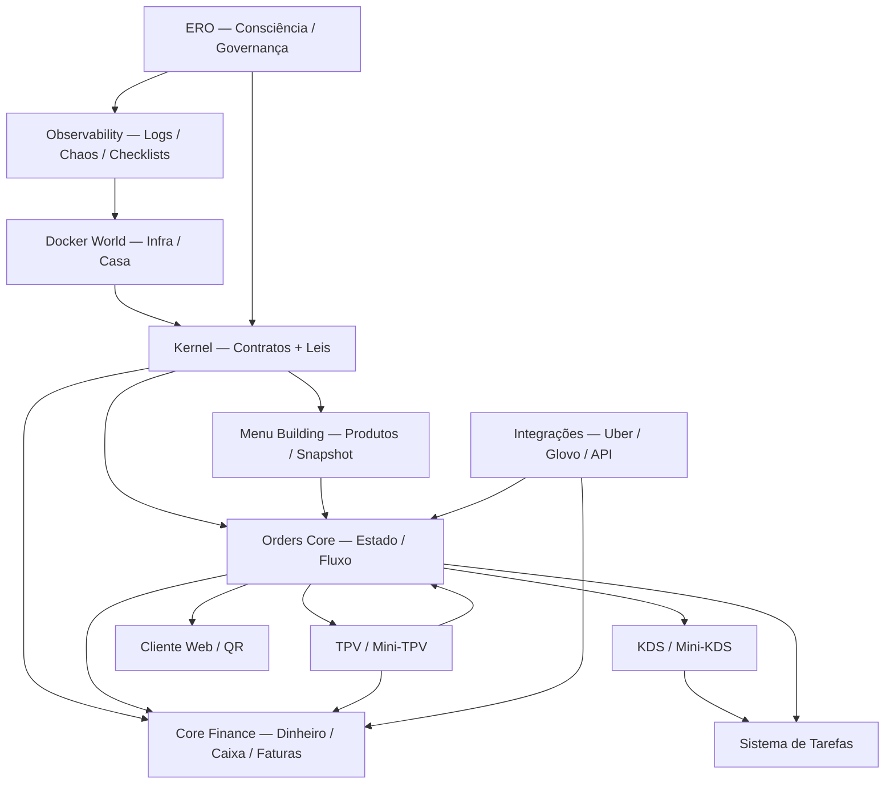
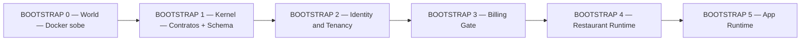
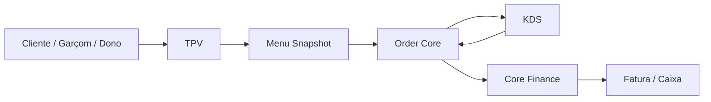
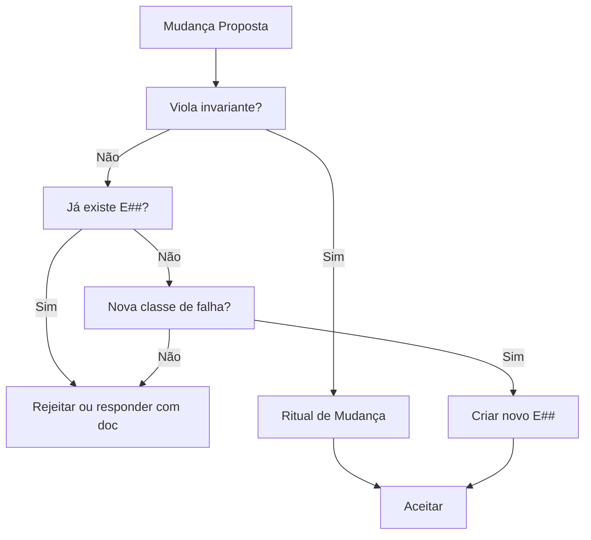
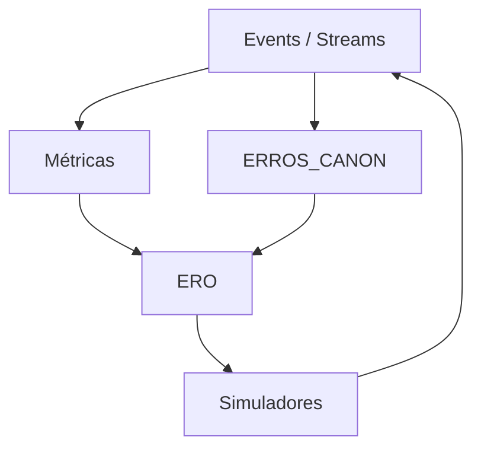

# Diagrama Canónico — ChefIApp OS (World → Kernel → Runtime)

Fonte de verdade visual: mapa mental e arquitectura técnica em Mermaid. Legível por humanos, versionável em Git, renderiza no GitHub e Cursor.

---

## 1. Diagrama macro — O Mundo Vivo (visão de cima)

---

## 2. Diagrama de bootstraps — Como o mundo nasce (ordem exacta)

**Lei:** Se um bootstrap falha, o mundo não sobe.

Referência: [docs/boot/BOOTSTRAP_CANON.md](../boot/BOOTSTRAP_CANON.md).

---

## 3. Diagrama funcional — Pedido do mundo real até o dinheiro

**Leis explícitas no fluxo:**

- Pedido ≠ Dinheiro
- Served ≠ Paid
- Menu congela snapshot
- Só RPC muda estado

Referências: [ORDER_STATUS_CONTRACT_v1](../contracts/ORDER_STATUS_CONTRACT_v1.md), [CORE_FINANCE_CONTRACT_v1](../contracts/CORE_FINANCE_CONTRACT_v1.md), [MENU_BUILDING_CONTRACT_v1](../contracts/MENU_BUILDING_CONTRACT_v1.md).

---

## 4. Diagrama de governança — Quem protege o sistema

Referência: [ERROS_CANON.md — Quando uma pergunta nova é válida ou ruído](../strategy/ERROS_CANON.md#quando-uma-pergunta-nova-é-válida-ou-ruído).

---

## 5. Diagrama cognitivo — Sistema vivo (nível futuro)

Aqui nasce o sistema cognitivo: o sistema começa a entender a si mesmo. Depende de EVENTS_MINIMAL v1 e métricas canónicas (próximos passos).

Referências: [EVENTS_AND_STREAMS.md](../contracts/EVENTS_AND_STREAMS.md), [ERROS_CANON.md](../strategy/ERROS_CANON.md).

---

## Referências

- [docs/boot/BOOTSTRAP_CANON.md](../boot/BOOTSTRAP_CANON.md) — Bootstraps 0–5.
- [docs/ERO_CANON.md](../ERO_CANON.md) — Hierarquia de verdade, consciência do sistema.
- [docs/strategy/LEI_EXISTENCIAL_CHEFIAPP_OS.md](../strategy/LEI_EXISTENCIAL_CHEFIAPP_OS.md) — Lei existencial, zonas intocáveis, ritual de mudança.
- [docs/strategy/ERROS_CANON.md](../strategy/ERROS_CANON.md) — Catálogo de falhas inevitáveis, filtro de perguntas novas.
- [docs/contracts/ORDER_STATUS_CONTRACT_v1.md](../contracts/ORDER_STATUS_CONTRACT_v1.md) — Estados de pedido.
- [docs/contracts/CORE_FINANCE_CONTRACT_v1.md](../contracts/CORE_FINANCE_CONTRACT_v1.md) — Dinheiro, caixa, faturas.
- [docs/contracts/MENU_BUILDING_CONTRACT_v1.md](../contracts/MENU_BUILDING_CONTRACT_v1.md) — Menu, snapshot.
- [docs/contracts/EVENTS_AND_STREAMS.md](../contracts/EVENTS_AND_STREAMS.md) — Contrato de eventos.
