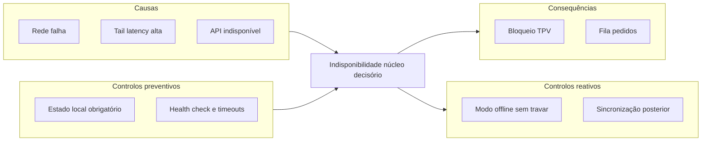
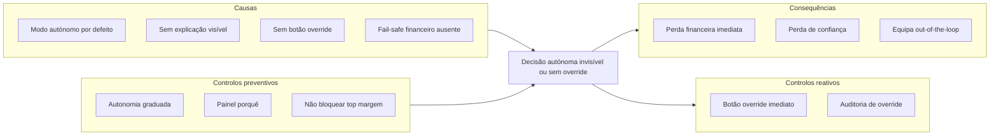

# Risk Register + Bowtie — POS Autónomo (ChefIApp)

**Data:** 2026-02  
**Propósito:** Formalizar os dois riscos principais do POS autónomo (latência e autoridade cognitiva), com diagramas Bowtie, critérios de aceitação e protocolos de teste. Documento canónico para riscos operacionais de autonomia; complementa [THREAT_MODEL.md](../architecture/THREAT_MODEL.md) (ameaças de segurança).

**Referências:** [CORE_OVERRIDE_AND_AUTHORITY_CONTRACT.md](../architecture/CORE_OVERRIDE_AND_AUTHORITY_CONTRACT.md) · [MUTATION_TESTING_QUICKSTART.md](./MUTATION_TESTING_QUICKSTART.md) · [PERFORMANCE_P2_FLUXO_CRITICO.md](./PERFORMANCE_P2_FLUXO_CRITICO.md) · [OBSERVABILITY_MINIMA](../strategy/OBSERVABILITY_MINIMA.md)

---

## 1. Risk Register

| Campo | Risco 1 (Latência) | Risco 2 (Autoridade cognitiva) |
|-------|--------------------|----------------------------------|
| **ID** | R1 | R2 |
| **Nome** | Falha por dependência de latência/rede | Decisão autónoma invisível ou sem override |
| **Descrição** | Núcleo decisório depende de API/cloud; rede falha implica perda de "inteligência" ou bloqueio operacional. | Sistema bloqueia/sugere sem explicar nem permitir override rápido; perda de confiança e controle. |
| **Causas (resumo)** | Rede instável, tail latency, cloud como única fonte de verdade. | Modo autónomo sem graduação, sem painel de "porquê", sem botão de override. |
| **Consequências** | Pedidos em fila, caixa bloqueada, experiência degradada. | Perda financeira imediata, equipa não percebe, gerente perde controle. |
| **Controlos preventivos** | Estado local obrigatório (mesa, cozinha, fila); cloud = sincronização. | Autonomia graduada (Observador → Assistente → Autónomo); toda decisão com explicação; fail-safe financeiro. |
| **Controlos reativos** | Modo offline sem travar; sincronização ao reconectar. | Override imediato; painel de decisões; auditoria de override. |
| **Dono** | Core / Infra | Product / Core (override contract) |

### Risco secundário (opcional)

| Campo | Risco R3 |
|-------|----------|
| **ID** | R3 |
| **Nome** | Automação reduz prática humana para recuperação (out-of-the-loop) |
| **Descrição** | Uso prolongado de modos autónomos reduz a prática do operador em tarefas manuais; quando a automação falha, a recuperação é mais lenta ou errática. |
| **Controlos** | Manter modos manuais sempre disponíveis; treino periódico; desenho de autonomia supervisionada (não totalmente autónoma). |

---

## 2. Bowtie — Risco R1 (Latência)

Evento central: **Núcleo decisório indisponível ou latência inaceitável**.

- **Causas:** rede falha, tail latency alta, API indisponível.
- **Preventivo:** estado local obrigatório (mesa, cozinha, fila); health check e timeouts.
- **Reativo:** modo offline sem travar; sincronização ao reconectar.
- **Consequências:** bloqueio TPV, fila de pedidos.

---

## 3. Bowtie — Risco R2 (Autoridade cognitiva)

Evento central: **Decisão autónoma invisível ou sem override**.

- **Causas:** modo autónomo por defeito, sem explicação, sem override, fail-safe financeiro ausente.
- **Preventivo:** autonomia graduada, painel "porquê", regra de não bloquear top produtos/margem.
- **Reativo:** botão override, auditoria de override.
- **Consequências:** perda financeira, perda de confiança, equipa out-of-the-loop.

---

## 4. Acceptance thresholds (critérios de aceitação)

| Risco | Métrica | Threshold | Como medir |
|-------|---------|-----------|------------|
| R1 | Latência p95 (input-to-response local) | &lt; 150 ms (ou valor definido) | Instrumentação / métricas Core; ver [OBSERVABILITY_MINIMA](../strategy/OBSERVABILITY_MINIMA.md) |
| R1 | Disponibilidade do núcleo local (offline) | 100% das funções críticas operam sem rede | Testes E2E com rede cortada |
| R1 | Perda de pedidos em modo offline | 0 | Contrato + testes de sync |
| R2 | Override disponível em &lt; N segundos | Ex.: &lt; 5 s (1 tap) | UX / contrato [CORE_OVERRIDE_AND_AUTHORITY_CONTRACT](../architecture/CORE_OVERRIDE_AND_AUTHORITY_CONTRACT.md) |
| R2 | Toda decisão de bloqueio tem explicação visível | 100% | Checklist de UI + contrato |
| R2 | Fail-safe: nunca bloquear top 3 margem se ocupação &lt; X% | Regra documentada e testada | Regras de negócio + testes |

Thresholds numéricos (ex.: 150 ms) devem ser alinhados com [PERFORMANCE_P2_FLUXO_CRITICO.md](./PERFORMANCE_P2_FLUXO_CRITICO.md) quando existir definição formal.

---

## 5. Test protocols (protocolos de teste)

### R1 — Latência e offline

- **Contrato:** Estado mínimo local (mesa, cozinha, fila) definido em contrato; API de health e timeout documentadas.
- **Testes:**
  1. **E2E com rede desligada:** TPV e KDS continuam a funcionar dentro do âmbito definido (captura de pedidos, marcação de itens, fila local).
  2. **Latência:** Mock de API com atraso &gt; threshold; verificar que UI não bloqueia ou que fallback local é ativado.
  3. **Mutation:** Mutar condição "offline" ou "timeout" e verificar que testes E2E falham quando esperado (sensibilidade do suite).

Referência: [MUTATION_TESTING_QUICKSTART.md](./MUTATION_TESTING_QUICKSTART.md); fluxo crítico em testes E2E existentes.

### R2 — Autoridade e override

- **Contrato:** [CORE_OVERRIDE_AND_AUTHORITY_CONTRACT.md](../architecture/CORE_OVERRIDE_AND_AUTHORITY_CONTRACT.md); toda ação de bloqueio/sugestão com explicação e override (quando aplicável) exposta pelo Core.
- **Testes:**
  1. **Contrato:** Endpoints ou estados que expõem "motivo de bloqueio" e "override" cobertos por testes de contrato (ex.: CORE_CONTRACT_INDEX).
  2. **E2E:** Fluxo em que o sistema bloqueia; verificar presença de explicação e botão de override; executar override e verificar efeito.
  3. **Mutation:** Mutar lógica de "explicação" ou "override disponível" e verificar que testes falham.

Referência: [CORE_OVERRIDE_AND_AUTHORITY_CONTRACT.md](../architecture/CORE_OVERRIDE_AND_AUTHORITY_CONTRACT.md) · [CORE_CONTRACT_INDEX.md](../architecture/CORE_CONTRACT_INDEX.md).

---

## 6. Manutenção e donos

- **Quando atualizar:** Novas capacidades autónomas, novos modos (Observador/Assistente/Autónomo), mudança de SLO ou de regras de fail-safe financeiro.
- **Dono sugerido:** Engenharia (Core/Infra) + Produto (regras de autonomia e override).
- **Evitar duplicação:** Riscos de segurança (ameaças, ativos) permanecem em [THREAT_MODEL.md](../architecture/THREAT_MODEL.md); níveis de autoridade e override em [CORE_OVERRIDE_AND_AUTHORITY_CONTRACT.md](../architecture/CORE_OVERRIDE_AND_AUTHORITY_CONTRACT.md). Este documento foca riscos **operacionais** do POS autónomo (latência e autoridade cognitiva).
