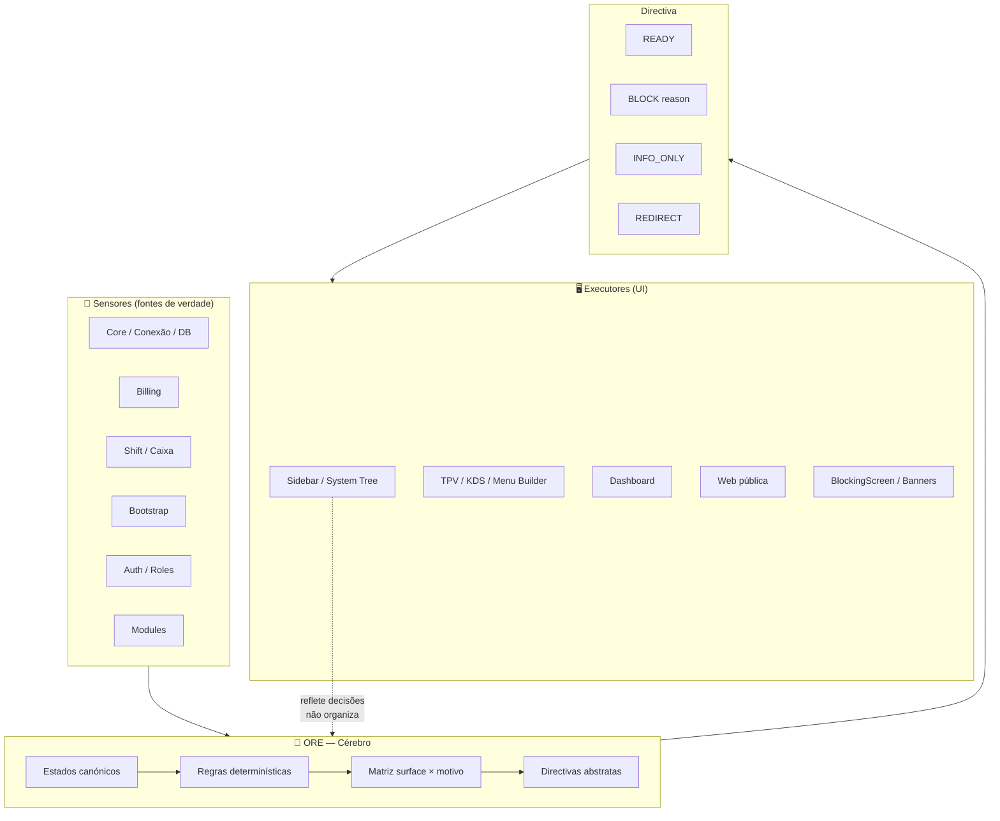

# System Tree anotado — Sensores → ORE → UI

Mapa mental do ORE em relação ao sidebar (System Tree). Material de onboarding e anti-regressão arquitetónica.

**Referência:** [OPERATIONAL_READINESS_ENGINE.md](OPERATIONAL_READINESS_ENGINE.md) — secção 10 (ORE e o Sidebar).

---

## Legenda

| Símbolo | Significado                                                                                          |
| ------- | ---------------------------------------------------------------------------------------------------- |
| 🔵      | **Sensor** — fonte de verdade; alimenta estado; não decide impacto.                                  |
| 🧠      | **ORE (cérebro)** — única autoridade que decide READY / BLOCK / INFO_ONLY / REDIRECT.                |
| 🖥️      | **Executor (UI)** — sidebar, páginas, BlockingScreen; obedece à uiDirective; nunca decide prontidão. |

---

## Diagrama

---

## Fluxo em uma frase

**Sensores** alimentam estado → **ORE** decide uma directiva → **UI** executa (mostrar, bloquear, informar, redireccionar). Sem atalhos. Sem excepções. Sem gates paralelos.

---

## O que o ORE NÃO é

- Gestor de módulos
- Orquestrador técnico
- Controller de UI
- Router
- Billing engine
- Shift engine

## O que o ORE É

- Autoridade semântica única
- Juiz soberano da operação
- Fonte final do "pode / não pode / como reagir"

---

## Referências

- **ORE (cérebro):** [OPERATIONAL_READINESS_ENGINE.md](OPERATIONAL_READINESS_ENGINE.md)
- **Manual (execução):** [OPERATIONAL_READINESS_MANUAL.md](OPERATIONAL_READINESS_MANUAL.md)
- **Bootstrap:** [README.md](README.md)
