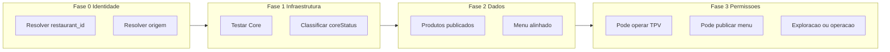
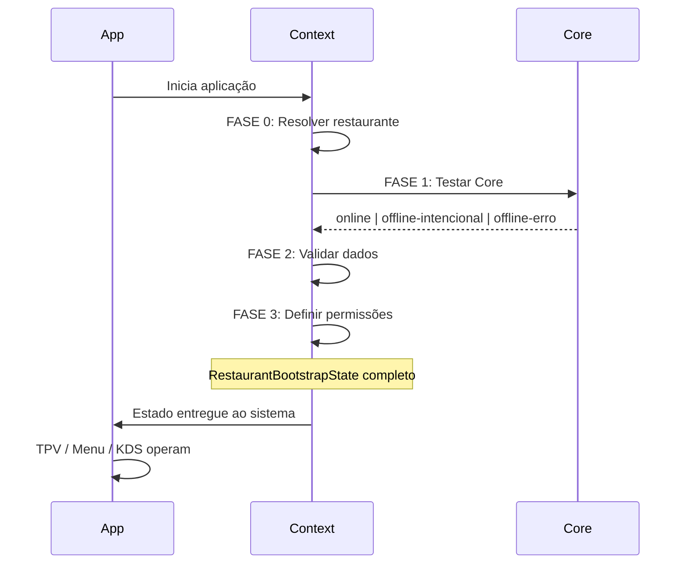

# Contrato de Bootstrap Soberano do Restaurante

**Origen da verdade.** Nada visual pode existir na UI sem estar explicado, decidido e documentado neste contrato.

---

## 1. Verdade central

Nada pode aparecer na UI que não esteja explicado, decidido e documentado no **Bootstrap State** do restaurante.

Se aparece:

- banner
- aviso
- botão
- fallback
- modo local
- "usar dados de exemplo"

então tem de existir no BOOTSTRAP como estado explícito, com **causa**, **efeito** e **transição**.

---

## 2. Estado canónico: RestaurantBootstrapState

O objeto que governa toda a UI:

```ts
type RestaurantBootstrapState = {
  coreStatus: "online" | "offline-intencional" | "offline-erro";
  dataSource: "core" | "local" | "exemplo";
  publishStatus: "nao-publicado" | "publicado" | "desalinhado";
  operationMode: "exploracao" | "operacao-real";
  blockingLevel: "nenhum" | "parcial" | "total";
};
```

- **coreStatus**: Core responde (online), uso local esperado (offline-intencional), falha real (offline-erro).
- **dataSource**: Dados vêm do Core, de armazenamento local, ou de exemplo/mock.
- **publishStatus**: Menu/restaurante publicados no Core, não publicados, ou desalinhados.
- **operationMode**: Utilizador em exploração (sem compromisso operacional) ou em operação real (TPV/KDS ao vivo).
- **blockingLevel**: Nenhum bloqueio, bloqueio parcial (algumas ações), ou bloqueio total.

---

## 3. Regra de ouro

- **Nenhuma tela pode inferir estado.**
- **Toda a tela consome o Bootstrap State.**

Se algo "deduz" (por exemplo `if (!coreResponding)`, `if (isDemo)`, `if (localStorageOnly)`) está errado. A decisão está no bootstrap; a tela só lê e renderiza.

---

## 4. Onde começa e onde termina o bootstrap

### Início (ponto canónico)

O bootstrap **não** começa na UI, no Core nem no login. Começa no momento em que o sistema decide: **que restaurante é este e em que estado ele está**.

**Ponto exacto:** primeiro contacto da aplicação com um identificador de restaurante (explícito ou implícito):

1. `restaurant_id` conhecido (URL, sessão, token)
2. Primeira instalação / acesso (sem sessão)
3. Recuperação pós-falha / reset

**Tecnicamente:** `RestaurantRuntimeContext` (init / primeira carga). Antes de qualquer tela "real" (TPV, Menu Builder, KDS). A **BootstrapPage** não inicia o bootstrap; apenas o representa visualmente.

### Fim (ponto canónico)

O bootstrap termina quando o objeto **RestaurantBootstrapState** está completo e entregue ao resto do sistema via Provider. A partir daí:

- O bootstrap não decide mais nada
- O bootstrap não reage a cliques
- O bootstrap não muda por navegação

Só pode mudar perante: **reset explícito**, **publish**, **reconexão do Core**, **falha grave**.

**Regra:** O bootstrap é um ritual de entrada. Depois que termina, ele não "opina" mais.

---

## 5. Fases do bootstrap (obrigatórias)



| Fase  | Nome                    | Perguntas                                                                                 |
| ----- | ----------------------- | ----------------------------------------------------------------------------------------- |
| **0** | Identidade              | Resolver `restaurant_id`. Resolver origem (sessão / local / novo).                        |
| **1** | Infraestrutura          | Testar Core (porta, RPC, schema). Classificar: online, offline-intencional, offline-erro. |
| **2** | Dados                   | Existem produtos publicados? Menu alinhado? Versão válida?                                |
| **3** | Permissões operacionais | Pode operar TPV? Pode publicar menu? Apenas explorar?                                     |

No fim da Fase 3 o bootstrap termina e o estado é imutável até um dos eventos de mudança acima.

---

## 6. Diagrama do bootstrap (linha do tempo)



---

## 7. Tabela mestra — tela a tela

Cada elemento visível (banner, botão, aviso, bloqueio) tem **condição** e **origem** no Bootstrap State. Nenhum elemento pode existir sem estar aqui.

### BootstrapPage

| Elemento                               | Condição                         | Origem    |
| -------------------------------------- | -------------------------------- | --------- |
| Botão "Continuar sem sessão (offline)" | coreStatus = offline-intencional | Bootstrap |
| Aviso Core indisponível                | NUNCA mostrar como erro genérico | —         |
| CTA iniciar Core                       | coreStatus = offline-erro        | Bootstrap |

### Menu Builder

| Elemento                              | Condição                                        | Origem    |
| ------------------------------------- | ----------------------------------------------- | --------- |
| Banner amarelo "Core não responde"    | REMOVIDO como aviso genérico                    | —         |
| Info "Editar localmente"              | dataSource = local e operationMode = exploracao | Bootstrap |
| Aviso "Core não responde" (erro real) | coreStatus = offline-erro e em fallback         | Bootstrap |
| Bloquear "Publicar"                   | coreStatus != online                            | Bootstrap |
| Criar item                            | Sempre permitido                                | Bootstrap |

### Publish Menu

| Elemento             | Condição                  |
| -------------------- | ------------------------- |
| Botão Publicar       | coreStatus = online       |
| Aviso "Core offline" | coreStatus = offline-erro |
| Mensagem sucesso     | publishStatus = publicado |

### TPV

| Elemento                      | Condição                                                                  |
| ----------------------------- | ------------------------------------------------------------------------- |
| Criar Pedido                  | publishStatus = publicado                                                 |
| Bloqueio FK (preventivo)      | publishStatus != publicado (evitar product_id inexistente em gm_products) |
| Mensagem "dados ilustrativos" | operationMode = exploracao                                                |

### KDS

| Elemento               | Condição                      |
| ---------------------- | ----------------------------- |
| Receber pedidos        | operationMode = operacao-real |
| Tela vazia informativa | operationMode = exploracao    |

---

## 8. O que NÃO é bootstrap

- Mostrar banner
- Esconder botão
- Avisar "Core offline"
- Bloquear acção pontual

Isso é **consumo** do bootstrap pela UI, não bootstrap. O bootstrap produz o estado; as telas consomem.

---

## 9. Lifecycle do restaurante (resumo)

| Momento           | Responsável              | Resultado                         |
| ----------------- | ------------------------ | --------------------------------- | ------------------- | ------------- |
| App inicia        | RestaurantRuntimeContext | Resolve restaurante e origem      |
| Teste Core        | Context / health         | coreStatus (online                | offline-intencional | offline-erro) |
| Validação dados   | Context / readers        | dataSource, publishStatus         |
| Permissões        | Context                  | operationMode, blockingLevel      |
| Bootstrap termina | Context                  | RestaurantBootstrapState entregue |
| Operação          | TPV / Menu / KDS         | Consomem estado; não inferem      |

Transições de estado válidas após bootstrap terminado:

- **Reconexão Core:** coreStatus pode passar de offline-erro para online; re-avaliação de dataSource e publishStatus.
- **Publish:** publishStatus passa a publicado; operationMode pode passar a operacao-real quando aplicável.
- **Reset explícito:** novo ciclo de bootstrap (Fase 0–3).

---

## 10. Referências

- Estado operacional Core (coreMode): implementado em `RestaurantRuntimeContext` (`coreMode`, `deriveCoreMode`, `allowLocalMode`).
- Guardrail FK product_id: TPV e useDynamicMenu só usam produtos do Core quando core reachable; evita 409 em `gm_order_items`.
- Contratos relacionados: `docs/contracts/RESTAURANT_LIFECYCLE_CONTRACT.md`, `docs/contracts/STATUS_CONTRACT.md`.

Este documento é a origem da verdade para bootstrap. Qualquer novo elemento visual (banner, botão, aviso, bloqueio) deve ser registado aqui com condição e origem antes de ser implementado.
