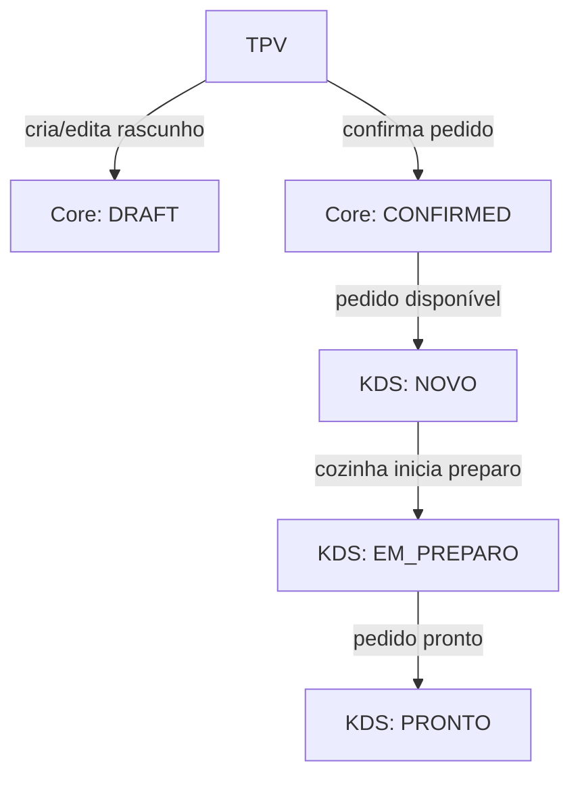

## Contrato: Fluxo de Pedido Operacional

**Propósito:** Definir, em contrato, o fluxo de um pedido operacional na Fase 1 (Semana 1) do roadmap de 30 dias — do momento em que o operador começa um pedido no TPV até à conclusão no KDS — com verdade centrada no Core e regras explícitas de estados, eventos e responsabilidades de cada superfície.

**Escopo:** Apenas contrato e documentação. **Nenhuma implementação é feita neste documento.**

---

## 1. Fluxo ideal em linguagem de restaurante

- **Atores:**
  - Operador de caixa (TPV).
  - Cozinha (KDS).
  - Cliente.

- **Etapas macro:**
  1. Operador abre o TPV e inicia um pedido.
  2. Adiciona/alterar/remove itens, ajusta quantidades, adiciona observações (por item e gerais).
  3. Confirma o pedido (commit).
  4. O pedido chega ao KDS com estado inicial **NOVO**.
  5. A cozinha atualiza o estado para **EM_PREPARO** e depois para **PRONTO**.
  6. O cliente recebe o pedido.

### 1.1 Diagrama do fluxo (conceptual)

> Nota: o diagrama é conceptual; não descreve componentes React nem endpoints específicos, apenas o fluxo de estados entre superfícies.

---

## 2. Modelo operacional mínimo do pedido no Core

### 2.1 Estrutura conceptual do pedido

Campos essenciais (em termos de conceito, não de schema concreto):

- `order_id`: identificador único do pedido.
- `restaurant_id`: restaurante onde o pedido foi criado.
- `terminal_id` / `session_id`: origem operacional (TPV ou sessão humana).
- `items`: lista de linhas de pedido, cada uma com:
  - `product_id`
  - `quantity`
  - `unit_price`
  - `item_note` (observação opcional por item)
- `note`: observação geral do pedido (opcional).
- `total_amount`: total calculado (impostos e arredondamentos fora de escopo desta fase; apenas consistência interna).
- `status`: estado comercial do pedido (`DRAFT`, `CONFIRMED`, `CANCELLED` se incluído na Fase 1).

### 2.2 Histórico de estados por evento

Regra estrutural:

- **Sem “update mágico”**: qualquer mudança relevante de estado ou conteúdo gera um **evento** explícito.

Eventos previstos nesta fase:

- `ORDER_DRAFT_UPDATED`
  - Emissão: enquanto o pedido está em `DRAFT`.
  - Conteúdo: itens, quantidades, notas (item e gerais).
- `ORDER_CONFIRMED`
  - Emissão: quando o operador confirma o pedido no TPV.
  - Efeito: o pedido passa de `DRAFT` para `CONFIRMED`.
- `ORDER_KDS_STATE_CHANGED`
  - Emissão: quando a cozinha muda o estado operacional do pedido no KDS.
  - Estados KDS: `NOVO`, `EM_PREPARO`, `PRONTO`.
- `ORDER_CANCELLED` (se decidido para a Fase 1)
  - Emissão: quando o pedido confirmado é cancelado com motivo claro.

Regra pós-confirmação:

- Após `ORDER_CONFIRMED`, o **pedido comercial** é imutável:
  - Linhas de pedido, quantidades e total não são alterados por “updates”.
  - Mudanças posteriores são sempre novos eventos (ex.: ajuste futuro, nota adicional, etc.), fora de escopo imediato desta fase.

---

## 3. Responsabilidades por superfície

### 3.1 TPV — superfície de entrada e confirmação

**Pode:**

- Criar e editar um rascunho de pedido (`DRAFT`).
- Adicionar/remover itens.
- Alterar quantidades.
- Adicionar observações por item e observação geral.
- Calcular e mostrar o total.
- Emitir `ORDER_CONFIRMED` para o Core.

**Não pode:**

- Alterar pedidos **após** confirmação (`CONFIRMED`).
- Forçar estados de cozinha (KDS) diretamente (NOVO/EM_PREPARO/PRONTO).

### 3.2 Core — fonte de verdade

**Regras:**

- Aceitar apenas pedidos válidos na confirmação:
  - Itens existentes.
  - Quantidades positivas.
  - Preços consistentes com o catálogo vigente.
- Gerar e manter o registo imutável do pedido **confirmado**.
- Gerir o histórico de eventos de pedido (draft updates, confirmação, estados KDS, cancelamentos).
- Expor leitura consistente para TPV e KDS:
  - TPV vê resumo comercial (itens, total, estado comercial).
  - KDS vê detalhes operacionais necessários para execução.

### 3.3 KDS — superfície de execução de cozinha

**Pode:**

- Ler pedidos confirmados com estado KDS inicial `NOVO`.
- Atualizar estado operacional para `EM_PREPARO` e `PRONTO` (via `ORDER_KDS_STATE_CHANGED`).
- Ver itens e observações relevantes para produção.

**Não pode:**

- Alterar total, itens ou observações comerciais do pedido.
- Criar ou confirmar pedidos por si só (não é TPV).

---

## 4. Estados e transições de pedido

### 4.1 Estados de ciclo de vida no Core

- **Estados de ordem comercial:**
  - `DRAFT`: rascunho no TPV, ainda não comprometido.
  - `CONFIRMED`: pedido válido, persistido, gera trabalho para cozinha.
  - `CANCELLED`: (se incluído na Fase 1) pedido cancelado com motivo.

- **Estados de cozinha (KDS):**
  - `NOVO`: pedido entrou na fila da cozinha.
  - `EM_PREPARO`: em execução.
  - `PRONTO`: pronto para servir/entregar.

### 4.2 Transições permitidas

- `DRAFT` → `CONFIRMED` (via TPV, com `ORDER_CONFIRMED`).
- `CONFIRMED` → KDS: `NOVO` → `EM_PREPARO` → `PRONTO` (via KDS, com `ORDER_KDS_STATE_CHANGED`).
- (Opcional, se decidido): `CONFIRMED` → `CANCELLED` (via evento `ORDER_CANCELLED`).

### 4.3 Invariantes

- Não pode existir estado KDS (`NOVO`, `EM_PREPARO`, `PRONTO`) sem que o pedido esteja `CONFIRMED`.
- Não há alterações de itens/total após `CONFIRMED`.
- Toda mudança de estado (comercial ou KDS) tem:
  - `timestamp`.
  - origem (`TPV` ou `KDS`).

---

## 5. Critérios de sucesso da Fase 1 (derivados do contrato)

### 5.1 Critério funcional

- É possível criar **pelo menos 20 pedidos seguidos** no TPV sem erro:
  - Adicionar/remover itens, alterar quantidades, adicionar observações.
  - Confirmar cada pedido com consistência.
- Cada pedido aparece no KDS de forma previsível:
  - Novos pedidos sempre em `NOVO`.
  - Transições para `EM_PREPARO` e `PRONTO` funcionam.
- Mudanças de estado no KDS são refletidas no Core corretamente.

### 5.2 Critério técnico

- Nenhum erro de DB.
- Nenhum erro de `relation does not exist`.
- Nenhum loop de navegação entre TPV/KDS e outras rotas.
- Logs seguem as regras de `docs/ops/OBSERVABILITY_POST_CUT.md`:
  - Zero spam estrutural.
  - Apenas eventos reais (confirmação, mudança de estado, etc.).

### 5.3 Critério de auditabilidade

- Para um pedido escolhido aleatoriamente entre os 20:
  - É possível reconstruir, via eventos registados, o que aconteceu:
    - Quais itens foram incluídos.
    - Quando e por quem foi confirmado.
    - Quais estados KDS o pedido percorreu.
  - Não existem “updates mágicos” sem evento correspondente.

---

## 6. Ligações com outros contratos

- **Operational Kernel**:
  - Este fluxo de pedido gera eventos que podem ser consumidos pelo Kernel como parte de `OperationalState` (ex.: pedidos atrasados monitorizados pelo EventMonitor).
- **OPERATIONAL_DASHBOARD_V2_CONTRACT**:
  - O dashboard pode exibir contagens agregadas baseadas neste fluxo (nº de pedidos em `NOVO`, `EM_PREPARO`, `PRONTO`), sem redefinir regras de estados.
- **TERMINAL_INSTALLATION_RITUAL**:
  - TPV e KDS só fazem sentido quando instalados como terminais válidos; este contrato assume que a instalação já foi tratada.

---

## 7. O que NÃO fazer neste contrato

- Não implementar código (nem hooks, nem endpoints).
- Não alterar UI nem fluxos existentes antes da implementação alinhada com este contrato.
- Não introduzir novos estados ou eventos fora dos aqui descritos sem revisão futura do contrato.

---

## 8. Próximos passos após o contrato

- Quebrar a Fase 1 em tarefas técnicas:
  - TPV: alinhamento de fluxo de rascunho/confirmado com este contrato.
  - KDS: garantir estados `NOVO` → `EM_PREPARO` → `PRONTO` e sincronização com o Core.
  - Core: rever modelo de dados e eventos para respeitar imutabilidade pós-confirmação.
- Definir testes guardiões (unitários, integração e QA) que reflitam:
  - Os 20 pedidos seguidos sem erro.
  - Ausência de erros de DB/“relation does not exist”.
  - Auditabilidade via eventos.

---

## 9. Fase 1 — Resultado do teste canónico (manual)

**Implementação Fase 1:** Alinhamento técnico (rascunho, confirmação, imutabilidade, logs centralizados, RPC única via) está implementado e freezado na tag `order-flow-freeze-v1` (ver `docs/ops/ROLLBACK_OPERATIONAL_FREEZE.md`).

**Instrução:** Executar 20 pedidos completos (TPV rascunho → confirmação; KDS NOVO → EM_PREPARO → PRONTO). Registar abaixo uma das duas linhas.

| Resultado (preencher após executar) |
|-------------------------------------|
| FASE 1 PASSOU. (200 pedidos em massa via `scripts/run-canonical-orders-bulk.sh`: create_order_atomic → update_order_status IN_PREP → READY → CLOSED.) |

