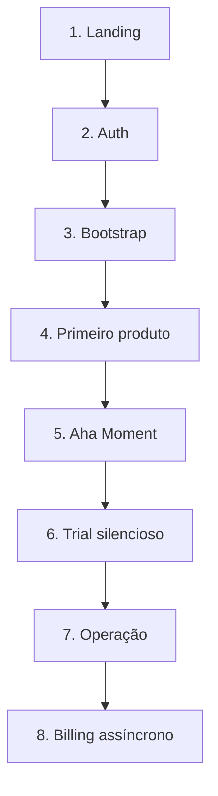
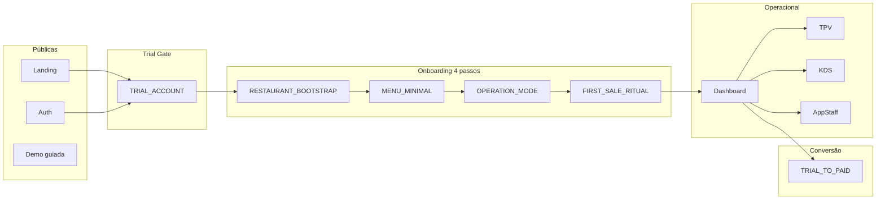

# Funil de Vida do Cliente — Mapa de Voo

**Propósito:** Referência única para "quem entra por onde, vê o quê, decide o quê, e quando passa ao próximo nível". Do primeiro contacto até o restaurante estar a vender. Ordem narrativa + contratos de passagem.

**Ref:** [CONTRATO_VIDA_RESTAURANTE.md](CONTRATO_VIDA_RESTAURANTE.md), [CONTRATO_TRIAL_REAL.md](CONTRATO_TRIAL_REAL.md), [CONTRATO_LANDING_CANONICA.md](CONTRATO_LANDING_CANONICA.md), [RESTAURANT_LIFECYCLE_CONTRACT.md](RESTAURANT_LIFECYCLE_CONTRACT.md), [ONBOARDING_5MIN_9_TELAS_CONTRACT.md](ONBOARDING_5MIN_9_TELAS_CONTRACT.md). Índice canónico: [CORE_CONTRACT_INDEX.md](../architecture/CORE_CONTRACT_INDEX.md).

**Onboarding 5min (9 telas):** O fluxo detalhado em 9 telas (~5 min) e o princípio **Onboarding ≠ Operação** (TPV em modo preview até ao Ritual de Abertura) estão no contrato [ONBOARDING_5MIN_9_TELAS_CONTRACT.md](ONBOARDING_5MIN_9_TELAS_CONTRACT.md). Este funil mantém a Sequência Canônica v1.0; o contrato de 9 telas substitui/estende o wizard de 4 passos para a implementação UI.

---

## Bloco 1 — Visão Única (espinha dorsal)

**Frase-mãe do ChefIApp™**

> *"Um restaurante começa a vender em minutos, não em dias — sem instalações, sem técnicos, sem stress."*

Tudo o que existe no sistema serve apenas a isto.

**Consequência directa:**

- Onboarding **não é** configuração
- Configuração **não é** obrigatória
- **Venda vem antes da perfeição**

---

## Camada 0 — Princípio Fundador (regra de ouro)

**Tudo é configurável no telefone. A web existe para convencer, explicar e acompanhar.**

- Donos descobrem no telemóvel.
- Decidem no desktop (ou tablet).
- Operam no telefone / tablet / terminal.

**Logo:** Onboarding deve ser **mobile-first**, mas **web-compatible**. O mesmo fluxo em ambos; state-driven, não device-driven.

---

## Sequência Canônica Oficial v1.0

**Esta sequência é o fluxo canônico v1.0.** UI, Core e discurso comercial devem alinhar-se a ela.

Os 8 passos oficiais, por ordem:

| # | Passo | Descrição |
|---|-------|-----------|
| 1 | **Landing** | CTA: Testar 14 dias; Demo 3 min; Já tenho acesso (login) |
| 2 | **Auth** | Demo 3 min, Simular registo local, Login produção |
| 3 | **Bootstrap obrigatório** | Criar restaurante: nome, tipo, país/moeda, contacto opcional |
| 4 | **Onboarding essencial** | Criar primeiro produto; opcional: pular ("Continuar sem adicionar agora") |
| 5 | **Aha Moment** | Abrir TPV → Criar pedido → Finalizar venda → Feedback "Pedido pago" |
| 6 | **Trial silencioso** | trial_active; sem bloqueio operacional |
| 7 | **Operação normal** | TPV / KDS / tarefas |
| 8 | **Billing assíncrono** | Banner discreto; escolher plano quando fizer sentido |

### Obrigatório vs pulável

| Passo | Obrigatório? | Notas |
|-------|--------------|-------|
| 1 Landing | Sim | Entrada única |
| 2 Auth | Sim | Conta trial criada |
| 3 Bootstrap | Sim | Restaurante criado (mínimo) |
| 4 Primeiro produto | Não (pulável) | "Continuar sem adicionar agora"; modo pode ficar implícito na UI |
| 5 Aha Moment (primeira venda) | Sim | Destrava operacional |
| 6 Trial em background | — | Automático |
| 7 Operação | — | Após passo 5 |
| 8 Billing | Assíncrono | Não bloqueia; banner discreto |

### Diagrama único (fluxo canônico v1.0)



### Discurso comercial (uma frase por fase)

| Fase | Frase de referência |
|------|----------------------|
| Landing | "Primeira venda em menos de 5 minutos" |
| Auth | "Testar 14 dias no meu restaurante" |
| Bootstrap | "Nome e contacto para começar" |
| Primeiro produto | "Um produto para destravar o TPV" |
| Aha Moment | "Pedido pago" |
| Operação | "TPV, KDS e tarefas sem bloqueios" |
| Billing | "Escolher plano quando fizer sentido" |

---

## Camada 1 — O Funil Real (de fora para dentro)

### 1. Landing Page (Web pública)

**Objetivo:** Converter curiosidade em intenção.

A landing **não configura nada**. Responde 3 perguntas:

1. "Isto resolve o meu problema?"
2. "Consigo testar sem dor?"
3. "É sério?"

**CTAs (máx. 3):**

- Testar 14 dias no meu restaurante (principal)
- Ver o sistema a funcionar (demo guiada)
- Já tenho acesso (login)

**Contrato implícito:** "Ainda não és cliente. Ainda não tens restaurante."

**Ref:** [CONTRATO_LANDING_CANONICA.md](CONTRATO_LANDING_CANONICA.md).

---

### 2. Criação de conta (Trial Gate)

**Primeiro contrato real.** Aqui nasce o TrialContract.

**Perguntas mínimas (não mais que isso):**

- Nome
- Email
- País
- Tipo de negócio (restaurante / bar / café / outro)

Nada de menu, mesas ou cozinha ainda.

**Estado criado:**

- User: ativo
- Trial: ativo (14 dias)
- Restaurant: ainda NÃO criado

**Contrato:** [TRIAL_ACCOUNT_CONTRACT.md](TRIAL_ACCOUNT_CONTRACT.md).

---

## Camada 2 — Onboarding Inteligente (guiado, não burocrático)

O onboarding é **state-driven**, não device-driven. Funciona igual na web e no mobile. Pode ser interrompido e retomado.

### Wizard — 4 passos (máximo)

| Passo | Nome | Contrato | Estado após |
|-------|------|----------|-------------|
| 1 | Criar o restaurante | [RESTAURANT_BOOTSTRAP_CONTRACT.md](RESTAURANT_BOOTSTRAP_CONTRACT.md) | Restaurant criado, status bootstrap |
| 2 | Criar o primeiro menu (mínimo) | [MENU_MINIMAL_CONTRACT.md](MENU_MINIMAL_CONTRACT.md) | Menu válido (mínimo) |
| 3 | Escolher modo de operação | [OPERATION_MODE_CONTRACT.md](OPERATION_MODE_CONTRACT.md) | Modo definido; UI adapta depois |
| 4 | Primeira venda (ritual) | [FIRST_SALE_RITUAL.md](FIRST_SALE_RITUAL.md) | Trial ativo, Restaurant operacional |

**Passo 1 — Criar restaurante (obrigatório):** Nome do restaurante, país/moeda, tipo de serviço (mesa / balcão / misto).

**Passo 2 — Menu mínimo:** 1 categoria, 1 produto, preço. Destravar em ~2 minutos.

**Passo 3 — Modo de operação:** "Quero vender agora" (modo rápido) vs "Quero configurar melhor antes".

**Passo 4 — Primeira venda (ritual):** Abrir TPV → criar pedido → marcar como pago. Primeira venda feita.

**Ref:** [CONTRATO_VIDA_RESTAURANTE.md](CONTRATO_VIDA_RESTAURANTE.md) (BOOTSTRAP_*, READY_TO_OPERATE).

---

## Camada 3 — Vida Normal do Trial

Depois da primeira venda: o cliente entra no **Dashboard Operacional**.

- Criar mais produtos
- Configurar equipa
- Ligar KDS
- Testar relatórios

**Nada bloqueia;** só avisos suaves: "Faltam X dias para terminar o trial."

**Contrato:** [TRIAL_OPERATION_CONTRACT.md](TRIAL_OPERATION_CONTRACT.md).

**Ref:** [CONTRATO_TRIAL_REAL.md](CONTRATO_TRIAL_REAL.md).

---

## Camada 4 — Conversão (sem agressão)

Quando o trial acaba:

- Escolher plano
- Continuar apenas em modo leitura
- Exportar dados

**Contrato:** [TRIAL_TO_PAID_CONTRACT.md](TRIAL_TO_PAID_CONTRACT.md).

---

## Tabela de Conexões (quem fala com quem)

| Origem | Destino | Contrato |
|--------|---------|----------|
| Landing | Trial Gate | TRIAL_ACCOUNT_CONTRACT |
| Trial | Onboarding | RESTAURANT_BOOTSTRAP_CONTRACT |
| Onboarding | TPV | FIRST_SALE_RITUAL |
| TPV | Core | FLUXO_DE_PEDIDO_OPERACIONAL |
| Core | Dashboard | RESTAURANT_LIFECYCLE / OPERATIONAL_STATE |
| Trial | Billing | TRIAL_TO_PAID_CONTRACT |

**Ref (fluxo pedido):** [FLUXO_DE_PEDIDO_OPERACIONAL.md](FLUXO_DE_PEDIDO_OPERACIONAL.md).

---

## Bloco 3 — Telas (wireflow real, sem fantasia)

**Total: 10 telas principais.** O resto são estados e permissões, não novas telas.

### 🟢 Fase Pública (Web)

| # | Tela | Notas |
|---|------|--------|
| 1 | **Landing** | CTA: "Testar 14 dias"; "Ver demo"; "Já tenho acesso" |
| 2 | **Login / Signup** | Cria TRIAL_ACCOUNT |

### 🟡 Onboarding (Web ou Mobile — igual)

**Estas telas são modais sequenciais, não páginas grandes.**

| # | Tela | Contrato |
|---|------|----------|
| 3 | Criar restaurante | RESTAURANT_BOOTSTRAP |
| 4 | Criar menu mínimo | MENU_MINIMAL |
| 5 | Escolher modo | OPERATION_MODE |
| 6 | Primeira venda (guiada) | FIRST_SALE_RITUAL |

### 🔵 Operação

| # | Tela |
|---|------|
| 7 | Dashboard |
| 8 | TPV |
| 9 | KDS |
| 10 | AppStaff (tarefas / equipa) |

**Regra:** Menos de 12 telas principais. O resto são **estados**, não páginas.

---

## Bloco 4 — Fluxograma completo (texto → fácil de desenhar)

```
[Landing]
   ↓
[Signup / Login]
   ↓
[Trial Account]
   ↓
[Onboarding Wizard]
   ├─ Criar Restaurante
   ├─ Menu Mínimo
   ├─ Escolher Modo
   └─ Primeira Venda
   ↓
[Restaurante Operacional]
   ↓
[Dashboard]
   ├─ TPV
   ├─ KDS
   ├─ Tarefas
   └─ Configurações
   ↓
[Trial Countdown]
   ↓
[Escolher Plano ou Encerrar]
```

---

## Diagrama do fluxo (Mermaid)



---

## Analogia do carro (estado do produto)

**Antes**

- Tinhas o motor, a caixa, os travões
- Mas sem volante, sem painel, sem estrada
- Era um carro de corrida dentro da garagem

**Agora**

- ✅ Motor testado por 7 dias seguidos
- ✅ Travões testados (pagamentos, fecho, tarefas)
- ✅ Caixa sincronizada (TPV ↔ KDS ↔ Core)
- ✅ Eletrónica validada (Kernel, contratos)

**O que falta**

- 🛞 Volante → onboarding fluido
- 🧭 GPS → sequência clara de telas
- 🪪 Placa → billing / planos
- 🎨 Acabamento → polish UX

**Estado real do projeto:** ~88–92% pronto. Falta o que o cliente vê, não o que faz o restaurante funcionar.

---

## Decisão estratégica

A partir daqui, **não se escreve mais backend por meses**, a menos que:

- seja billing
- seja auth final
- seja mobile

**Foco agora:**

1. Onboarding perfeito
2. Conversão sem fricção
3. Narrativa clara

---

## Próximos passos (engrenagens)

| # | Engrenagem | Descrição |
|---|------------|-----------|
| 1 | 🧩 ONBOARDING_FLOW_CONTRACT | Contrato do fluxo onboarding (modais, estados, passagens) |
| 2 | 🎨 Wireflow visual | Desenho tela a tela (wireflow visual) |
| 3 | 💳 Billing + planos | Fechar billing e planos (TRIAL_TO_PAID, BILLING_AND_PLAN) |
| 4 | 📱 Mobile-first real | Adaptar tudo para mobile-first |

---

## Resumo em uma frase

Um onboarding único, **state-driven**, **mobile-first**, que funciona igual na web e no telefone — com **contratos claros** entre cada passagem.
