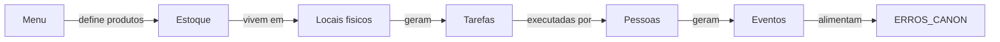
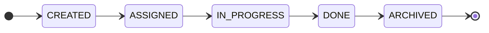

# TASKS Contract — v1

**Contrato canónico do sistema de tarefas.** Tarefas são obrigações operacionais criadas por pedido, estado do sistema, regra legal, exceção ou ausência de pedidos. O sistema de tarefas é regulatório do restaurante, não um "Trello".

---

## Subordinação

Este contrato é subordinado a [CORE_FINANCIAL_SOVEREIGNTY_CONTRACT.md](../architecture/CORE_FINANCIAL_SOVEREIGNTY_CONTRACT.md) e a [CORE_FINANCE_CONTRACT_v1.md](./CORE_FINANCE_CONTRACT_v1.md). Nenhuma regra aqui sobrepõe o Docker Financial Core.

Para quem cria tarefas, onde aparecem e SLA: [CORE_TASK_SYSTEM_CONTRACT.md](../architecture/CORE_TASK_SYSTEM_CONTRACT.md). Para o que o AppStaff faz (mostrar, confirmar, executar, reportar): [CORE_TASK_EXECUTION_CONTRACT.md](../architecture/CORE_TASK_EXECUTION_CONTRACT.md).

---

## 1. Tipos de tarefa

| Tipo             | Exemplos                                                                                 | Mapeamento gm_tasks.task_type (opcional)                         |
| ---------------- | ---------------------------------------------------------------------------------------- | ---------------------------------------------------------------- |
| **Reactivas**    | Preparar pedido, montar prato, entregar pedido, limpar mesa após pedido                  | PEDIDO_NOVO, ENTREGA_PENDENTE, ATRASO_ITEM                       |
| **Regulatórias** | Limpeza obrigatória, controle de temperatura, troca de óleo, higiene / checklist legal   | ESTOQUE_CRITICO, templates agendados (temp_check_fridge, etc.)   |
| **Fallback**     | "Não há pedidos → executar tarefas base"; evita staff parado e restaurante desorganizado | MODO_INTERNO                                                     |
| **Excepcionais** | Pedido cancelado, produto faltou, erro de estoque, cliente insatisfeito                  | ATRASO_ITEM, ESTOQUE_CRITICO, RUPTURA_PREVISTA (conforme schema) |

O Core classifica e encaminha. Terminais mostram o que o Core expõe para o seu contexto (restaurante, cargo, equipa).

---

## 2. Ciclo de vida

**Estados:** CREATED → ASSIGNED → IN_PROGRESS → DONE → (ARCHIVED).

**Invariantes:**

- Tarefa **nunca some silenciosamente**; permanece rastreável até DONE ou ARCHIVED.
- Tarefa **pode ficar overdue**; o Core/SLA define quando vira alerta ou incidente.
- Tarefa **pode ser rejeitada** com motivo registado; não é eliminada sem causa.
- Tarefa **ignorada** pode gerar entrada no [ERROS_CANON](../strategy/ERROS_CANON.md) ou incidente conforme governança.

Estados consumidos pelo AppStaff/KDS (nomes podem variar; fonte = Core): Pendente, Em execução, Concluída, Bloqueada/Incidente.

---

## 3. Onde aparecem

| Terminal                               | Papel                                                                                          |
| -------------------------------------- | ---------------------------------------------------------------------------------------------- |
| **KDS**                                | Tarefas da cozinha (ligadas a pedidos ou operacionais); SLA; confirmação de preparo/conclusão. |
| **Mini-KDS**                           | Tarefas locais (leitura e confirmação simples se o Core permitir).                             |
| **TPV**                                | Tarefas do salão/caixa (entregar, fechar mesa, etc.).                                          |
| **Painel do gerente (Command Center)** | Criar, delegar, ver execução (estado por tarefa/equipa).                                       |
| **Dono**                               | Exceções e gargalos; visão geral.                                                              |

**Regra:** Nenhum terminal inventa tarefas nem regras de prioridade/SLA. Core manda.

---

## 4. Pessoas

O sistema deve permitir responder: **quem fez o quê, quando, e sob qual papel.**

- **Passado (auditoria, memória):** Quem estava de turno quando isto aconteceu? Quem executou esta ação (pedido, preparo, cancelamento, pagamento)? Quem era responsável pela tarefa X naquele momento? Havia alguém atribuído ou a tarefa estava órfã?
- **Presente (operação viva):** Quem está a trabalhar agora? Quem pode executar esta tarefa agora? Há tarefas pendentes não vistas?
- **Futuro (previsão, aprendizado):** Onde a equipa falha mais? Quais tarefas atrasam mais? (Sistema aprende depois de sobreviver; não antes.)

Referências: Identity & Tenancy (roles), Order + Task Events (ou futuros events), [ERROS_CANON](../strategy/ERROS_CANON.md) (ex.: E43 troca de turno sem handover).

---

## 5. Relação Menu ↔ Estoque ↔ Tarefas

**Fluxo conceptual:** Menu define produtos → produtos consomem estoque → estoque vive em locais físicos (geladeiras, depósito) → geram tarefas → tarefas são executadas por pessoas → geram eventos → alimentam memória (ERROS_CANON).

**Estoque/inventário/geladeiras:** No contrato, o modelo mental inclui entidades como StorageUnit (ex.: Geladeira A), StorageType (fridge, freezer, dry), InventoryItem, e mapeamento Product ↔ Inventory. Um produto do menu consome estoque; um item de estoque vive num local físico. A implementação MVP pode não automatizar isto; o desenho já suporta e o [ERROS_CANON](../strategy/ERROS_CANON.md) prevê falhas (ex.: E32 produto some no meio do pedido).

---

## 6. Diagrama — Ciclo de vida e terminais

**Terminais que consomem tarefas:** KDS, MiniKDS, TPV, AppStaff, CommandCenter. Nenhum inventa tarefas; todos obedecem ao Core.

---

## 7. Referências

- [CORE_TASK_SYSTEM_CONTRACT.md](../architecture/CORE_TASK_SYSTEM_CONTRACT.md) — Quem cria, onde aparecem, SLA.
- [CORE_TASK_EXECUTION_CONTRACT.md](../architecture/CORE_TASK_EXECUTION_CONTRACT.md) — AppStaff: mostrar, confirmar, executar, reportar.
- [ORDER_STATUS_CONTRACT_v1.md](./ORDER_STATUS_CONTRACT_v1.md) — Estado de pedidos (tarefas ligadas a pedidos).
- [MENU_BUILDING_CONTRACT_v1.md](./MENU_BUILDING_CONTRACT_v1.md) — Menu e produtos (produto pode gerar tarefas).
- [ERROS_CANON.md](../strategy/ERROS_CANON.md) — Catálogo de falhas inevitáveis; tarefa órfã, ignorada, overdue.
- [CONTRATO_DE_ATIVIDADE_OPERACIONAL.md](./CONTRATO_DE_ATIVIDADE_OPERACIONAL.md) — Modo ocioso e geração de tarefas base.

---

## 8. Scope agora

**Não implementar tudo agora.** O que é necessário neste momento: testar pedidos, testar tarefas básicas, observar humanos. O resto já está pensado; o modelo mental e o contrato suportam evolução posterior (Menu ↔ Estoque ↔ Tarefas automatizado, métricas por tarefa/papel). Prioridade: sobreviver e validar com uso real antes de expandir.
