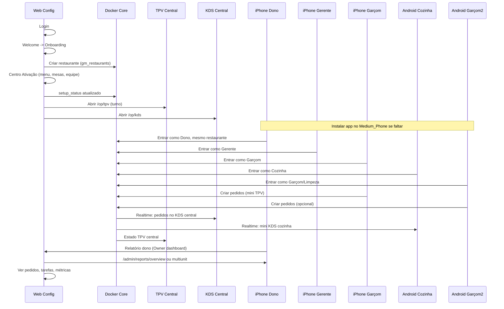

# Guia: Demo completa com 5 simuladores (TPV central, KDS central, mini TPV/KDS, relatório do dono)

**Propósito:** Repetir a demo com 5 dispositivos (3 iPhones, 2 Android), nova empresa via web, TPV/KDS central e mini TPV/KDS nos telemóveis, relatório do dono com pedidos e tarefas por funcionário.
**Referência:** Plano em `.cursor/plans/demo_5_simuladores_tpv_kds_*.plan.md`.

---

## 1. Instalar o app no Android em falta (Medium_Phone)

**Problema:** O emulador **Medium_Phone_API_36** (ou Medium_Phone_API_30) pode não ter o ChefIApp instalado.

**Ação:**

1. **Com APK já construído** (mais rápido):

   ```bash
   ./scripts/demo/install-app-android-medium-phone.sh
   ```

   Ou manualmente:

   ```bash
   adb -s <device_id> install -r mobile-app/android/app/build/outputs/apk/debug/app-debug.apk
   ```

2. **Compilar e instalar com Expo:**
   ```bash
   cd mobile-app && pnpm android
   ```
   Selecionar o AVD **Medium_Phone** quando o Expo pedir o dispositivo.

**Pré-requisito:** Metro a correr (porta 8081) e, no emulador Android, `adb reverse tcp:8081 tcp:8081` para o bundle carregar.

---

## 2. Criar nova empresa via web de configuração

Fluxo canónico (sem alterar código):

1. **Autenticação**
   Aceder ao merchant-portal (ex.: `http://localhost:5175`), fazer login (auth phone ou método configurado).

2. **Sem organização**
   Após login, o [CoreFlow](merchant-portal/src/core/flow/CoreFlow.ts) redireciona para `**/welcome**` ([WelcomePage](merchant-portal/src/pages/Welcome/WelcomePage.tsx)).

3. **Bem-vindo**
   Clicar em **"Começar Configuração Guiada"** → navega para `**/onboarding**` ([OnboardingAssistantPage](merchant-portal/src/pages/Onboarding/OnboardingAssistantPage.tsx)).

4. **Onboarding**
   O assistente leva por: identidade (nome, tipo, país), localização/mesas, pessoas, etc. A criação do restaurante ocorre em:

   - [BootstrapPage](merchant-portal/src/pages/BootstrapPage.tsx) (insert em `gm_restaurants` via Core/DbWriteGate), ou
   - [IdentitySection](merchant-portal/src/pages/Onboarding/sections/IdentitySection.tsx) (insert em `gm_restaurants` via dockerCoreClient).

5. **Centro de Ativação**
   Após ter organização, utilizadores não ativados vão para `**/app/activation**` ([ActivationCenterPage](merchant-portal/src/pages/Activation/ActivationCenterPage.tsx)). Completar o checklist:

   - Criar menu → `/app/setup/menu`
   - Configurar mesas → `/app/setup/mesas`
   - Configurar impressora → `/config`
   - Criar usuários → `/app/setup/equipe`
   - Testar pedido → `/op/tpv`
   - Ativar plano → `/app/billing`

6. **Estado operacional**
   O [CoreFlow](merchant-portal/src/core/flow/CoreFlow.ts) bloqueia **TPV/KDS** enquanto `systemState === "SETUP"`, redirecionando para `/app/activation`. Quando o runtime tiver `setup_status` completo e a entidade estiver "ativada", o acesso a `/op/tpv` e `/op/kds` é permitido (RoleGate + ShiftGate onde aplicável).

**Tarefa concreta:** Navegar na web por: **Login → Welcome → Onboarding (criar restaurante) → Centro de Ativação → completar menu, mesas, equipa** até o runtime marcar setup como completo e desbloquear TPV/KDS. Pode usar o cenário E2E `merchant-portal/tests/e2e/demo-5-simuladores.spec.ts` como referência dos passos.

---

## 3. Ativar TPV central e KDS central

- **TPV central (web):** Rota `**/op/tpv**`. Abrir no browser: `http://localhost:5175/op/tpv`. Requer turno e dispositivo ativo ([CONFIG_RUNTIME_CONTRACT](../contracts/CONFIG_RUNTIME_CONTRACT.md), [useOperationalReadiness](merchant-portal/src/core/readiness/useOperationalReadiness.ts)). Usa [TPVMinimal](merchant-portal/src/pages/TPV/TPV.tsx) e [ShiftGate](merchant-portal/src/components/operational/ShiftGate.tsx).

- **KDS central (web):** Rota `**/op/kds**`. Abrir `http://localhost:5175/op/kds`. Usa [KDSMinimal](merchant-portal/src/pages/KDSMinimal/KDSMinimal.tsx) e [KitchenDisplay](merchant-portal/src/pages/TPV/KDS/KitchenDisplay.tsx); pedidos vêm do Core/realtime.

**Pré-requisitos:** Restaurante ativado (setup completo), turno aberto (para TPV), Core/Docker a correr. Eventos entre mini-TPV e central: [TPVCentralEvents](merchant-portal/src/core/tpv/TPVCentralEvents.ts).

**Tarefa:** Com a nova empresa criada e ativada, abrir duas abas (ou dois monitores): uma em `/op/tpv` (TPV central) e outra em `/op/kds` (KDS central). Garantir turno aberto e Core acessível para pedidos e estados aparecerem.

---

## 4. Mapear 5 simuladores a 5 empregados (papéis)

No AppStaff (mobile), os papéis vêm da seleção **"Entrar como:"** ([AppStaffContext](mobile-app/context/AppStaffContext.tsx) e ecrã de entrada). Cada dispositivo escolhe um papel:

| Dispositivo              | Papel sugerido      | O que verá (tabs/áreas)                                          |
| ------------------------ | ------------------- | ---------------------------------------------------------------- |
| iPhone 1                 | Dono (Owner)        | OwnerHome / OwnerGlobalDashboard; relatório do dono, visão geral |
| iPhone 2                 | Gerente             | Manager; pedidos, mesas, tarefas                                 |
| iPhone 3                 | Garçom (Waiter)     | staff, orders, kitchen, tables, cardapio; mini TPV / comandas    |
| Android 1 (chef_pixel)   | Cozinha (Cook)      | staff, kitchen (mini KDS), orders                                |
| Android 2 (Medium_Phone) | Limpeza ou Garçom 2 | staff, tarefas; ou segundo garçom para mais pedidos              |

**Contrato/localização:** Todos os 5 dispositivos devem entrar no **mesmo restaurante** (código/QR ou operação local com o mesmo `restaurantId`) para pedidos e tarefas aparecerem no mesmo tenant.

**Tarefa:** Em cada simulador, após abrir o AppStaff, escolher o papel correspondente e entrar no mesmo restaurante. Aceitar cookies se aparecer o banner.

---

## 5. Fluxo de pedidos: mini TPV → KDS central e mini KDS

- **Emitir pedidos:** Nos dispositivos com papel Garçom (onde o mini TPV estiver disponível), criar pedidos a partir das mesas/comandas. Os pedidos são escritos no Core (PostgREST/realtime) e associados ao restaurante e ao turno.

- **KDS central (web):** Em `/op/kds`, os pedidos aparecem em tempo (quase) real via subscrição realtime ([KitchenDisplay](merchant-portal/src/pages/TPV/KDS/KitchenDisplay.tsx), [useOrders](merchant-portal/src/pages/TPV/context/OrderContextReal.tsx)).

- **Mini KDS (mobile):** Nos dispositivos Cozinha/Garçom, o tab **"Cozinha"** (kitchen) mostra o mini KDS; deve refletir os mesmos pedidos quando o app está no mesmo `restaurantId` e com realtime ativo.

- **Offline:** Se o Android mostrar "Modo offline" ou "Não foi possível carregar as mesas", verificar Core acessível e rede no emulador (localhost ou IP do host com `adb reverse` ou Metro acessível).

**Tarefa:** Com TPV central e KDS central abertos na web, e 5 simuladores ligados ao mesmo restaurante: (1) abrir turno no TPV central se ainda não estiver; (2) em pelo menos um Garçom (mini TPV), criar um ou mais pedidos; (3) verificar aparecimento no KDS central (web) e nos mini KDS (Cozinha) nos telemóveis; (4) opcionalmente usar o TPV central para mais pedidos e confirmar que tudo aparece nos KDS.

---

## 6. Tarefas por funcionário e relatório do dono

- **Tarefas:** O AppStaff expõe o tab **"Turno"** (staff) com tarefas ([ShiftChecklistSection](merchant-portal/src/components/tasks/ShiftChecklistSection.tsx)). As tarefas podem ser filtradas por utilizador/função. Garantir que no Core existem tarefas ou checklist associadas a funcionários/turno para aparecerem por papel.

- **Relatório do dono:**
  - **AppStaff (owner):** [OwnerGlobalDashboard](merchant-portal/src/pages/AppStaff/dashboards/OwnerGlobalDashboard.tsx) ou OwnerHome no mobile (rota `/app/staff/home/owner`).
  - **Web (admin):** [MultiUnitOverviewReportPage](merchant-portal/src/features/admin/reports/MultiUnitOverviewReportPage.tsx) em `/admin/reports/multiunit`, [AdminReportsOverview](merchant-portal/src/features/admin/reports/AdminReportsOverview.tsx) em `/admin/reports/overview`, e relatório de fecho diário em `/app/reports/daily-closing`. O [OwnerDashboard](merchant-portal/src/pages/AppStaff/OwnerDashboard.tsx) (web) mostra "Dinheiro agora", "Motor da operação", pedidos ativos, etc.

**Tarefa:** No simulador **Dono**, abrir a visão do dono (Owner home/dashboard) e, na web, abrir `/admin/reports/overview` ou `/admin/reports/multiunit` (e, se aplicável, daily-closing). Confirmar: pedidos do dia, métricas e, onde existir, tarefas ou indicadores por funcionário. Validar que os pedidos feitos nos mini TPV e no TPV central aparecem nestes relatórios.

---

## 7. "Durante 24h00" e duração da demo

- **Interpretação recomendada:** Correr a demo durante o tempo necessário para: (1) criar empresa e ativar TPV/KDS; (2) simular vários empregados e emitir pedidos; (3) ver pedidos no KDS central e mini KDS; (4) ver relatório do dono e tarefas. Não é obrigatório deixar 24 horas a correr; "24h00" pode ser o período de dados que o relatório cobre (ex.: "hoje") ou um turno longo.

- **Visibilidade de 24h no relatório:** Manter Core e portal a correr; opcionalmente criar pedidos/turno que cubram um intervalo de 24h (ou usar dados de seed) para os gráficos/métricas do dono mostrarem um dia completo.

---

## 8. Ordem sugerida de execução



---

## 9. Dependências

- **Docker Core** a correr (PostgREST, realtime, `gm_restaurants`, orders, shift, etc.); health: `http://localhost:3001/rest/v1/`.
- **Merchant-portal** na porta 5175 (ou configurada).
- **Metro** para o mobile-app (ex.: 8081); emuladores Android com `adb reverse` se necessário.
- **Nova empresa** criada via web (Welcome → Onboarding → Activation) para não misturar com outros tenants.
- **Turno aberto** no restaurante para o TPV central e para pedidos válidos.
- **Mesmo restaurante** em todos os 5 dispositivos (código/QR ou operação local) para pedidos e tarefas no mesmo tenant.

---

## 10. Riscos e mitigações

| Risco                                          | Mitigação                                                                                                               |
| ---------------------------------------------- | ----------------------------------------------------------------------------------------------------------------------- |
| Medium_Phone sem app                           | Instalar via `./scripts/demo/install-app-android-medium-phone.sh` ou `expo run:android` com AVD.                        |
| "Não foi possível carregar as mesas" / Offline | Verificar Core acessível, `restaurantId` correto, realtime e rede nos emuladores (localhost/10.0.2.2 + reverse).        |
| TPV/KDS bloqueados                             | Completar Centro de Ativação até o runtime sair de SETUP e permitir `/op/tpv` e `/op/kds`.                              |
| Tarefas vazias no dono                         | Confirmar que o Core (ou módulo de tarefas) persiste tarefas por utilizador/turno e que o dashboard do dono as consome. |

---

Nenhuma alteração de código é obrigatória para esta demo; o guia usa rotas e fluxos existentes. Cenário E2E de referência: `merchant-portal/tests/e2e/demo-5-simuladores.spec.ts`.
