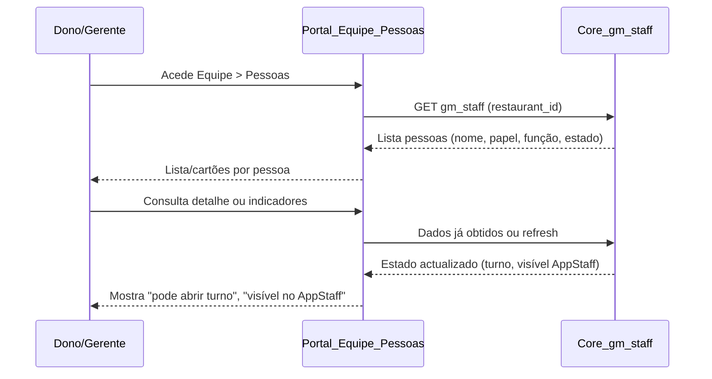

# Desenho — Pessoas (gm_staff) como First-Class na UI

**Propósito:** Documento de desenho do Trilho 2 pós-freeze. Define o que será construído para que gm_staff seja first-class na UI: quem é gerente/staff, quem pode abrir turno, quem aparece no AppStaff. Este doc é desenho de produto e experiência — não altera contratos, Core nem System Tree.

**Relação com o freeze:** Este documento é desenho pós-freeze; não altera [SCOPE_FREEZE.md](../strategy/SCOPE_FREEZE.md) nem [CORE_SYSTEM_TREE_CONTRACT.md](../architecture/CORE_SYSTEM_TREE_CONTRACT.md). A implementação virá numa fase seguinte, após aprovação deste desenho.

---

## 1. Propósito e âmbito

### Objetivo

- **gm_staff como first-class na UI:** A UI do bloco Equipe deve tratar "Pessoas" como entidade central, não como algo futuro ou secundário.
- **Clareza operacional:** Ficar explícito quem é gerente, quem é staff, quem pode abrir turno e quem aparece no AppStaff.
- **Alinhamento com o mercado:** Nos grandes players (GloriaFood, Toast, Square), staff vem antes de vender; o sistema deve "respirar restaurante" e pessoas, não só terminais.

### Âmbito deste desenho

- Fluxo humano e de sistema para consulta e gestão de pessoas (lista, detalhe, estado, papéis).
- UI mínima: páginas/ecrãs do bloco Equipe — Pessoas (lista e cartão/detalhe por pessoa).
- Regras de negócio já definidas nos contratos: este desenho expõe e aciona; não redefine papéis nem estados.

### Fora de âmbito

- Alteração de contratos existentes, Core ou System Tree.
- Novos estados além dos já definidos nos contratos (ativo, suspenso, fora de turno).
- Implementação em código (fase seguinte).

---

## 2. Contratos que governam

Este desenho obedece aos seguintes contratos. A implementação futura deve consumir estes contratos; a UI apenas expõe e aciona.

| Contrato                                                                                 | O que este desenho respeita                                                                                                                                                                                                                                                                       |
| ---------------------------------------------------------------------------------------- | ------------------------------------------------------------------------------------------------------------------------------------------------------------------------------------------------------------------------------------------------------------------------------------------------- |
| [CORE_APPSTAFF_IDENTITY_CONTRACT.md](../architecture/CORE_APPSTAFF_IDENTITY_CONTRACT.md) | Identidade, vínculo ao restaurante, papel e estado são obrigatórios; perfil (nome, papel, função), QR pessoal e último check-in vêm do Core. "AppStaff mostra, Core decide." Quem pode abrir turno e quem aparece no AppStaff fica definido pelo Core e pelos papéis; a UI apenas expõe e aciona. |
| [CORE_SYSTEM_TREE_CONTRACT.md](../architecture/CORE_SYSTEM_TREE_CONTRACT.md)             | O nó Pessoas (Owner, Staff, Funções) e o recurso gm_staff (GET) alimentam a árvore. O bloco Equipe contém AppStaff, Pessoas, Tarefas, Presença Online. Links people e appstaff já existem; este desenho não altera a estrutura da árvore nem os 5 blocos.                                         |
| [CHEFIAPP_ROLE_SYSTEM_SPEC.md](../CHEFIAPP_ROLE_SYSTEM_SPEC.md)                          | Papéis formais: owner, manager, staff. A UI consome estes papéis; não redefine. Sub-roles operacionais (garçom, cozinha, caixa) podem existir para função/contexto; para acesso e "quem pode abrir turno" usamos owner, manager ou staff.                                                         |
| [ROADMAP_POS_FREEZE.md](../strategy/ROADMAP_POS_FREEZE.md)                               | Gap B — Banco de Pessoas (gm_staff) ainda não é first-class na UI. Fase Pós-Freeze 1 — Identidade Operacional: gm_staff first-class, restaurante visível, papéis claros. Este desenho é a especificação para fechar o Gap B na UI.                                                                |

---

## 3. Fluxo (passo a passo)

Fluxo humano e de sistema, em ordem lógica, sem código.

1. **Acesso a Pessoas**

   - Dono ou gerente acede ao bloco **Equipe** no dashboard (sidebar).
   - Clica em **Pessoas** (link existente no contrato da árvore: people).
   - A UI navega para a vista de lista de pessoas (ex.: `/people` ou `/config/people` conforme rotas existentes).

2. **Lista de pessoas**

   - A lista é alimentada pelo Core (recurso gm_staff, GET).
   - Cada pessoa aparece como cartão ou linha com: **nome**, **papel** (owner / manager / staff), **função** operacional se aplicável (garçom, cozinha, caixa), **estado** (em turno / fora de turno / suspenso).
   - Indicadores claros: **Pode abrir turno** (sim/não), conforme contrato de papéis; **Visível no AppStaff** (sim/não), ou seja, staff/manager/owner com vínculo ao restaurante e estado permitido.

3. **Quem pode abrir turno**

   - Regra definida pelo Core e pelo [CHEFIAPP_ROLE_SYSTEM_SPEC](../CHEFIAPP_ROLE_SYSTEM_SPEC.md): owner e manager podem abrir turno; staff conforme política do restaurante (o contrato não redefine; a UI mostra o valor que o Core devolve).
   - A UI apenas exibe e, se aplicável, oferece a acção "Abrir turno" a quem tiver permissão; não decide.

4. **Quem aparece no AppStaff**

   - Regra: pessoas com papel staff, manager ou owner, com vínculo ao restaurante e estado permitido (ativo, não suspenso) aparecem no AppStaff. Fonte: Core e [CORE_APPSTAFF_IDENTITY_CONTRACT](../architecture/CORE_APPSTAFF_IDENTITY_CONTRACT.md).
   - A UI mostra "Visível no AppStaff" sim/não por pessoa; não decide.

5. **Criação e edição de pessoa**
   - Onde se cria/edita pessoa: **Config** ou **Backoffice** (não no AppStaff). Já está definido no [CORE_APPSTAFF_IDENTITY_CONTRACT](../architecture/CORE_APPSTAFF_IDENTITY_CONTRACT.md): "Perfil (nome, papel, função) é só leitura no AppStaff; edição é fora do terminal (config, backoffice)."
   - Na vista Pessoas do portal, pode existir CTA para "Adicionar pessoa" que leva a config/backoffice; o desenho não obriga a formulário inline na lista.

### Diagrama de fluxo (leitura: utilizador → UI → Core; Core como autoridade)

---

## 4. UI mínima (wireframe em texto)

Suficiente para um dev saber o que construir depois. Sem mockups gráficos obrigatórios.

### 4.1 Bloco Equipe (já existe)

- Sidebar: bloco **Equipe** com itens AppStaff, **Pessoas**, Tarefas, Presença Online.
- **Pessoas** leva à vista de lista de pessoas. A árvore de navegação **não** muda neste desenho (respeita os 5 blocos e o [CORE_SYSTEM_TREE_CONTRACT](../architecture/CORE_SYSTEM_TREE_CONTRACT.md)).

### 4.2 Vista: Lista de pessoas

- **Título:** "Pessoas" ou "Perfis operacionais" (alinhado à cópia existente, ex. "Pessoas — Perfis Operacionais").
- **Conteúdo:** Lista ou grid de cartões. Cada item (pessoa) mostra:
  - Nome
  - Papel (owner / manager / staff)
  - Função (garçom, cozinha, caixa — se aplicável)
  - Estado (em turno / fora de turno / suspenso)
  - Indicador "Pode abrir turno" (sim/não)
  - Indicador "Visível no AppStaff" (sim/não)
- **CTA opcional:** "Adicionar pessoa" → leva a config ou backoffice para criar pessoa (não definir aqui o fluxo de criação; apenas o destino).
- **Estado vazio:** Se gm_staff devolver lista vazia: mensagem tipo "Nenhum perfil operacional encontrado" e CTA para adicionar (consistente com verificação E2E existente).

### 4.3 Vista: Detalhe ou cartão por pessoa (opcional mas recomendado)

- Ao clicar numa pessoa (ou abrir detalhe): mesmo conjunto de campos (nome, papel, função, estado, pode abrir turno, visível no AppStaff).
- Pode incluir: último check-in (quando entrou em turno), QR pessoal (se o Core expuser; conforme [CORE_APPSTAFF_IDENTITY_CONTRACT](../architecture/CORE_APPSTAFF_IDENTITY_CONTRACT.md)).
- Edição: link ou botão "Editar" → config/backoffice; não edição inline nesta vista.

### 4.4 Restrições de UI

- Navegação permanece nos 5 blocos; nenhum novo bloco nem novo nó na árvore.
- Estados exibidos são apenas os já definidos nos contratos: ativo (em turno), suspenso, fora de turno. Nenhum estado novo.

---

## 5. O que NÃO faz parte deste desenho

- **Não alterar** System Tree, Core ou contratos existentes.
- **Não definir** novos estados além dos já nos contratos (ativo, suspenso, fora de turno).
- **Não implementar** nada em código neste passo — este documento é apenas especificação de desenho.
- **Não redefinir** papéis nem permissões; a UI consome o que os contratos já definem.

Se algo faltar ou incomodar, deve virar nota de gap ou secção "Fora de âmbito" neste doc (ou em ROADMAP_POS_FREEZE), não patch no código nem nos contratos.

---

## 6. Próximo passo após aprovação

Implementação só após aprovação deste desenho; a implementação respeitará os mesmos contratos aqui referenciados.

---

## Referências

- [CORE_APPSTAFF_IDENTITY_CONTRACT.md](../architecture/CORE_APPSTAFF_IDENTITY_CONTRACT.md)
- [CORE_SYSTEM_TREE_CONTRACT.md](../architecture/CORE_SYSTEM_TREE_CONTRACT.md)
- [CHEFIAPP_ROLE_SYSTEM_SPEC.md](../CHEFIAPP_ROLE_SYSTEM_SPEC.md)
- [ROADMAP_POS_FREEZE.md](../strategy/ROADMAP_POS_FREEZE.md) — Gap B, Fase Pós-Freeze 1
