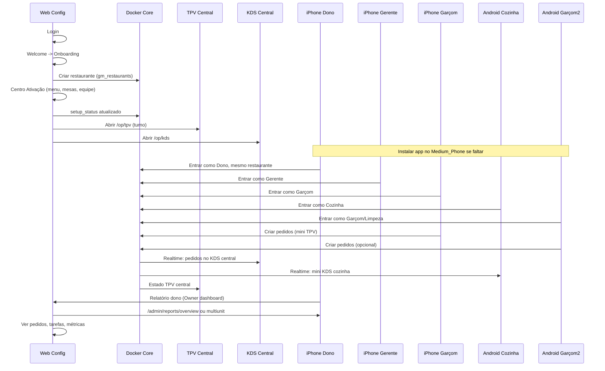

# Runbook: Demo 5 simuladores (TPV central, KDS central, mini TPV/KDS, relatório dono)

Ordem de execução e checklist para a demo completa com 5 dispositivos. Detalhe em [DEMO_5_SIMULADORES_GUIA.md](./DEMO_5_SIMULADORES_GUIA.md).

---

## Ordem sugerida de execução

---

## Checklist de execução

### Pré-requisitos

- [ ] **Docker Core** a correr: `bash scripts/core/health-check-core.sh` → OK
- [ ] **Merchant-portal** na porta 5175: `pnpm --filter merchant-portal run dev`
- [ ] **Metro** (ex.: 8081) para mobile: `cd mobile-app && npx expo start --port 8081`
- [ ] **5 dispositivos** ligados: 3 iOS + 2 Android (chef_pixel + Medium_Phone)

### 1. Instalar app no Android em falta (Medium_Phone)

- [ ] Se o Medium_Phone não tiver o ChefIApp: `./scripts/ops/install-app-android-medium-phone.sh` (run ou apk)
- [ ] Em cada Android: `adb -s <device_id> reverse tcp:8081 tcp:8081` e `adb -s <device_id> reverse tcp:3001 tcp:3001`

### 2. Criar nova empresa via web

- [ ] Abrir `http://localhost:5175`, fazer login (auth phone ou método configurado)
- [ ] Sem organização → redirecionamento para `/welcome`
- [ ] Clicar **"Começar Configuração Guiada"** → `/onboarding`
- [ ] Completar onboarding: identidade, localização/mesas, pessoas
- [ ] Centro de Ativação `/app/activation`: completar menu, mesas, equipa (e o necessário para desbloquear TPV/KDS)
- [ ] **E2E de referência:** `merchant-portal/tests/e2e/teste-humano-jornada-completa.spec.ts`, `merchant-portal/tests/e2e/demo-5-simuladores.spec.ts`

### 3. Ativar TPV central e KDS central

- [ ] Abrir TPV central: `http://localhost:5175/op/tpv` (ou `./scripts/ops/open-tpv-kds-central.sh`)
- [ ] Abrir KDS central: `http://localhost:5175/op/kds`
- [ ] Abrir turno no TPV central se ainda não estiver

### 4. Mapear 5 simuladores a 5 empregados

| Dispositivo              | Papel sugerido      | O que verá                                        |
| ------------------------ | ------------------- | ------------------------------------------------- |
| iPhone 1                 | Dono (Owner)        | Owner home/dashboard; relatório do dono           |
| iPhone 2                 | Gerente             | Manager; pedidos, mesas, tarefas                  |
| iPhone 3                 | Garçom (Waiter)     | staff, orders, kitchen, tables; mini TPV/comandas |
| Android 1 (chef_pixel)   | Cozinha (Cook)      | staff, kitchen (mini KDS), orders                 |
| Android 2 (Medium_Phone) | Limpeza ou Garçom 2 | staff, tarefas; ou segundo garçom                 |

- [ ] Em cada dispositivo: abrir AppStaff, escolher o papel, entrar no **mesmo restaurante** (código/QR ou operação local)

### 5. Fluxo de pedidos: mini TPV → KDS central e mini KDS

- [ ] Turno aberto no TPV central (web)
- [ ] Em pelo menos um Garçom (mini TPV), criar um ou mais pedidos
- [ ] Verificar: pedidos aparecem no KDS central (web) e nos tabs Cozinha (mini KDS) nos telemóveis
- [ ] Opcional: `./scripts/ops/run-demo-orders.sh` para criar pedidos via API (vários “empregados”)

### 6. Tarefas por funcionário e relatório do dono

- [ ] No simulador Dono: abrir visão Owner home / OwnerGlobalDashboard
- [ ] Na web: abrir `http://localhost:5175/admin/reports/overview` ou `/admin/reports/multiunit` (e se aplicável `/app/reports/daily-closing`)
- [ ] Confirmar: pedidos do dia, métricas, e onde existir — tarefas ou indicadores por funcionário

### 7. Duração da demo ("24h00")

A demo não exige 24 horas a correr. Basta o tempo para: (1) criar empresa e ativar TPV/KDS; (2) simular empregados e emitir pedidos; (3) ver pedidos no KDS central e mini KDS; (4) ver relatório do dono e tarefas. "24h00" pode ser o período de dados que o relatório cobre (ex.: "hoje") ou um turno longo.

---

## Dependências resumidas

| Dependência       | Comando / URL                                                                  |
| ----------------- | ------------------------------------------------------------------------------ |
| Docker Core       | `http://localhost:3001/rest/v1/` → 200                                         |
| Merchant-portal   | `http://localhost:5175`                                                        |
| Metro             | porta 8081                                                                     |
| Nova empresa      | Via web: Login → Welcome → Onboarding → Centro de Ativação                     |
| Turno aberto      | TPV central ou RPC `open_cash_register_atomic`                                 |
| Mesmo restaurante | Todos os 5 dispositivos com mesmo `restaurantId` (código/QR ou operação local) |

---

## Riscos e mitigações

| Risco                                          | Mitigação                                                                                               |
| ---------------------------------------------- | ------------------------------------------------------------------------------------------------------- |
| Medium_Phone sem app                           | `./scripts/ops/install-app-android-medium-phone.sh`                                                     |
| "Não foi possível carregar as mesas" / Offline | Core acessível; `restaurantId` correto; `adb reverse` 8081 e 3001; `EXPO_PUBLIC_CORE_URL` no mobile-app |
| TPV/KDS bloqueados                             | Completar Centro de Ativação até o runtime sair de SETUP                                                |
| Tarefas vazias no dono                         | Confirmar que o Core persiste tarefas por utilizador/turno e que o dashboard do dono as consome         |

---

## Scripts úteis

- **Instalar app no Medium_Phone:** `./scripts/ops/install-app-android-medium-phone.sh` [run\|apk]
- **Abrir TPV e KDS central:** `./scripts/ops/open-tpv-kds-central.sh` [base_url]
- **Criar pedidos de demo (API):** `./scripts/ops/run-demo-orders.sh` (opcional: `NUM_ORDERS=8`, `RESTAURANT_ID=...`)
- **Health Core:** `bash scripts/core/health-check-core.sh`

Nenhuma alteração de código é obrigatória para esta demo; o runbook usa rotas e fluxos existentes.
