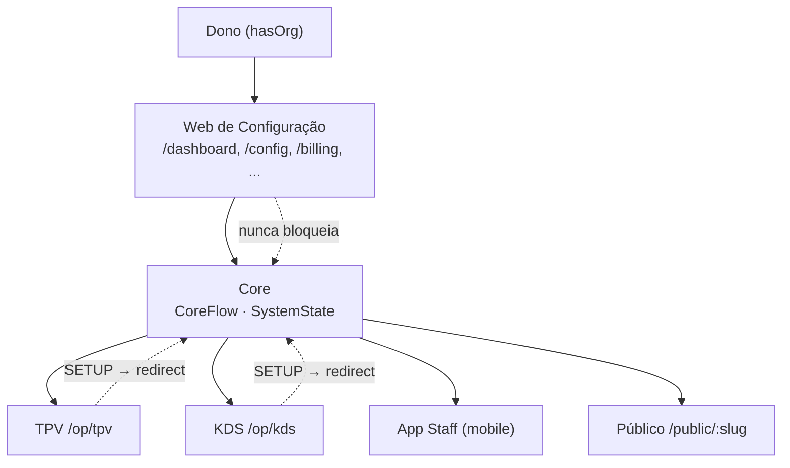

# Diagrama mestre — Web ↔ Core ↔ Operação

**Propósito:** Visão única do fluxo Dono → Web de Configuração → Core → Terminais operacionais (TPV, KDS, App Staff). Fonte de verdade do fluxo: [ROUTES_WEB_VS_OPERATION.md](../implementation/ROUTES_WEB_VS_OPERATION.md) e `CoreFlow.ts`.

---

## 1. Visão em camadas

```
                    ┌─────────────────────────────────────────────────────────┐
                    │                    DONO (hasOrg)                        │
                    └─────────────────────────┬───────────────────────────────┘
                                             │
                                             ▼
┌────────────────────────────────────────────────────────────────────────────────────────────┐
│                         WEB DE CONFIGURAÇÃO (Portal do Dono)                               │
│  /dashboard | /config | /menu-builder | /app/billing | /purchases | /financial | /mentor   │
│  /reservations | /groups | /onboarding/first-product                                        │
│  Guard: NUNCA bloquear por systemState nem billing. NUNCA return null.                      │
└─────────────────────────┬──────────────────────────────────────────────────────────────────┘
                          │
                          │  lê/escreve
                          ▼
┌────────────────────────────────────────────────────────────────────────────────────────────┐
│                                    CORE (fonte de verdade)                                  │
│  Docker Core (financeiro soberano) | Supabase local (auth, dados)                           │
│  resolveNextRoute() | isWebConfigPath() | isOperationalPath()                               │
│  SystemState: SETUP | TRIAL | ACTIVE | SUSPENDED                                            │
└─────────────────────────┬──────────────────────────────────────────────────────────────────┘
                          │
          ┌───────────────┼───────────────┬─────────────────────┐
          │               │               │                     │
          ▼               ▼               ▼                     ▼
┌──────────────┐  ┌──────────────┐  ┌──────────────┐  ┌──────────────────┐
│     TPV      │  │     KDS      │  │  App Staff   │  │  Público (Web)   │
│  /op/tpv     │  │  /op/kds     │  │  (mobile)    │  │  /public/:slug   │
│  Caixa       │  │  Cozinha     │  │  Garçom      │  │  Menu, QR mesa   │
│              │  │              │  │  Check-in    │  │  Pedidos WEB/QR   │
│ SETUP→       │  │ SETUP→       │  │  (fora web)  │  │  Sem auth         │
│ redirect     │  │ redirect     │  │              │  │                  │
│ first-product│  │ first-product│  │              │  │                  │
└──────────────┘  └──────────────┘  └──────────────┘  └──────────────────┘
       OPERAÇÃO          OPERAÇÃO         OPERAÇÃO           PÚBLICO
```

---

## 2. Fluxo de decisão (CoreFlow)

```
                    ┌─────────────┐
                    │  Request    │
                    │  (path)     │
                    └──────┬──────┘
                           │
                           ▼
                    ┌─────────────┐     Não
                    │ Authenticated?├──────────► REDIRECT /auth
                    └──────┬──────┘
                           │ Sim
                           ▼
                    ┌─────────────┐     Não
                    │ hasOrg?     ├──────────► REDIRECT /bootstrap
                    └──────┬──────┘
                           │ Sim
                           ▼
                    ┌─────────────────────────┐     Sim
                    │ systemState===SETUP     ├──────────► REDIRECT /onboarding/first-product
                    │ AND isOperationalPath?  │
                    └──────┬──────────────────┘
                           │ Não
                           ▼
                    ┌─────────────┐
                    │   ALLOW     │  (Web sempre ALLOW para hasOrg; Operação ALLOW se TRIAL/ACTIVE)
                    └─────────────┘
```

---

## 3. Mermaid (alternativa para render em MD)



---

## 4. Referências

- **CoreFlow:** `merchant-portal/src/core/flow/CoreFlow.ts`
- **Mapa rotas:** [ROUTES_WEB_VS_OPERATION.md](../implementation/ROUTES_WEB_VS_OPERATION.md)
- **Rotas web (contrato):** [README_WEB_ROUTES.md](README_WEB_ROUTES.md) e [web/](web/)
- **Contratos Core:** [architecture/CORE_CONTRACT_INDEX.md](../architecture/CORE_CONTRACT_INDEX.md)

Última atualização: 2026-02-01.
