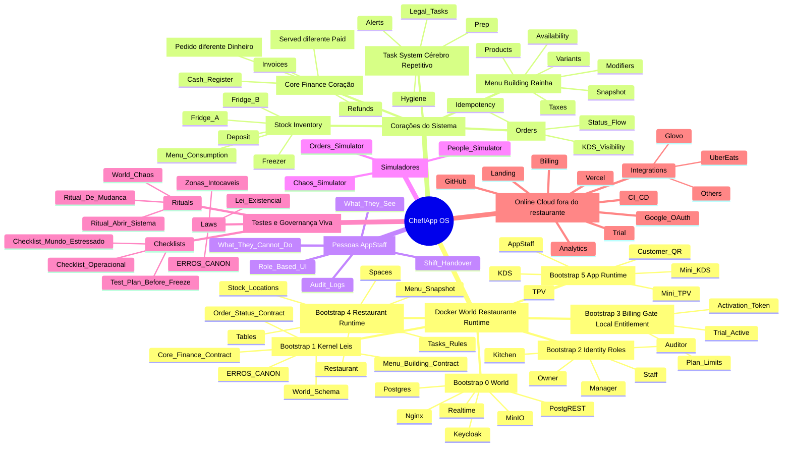
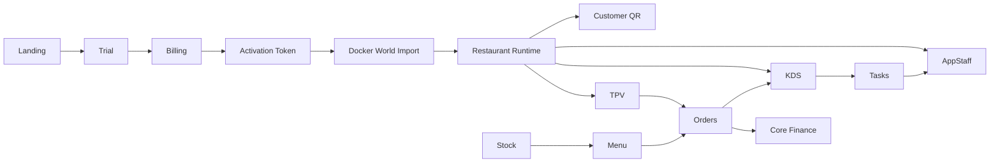

# ChefIApp OS — Mapa Mental e Fluxo (Bússola)

**Propósito:** Documento de referência para leitura, auditoria e navegação do projeto. Separa claramente **Restaurante (Runtime)** vs **Online (Cloud)**, mostra bootstraps, núcleos, apps, tarefas, estoque, pessoas, testes e governança.

**Uso:** Quando precisar de orientação sobre "onde está cada coisa" ou "onde se testa o quê". Não descreve só software — descreve um organismo com memória, leis, papéis, tempo e defesas contra si mesmo.

---

## Mapa Mental — ChefIApp OS (Sistema Vivo)

---

## Fluxo — Online → Restaurante → Operação

---

## Onde se testa cada coisa (regra de ouro)

| O quê                | Onde / como                                |
| -------------------- | ------------------------------------------ |
| Docker World         | Simulador, caos, checklist                 |
| Core Finance         | Contratos + E07 / E10 / E22                |
| Menu / Stock / Tasks | Snapshot + [ERROS_CANON](./ERROS_CANON.md) |
| AppStaff             | Role-based UI + logs                       |
| Online               | Testes isolados (não tocam `gm_orders`)    |

---

## Quando pode congelar (freeze legítimo)

Pode congelar quando:

- Docker World passou Test Day
- Simuladores funcionam
- Caos não mata estado
- Um humano operou TPV + KDS + caixa
- Perguntas novas passam pelo filtro (invariante / E## / novo eixo)

Referências: [SCOPE_FREEZE.md](./SCOPE_FREEZE.md), [TEST_PLAN_BEFORE_FREEZE.md](./TEST_PLAN_BEFORE_FREEZE.md), [LEI_EXISTENCIAL_CHEFIAPP_OS.md](./LEI_EXISTENCIAL_CHEFIAPP_OS.md).

---

## Verdade final (em uma linha)

Este diagrama não descreve "software". Descreve um organismo com memória, leis, papéis, tempo e defesas contra si mesmo.

---

## Documentos relacionados

| Documento                                                                              | Propósito                                                                |
| -------------------------------------------------------------------------------------- | ------------------------------------------------------------------------ |
| [SCOPE_FREEZE.md](./SCOPE_FREEZE.md)                                                   | Escopo congelado; o que não se faz agora                                 |
| [TEST_PLAN_BEFORE_FREEZE.md](./TEST_PLAN_BEFORE_FREEZE.md)                             | Plano de teste antes de freeze; 4 testes                                 |
| [CHECKLIST_OPERACIONAL_TPV_KDS_CLIENTE.md](./CHECKLIST_OPERACIONAL_TPV_KDS_CLIENTE.md) | Checklist operacional TPV, KDS, Cliente                                  |
| [ERROS_CANON.md](./ERROS_CANON.md)                                                     | Erros canónicos (E07, E10, E22, etc.)                                    |
| [LEI_EXISTENCIAL_CHEFIAPP_OS.md](./LEI_EXISTENCIAL_CHEFIAPP_OS.md)                     | Lei existencial; ritual de mudança; zonas intocáveis                     |
| [FREEZE_OPERACIONAL.md](./FREEZE_OPERACIONAL.md)                                       | Freeze operacional 1.0-rc; o que está congelado; fases e decisão binária |
| [CORE_CONTRACT_INDEX.md](../architecture/CORE_CONTRACT_INDEX.md)                       | Índice de contratos Core                                                 |
| [CORE_SYSTEM_TREE_CONTRACT.md](../architecture/CORE_SYSTEM_TREE_CONTRACT.md)           | Árvore canónica do Restaurant OS; mapa endpoint → nó; fonte para DS e UI |
