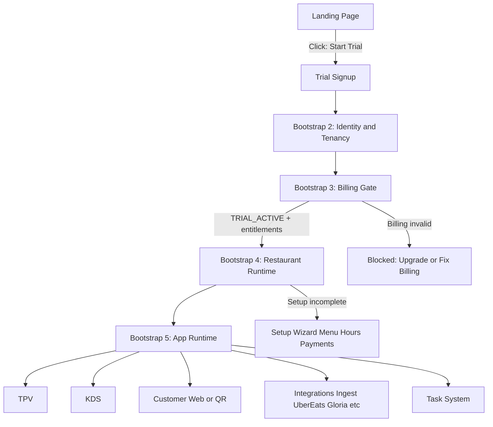

# Fluxo Landing → Trial → Billing → Runtime

Fluxo de entrada no sistema ChefIApp OS: da landing (fora do Core) ao runtime operacional (TPV, KDS, Cliente, Integrations).

---

## Resumo do fluxo

1. **Landing** — Fora do Core. Marketing, SEO, “Provar agora”, “14 dias grátis”. Só captação; nenhuma decisão operacional.
2. **Trial (Gate 1)** — Utilizador clica em Trial. Cria-se tenant, restaurant, owner; associa-se plano TRIAL; gera-se world_config inicial. Aqui nasce o restaurante activo para testes.
3. **Billing Gate (Gate 2)** — Mesmo no trial, o Billing existe (TRIAL_ACTIVE, NO_CHARGE, entitlements/limites). É Core Finance; controlo de acesso ao runtime, não “depois vemos”.
4. **Restaurant Runtime** — Store activo + spaces, tables, open_hours, payment_methods, menu mínimo ou setup wizard. Saída: existe um restaurante operacional.
5. **App Runtime** — TPV, KDS, Cliente conectam ao Core (PostgREST); Realtime habilitado; integrations via ingest; task system activo. O restaurante funciona no dia-a-dia.

Se **Billing** for inválido → bloqueado (Upgrade / Fix Billing). Se **Restaurant Runtime** estiver incompleto → Setup Wizard (Menu/Hours/Payments).

---

## Diagrama (Mermaid)

---

## Referências

- Bootstraps canónicos: [docs/boot/BOOTSTRAP_CANON.md](../boot/BOOTSTRAP_CANON.md)
- ERO (consciência do sistema): [docs/ERO_CANON.md](../ERO_CANON.md)
- Checklist de aceite: [CHECKLIST_OPERACIONAL_TPV_KDS_CLIENTE.md](./CHECKLIST_OPERACIONAL_TPV_KDS_CLIENTE.md)
