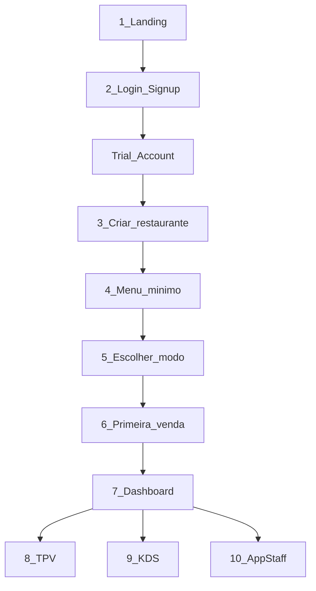

# Wireflow — 10 telas principais

**Propósito:** Especificação tela a tela das 10 telas principais do ChefIApp: conteúdo, CTAs, estado antes/depois. Utilizável para desenho em ferramenta externa ou implementação. Sem imagens; o documento é a especificação.

**Ref:** [FUNIL_VIDA_CLIENTE.md](../contracts/FUNIL_VIDA_CLIENTE.md), [ONBOARDING_FLOW_CONTRACT.md](../contracts/ONBOARDING_FLOW_CONTRACT.md), [CORE_CONTRACT_INDEX.md](../architecture/CORE_CONTRACT_INDEX.md).

---

## Fluxograma geral

---

## Fase Pública (2 telas)

### Tela 1 — Landing

**Propósito:** Converter curiosidade em intenção. Responde: "Isto resolve o meu problema?", "Consigo testar sem dor?", "É sério?"

**Estado antes:** Visitante anónimo, sem estado (LANDING_ENTRY).

**Wireframe (descrição):**
- Cabeçalho com marca ChefIApp.
- Hero: mensagem principal alinhada à frase-mãe ("Um restaurante começa a vender em minutos...").
- Máximo 3 CTAs em destaque:
  1. **Testar 14 dias no meu restaurante** (principal) — leva a Signup/Login.
  2. **Ver o sistema a funcionar** (demo guiada) — leva a demo.
  3. **Já tenho acesso** (login) — leva a Login.
- Rodapé com links secundários (preços, contacto, etc.) conforme CONTRATO_LANDING_CANONICA.

**Estado após (se CTA 1 ou 3):** Utilizador segue para Login/Signup. Estado após (se CTA 2): Demo guiada.

**Contrato:** CONTRATO_LANDING_CANONICA (LANDING_ENTRY).

---

### Tela 2 — Login / Signup

**Propósito:** Criar conta (Trial Gate) ou autenticar. Perguntas mínimas: Nome, Email, País, Tipo de negócio (restaurante/bar/café/outro). Nada de menu, mesas ou cozinha.

**Estado antes:** Visitante anónimo ou utilizador que clicou "Já tenho acesso".

**Wireframe (descrição):**
- Formulário: Nome, Email, País (select), Tipo de negócio (select). Para login: Email + palavra-passe (ou link "Esqueci a palavra-passe").
- CTA principal: "Criar conta" ou "Entrar".
- Link "Já tenho conta" / "Criar conta" conforme modo.
- Sem campos de restaurante, menu ou configuração.

**Estado após:** User ativo, Trial ativo (14 dias), Restaurant ainda NÃO criado (TRIAL_ACCOUNT).

**Contrato:** TRIAL_ACCOUNT_CONTRACT.

---

## Onboarding (4 telas / modais sequenciais)

As telas 3–6 são **modais sequenciais**, não páginas grandes. O mesmo fluxo em web e mobile; state-driven.

### Tela 3 — Criar restaurante

**Propósito:** Passo 1 do wizard. Criar o restaurante com dados mínimos obrigatórios.

**Estado antes:** Trial ativo, sem restaurante (trial_no_restaurant).

**Wireframe (descrição):**
- Título: "Criar o teu restaurante" (ou equivalente).
- Campos obrigatórios: Nome do restaurante (texto), País/moeda (select ou presets), Tipo de serviço (mesa / balcão / misto).
- CTA: "Continuar" ou "Criar".
- Indicador de progresso do wizard (ex.: passo 1 de 4).
- Sem campos de menu, horários ou equipa.

**Estado após:** Restaurant criado, status bootstrap (restaurant_bootstrap). Pronto para Passo 2.

**Contrato:** RESTAURANT_BOOTSTRAP_CONTRACT.

---

### Tela 4 — Criar menu mínimo

**Propósito:** Passo 2. Destravar o sistema com o mínimo: 1 categoria, 1 produto, preço. ~2 minutos.

**Estado antes:** Restaurant criado, sem menu válido para vender.

**Wireframe (descrição):**
- Título: "Primeiro menu" ou "Menu mínimo".
- Secção categoria: nome da categoria (ex.: "Entradas" ou livre).
- Secção produto: nome do produto, preço (obrigatório). Pode haver campo opcional de descrição.
- CTA: "Adicionar e continuar" ou "Guardar menu".
- Indicador de progresso (passo 2 de 4).
- Mensagem de ajuda: "Só precisas de 1 categoria e 1 produto para começar a vender."

**Estado após:** Menu válido (mínimo). Pronto para Passo 3 (menu_minimal).

**Contrato:** MENU_MINIMAL_CONTRACT.

---

### Tela 5 — Escolher modo

**Propósito:** Passo 3. O utilizador escolhe como quer prosseguir; a UI adapta depois.

**Estado antes:** Restaurant criado, menu mínimo válido. Modo ainda não definido.

**Wireframe (descrição):**
- Título: "Como queres continuar?"
- Duas opções claras (cartões ou botões):
  1. **Quero vender agora** — modo rápido: ir direto para o ritual da primeira venda.
  2. **Quero configurar melhor antes** — mais tempo no Dashboard/Config antes da primeira venda.
- CTA: "Continuar" após escolha.
- Indicador de progresso (passo 3 de 4).

**Estado após:** Modo definido (operation_mode_set). UI adapta (ex.: CTA principal para TPV vs Config).

**Contrato:** OPERATION_MODE_CONTRACT.

---

### Tela 6 — Primeira venda (guiada)

**Propósito:** Passo 4. Ritual explícito: abrir TPV/turno → criar pedido → marcar como pago. Primeira venda feita.

**Estado antes:** Modo definido; ainda não houve primeira venda no sistema.

**Wireframe (descrição):**
- Título: "Primeira venda" ou "Vamos fazer a tua primeira venda."
- Passos guiados (texto ou mini-wizard):
  1. Abrir turno (caixa) se aplicável.
  2. Adicionar pelo menos um item do menu ao pedido.
  3. Confirmar e marcar como pago.
- Pode ser uma vista que embebe o TPV com instruções por cima, ou um fluxo passo a passo que termina no TPV.
- CTA: "Abrir TPV", "Abrir turno", "Adicionar produto", "Marcar pago".
- Ao concluir o ritual: mensagem de sucesso e transição para Dashboard.

**Estado após:** first_sale_done → operational. Trial ativo, Restaurant operacional.

**Contrato:** FIRST_SALE_RITUAL.

---

## Operação (4 telas)

### Tela 7 — Dashboard

**Propósito:** Hub operacional após onboarding. Acesso a TPV, KDS, Tarefas, Configurações; avisos de trial countdown.

**Entrada:** Utilizador com restaurante operacional (primeira venda feita) ou em trial com acesso ao dashboard.

**Wireframe (descrição):**
- Cabeçalho: identidade do restaurante, estado (turno aberto/fechado), operador actual se aplicável.
- Área principal: cartões ou atalhos para TPV, KDS, Tarefas (AppStaff), Configurações.
- Se trial: banner ou aviso suave "Faltam X dias para terminar o trial."
- Sidebar ou menu de navegação para /app/dashboard, /app/tpv, /app/kds, /app/staff (ou equivalentes), /config, /app/billing.

**Acções principais:** Navegar para TPV, KDS, AppStaff, Config; ver resumo do dia; abrir/fechar turno conforme contrato do turno.

**Saídas:** TPV, KDS, AppStaff, Config, Billing (conforme permissões).

**Contrato:** TRIAL_OPERATION_CONTRACT, OPERATIONAL_SURFACES_CONTRACT.

---

### Tela 8 — TPV

**Propósito:** Ponto de venda. Criar pedidos, adicionar itens do menu, marcar pagamento, fechar pedidos.

**Entrada:** A partir do Dashboard ou atalho directo. Pode exigir turno aberto (CASH_REGISTER_AND_PAYMENTS_CONTRACT, CONTRATO_DO_TURNO).

**Wireframe (descrição):**
- Lista ou grelha de produtos/categorias do menu (lado esquerdo ou superior em mobile).
- Carrinho/ pedido actual (itens, quantidades, totais).
- Acções: adicionar item, remover item, aplicar desconto se aplicável.
- Botão "Confirmar pedido" e depois "Marcar como pago" (ou escolher método de pagamento).
- Indicador de turno (aberto/fechado) e opção "Abrir turno" / "Fechar turno" conforme contrato.

**Acções principais:** Adicionar itens ao pedido, confirmar pedido, marcar pago; gerir turno.

**Saídas:** Voltar ao Dashboard; após pagamento, novo pedido ou resumo. Fecho de caixa conforme CASH_REGISTER_AND_PAYMENTS_CONTRACT.

**Contrato:** FLUXO_DE_PEDIDO_OPERACIONAL, CASH_REGISTER_AND_PAYMENTS_CONTRACT.

---

### Tela 9 — KDS

**Propósito:** Kitchen Display System. Visualizar pedidos em preparação, marcar estados (em preparação, pronto, entregue).

**Entrada:** A partir do Dashboard ou atalho. Usado por cozinha/equipa.

**Wireframe (descrição):**
- Colunas ou cartões por estado do pedido (novo, em preparação, pronto, entregue).
- Cada pedido mostra: identificador, itens, notas, hora. Toque ou clique para avançar estado.
- Pode haver filtro por tipo (takeaway, mesa, etc.) conforme produto.
- Actualização em tempo real (pedidos enviados pelo TPV aparecem no KDS).

**Acções principais:** Ver pedidos; marcar pedido "em preparação", "pronto", "entregue".

**Saídas:** Voltar ao Dashboard. Sem venda directa; apenas gestão do fluxo de cozinha.

**Contrato:** FLUXO_DE_PEDIDO_OPERACIONAL, OPERATIONAL_SURFACES_CONTRACT.

---

### Tela 10 — AppStaff (tarefas / equipa)

**Propósito:** Tarefas e equipa. Lista de tarefas (repor stock, limpeza, etc.), atribuição, estado. Pode incluir visão de equipa ou turnos conforme TASKS_CONTRACT_v1.

**Entrada:** A partir do Dashboard. Usado por gerente/staff.

**Wireframe (descrição):**
- Lista de tarefas com estado (pendente, em curso, concluída). Filtros por tipo ou pessoa.
- Detalhe de tarefa: descrição, atribuído a, prazo, acções (marcar concluída, reassign).
- Pode haver secção "Equipa" ou "Turnos" (quem está a trabalhar) conforme produto.
- CTA: "Nova tarefa", "Marcar concluída", etc.

**Acções principais:** Ver tarefas, criar tarefa, marcar concluída, atribuir a membro da equipa.

**Saídas:** Voltar ao Dashboard; navegação para Config (pessoas/turnos) se aplicável.

**Contrato:** TASKS_CONTRACT_v1, OPERATIONAL_SURFACES_CONTRACT.

---

## Resumo por fase

| # | Tela | Fase | Contrato principal |
|---|------|------|--------------------|
| 1 | Landing | Pública | LANDING_ENTRY |
| 2 | Login / Signup | Pública | TRIAL_ACCOUNT |
| 3 | Criar restaurante | Onboarding | RESTAURANT_BOOTSTRAP |
| 4 | Criar menu mínimo | Onboarding | MENU_MINIMAL |
| 5 | Escolher modo | Onboarding | OPERATION_MODE |
| 6 | Primeira venda (guiada) | Onboarding | FIRST_SALE_RITUAL |
| 7 | Dashboard | Operação | TRIAL_OPERATION, OPERATIONAL_SURFACES |
| 8 | TPV | Operação | FLUXO_DE_PEDIDO, CASH_REGISTER_AND_PAYMENTS |
| 9 | KDS | Operação | FLUXO_DE_PEDIDO, OPERATIONAL_SURFACES |
| 10 | AppStaff | Operação | TASKS_CONTRACT_v1, OPERATIONAL_SURFACES |

O resto são **estados** e **permissões**, não novas telas (ex.: Configurações é uma área com subpáginas; Billing é uma tela de conversão após trial).
