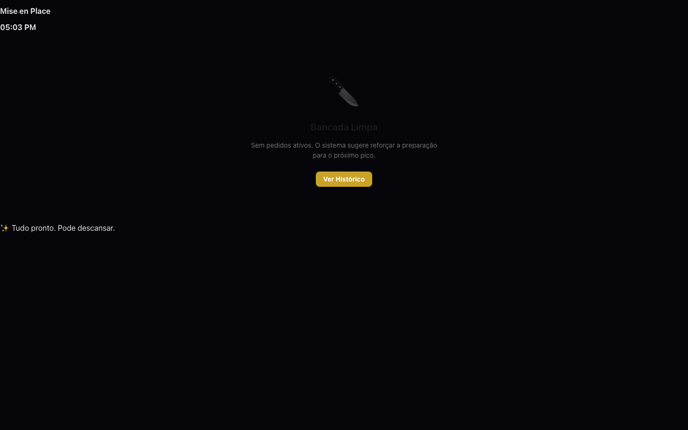
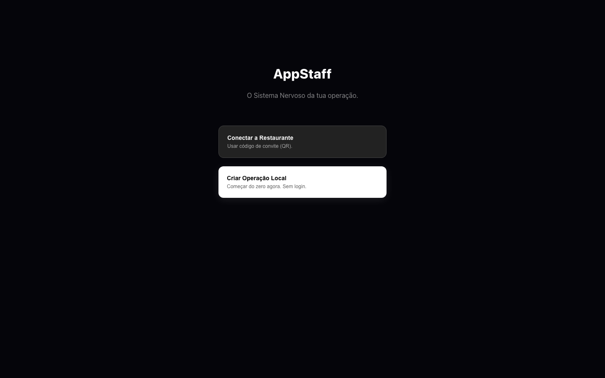
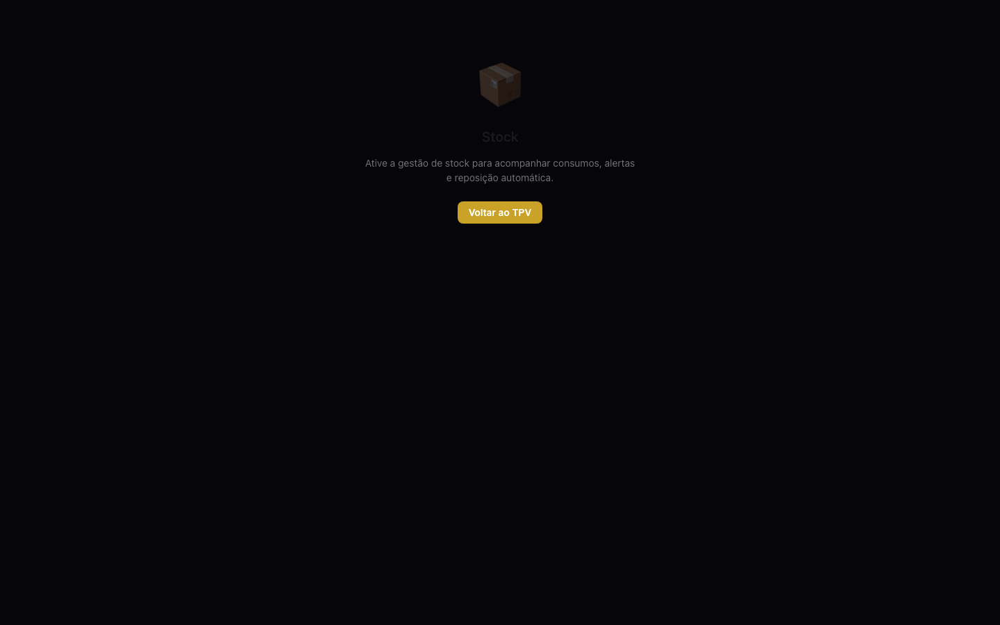
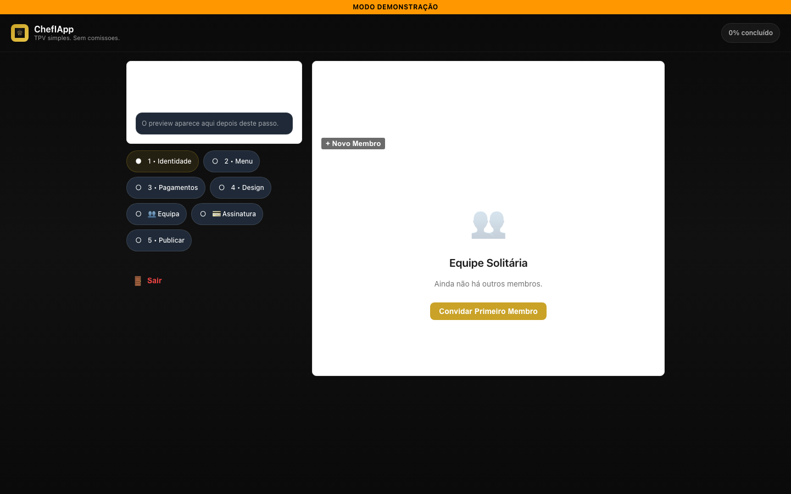
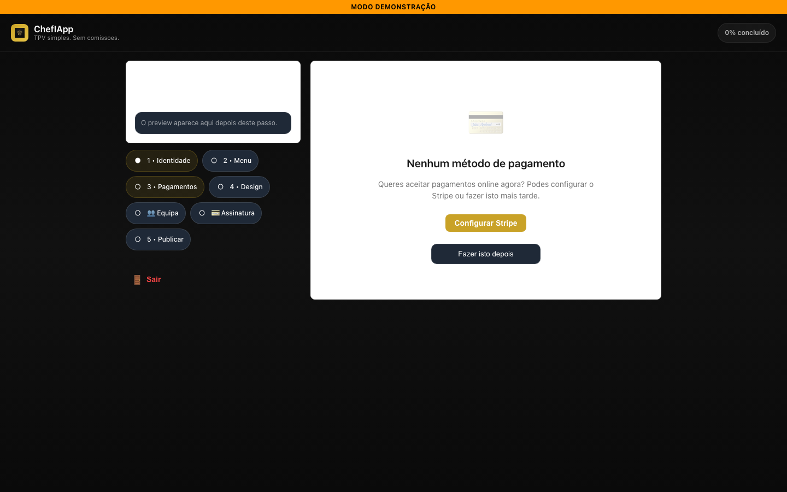
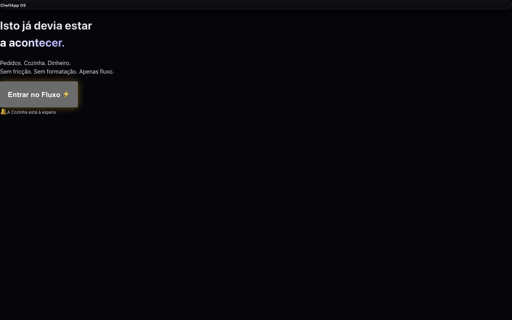
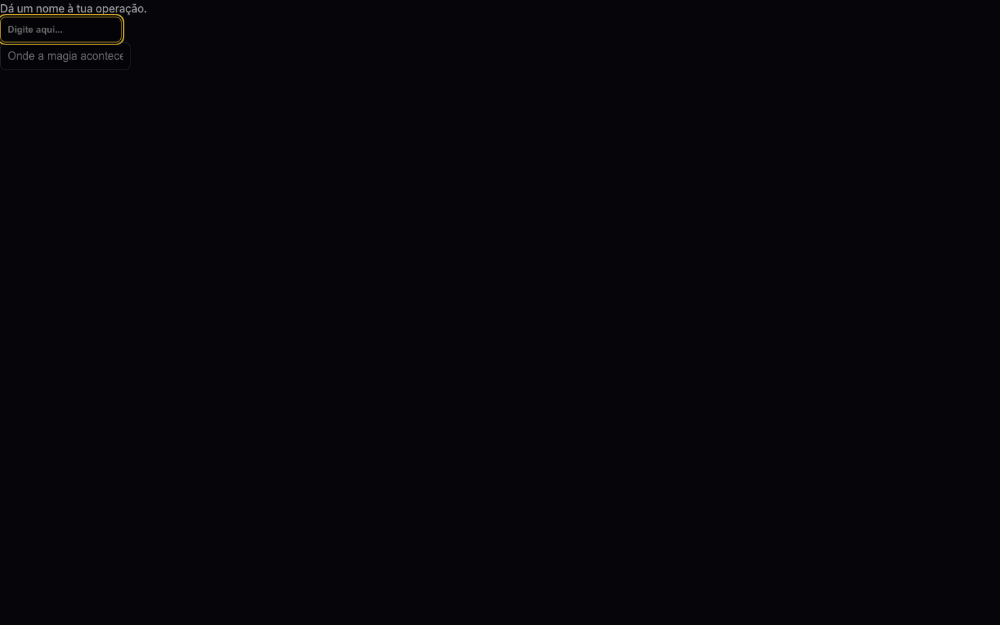

# UI/UX Browser Walkthrough Report
**Date**: 2025-12-27T16:02:54.837Z
**Agent**: AntGravit (Simulated Human)

## Route: TPV (`/app/tpv`)
**Status**: ✅ OK

**First Visual Impression**: Rendered successfully. Professional appearance.
**Main Action Obvious?**: YES
**Broken/Cheap?**: NO
**Sellable?**: YES

### Screenshots
Before/Fail: 

**Notes**: Clean load. Interaction 'Click New Order' failed/blocked.
---
## Route: KDS (`/app/kds`)
**Status**: ✅ OK

**First Visual Impression**: Rendered successfully. Professional appearance.
**Main Action Obvious?**: N/A
**Broken/Cheap?**: NO
**Sellable?**: YES

### Screenshots
Before/Fail: 

**Notes**: Clean load.
---
## Route: Staff (`/app/staff`)
**Status**: 🔴 BLOCKER

**First Visual Impression**: Failed to render.
**Main Action Obvious?**: YES
**Broken/Cheap?**: YES (Render Fail)
**Sellable?**: NO

### Screenshots
Before/Fail: 

**Notes**: Render timeout / Selector not found. [Debug content: "AppStaff

O Sistema Nervoso da tua operação.

Cone..."]
---
## Route: Inventory (`/app/inventory`)
**Status**: ✅ OK

**First Visual Impression**: Rendered successfully. Professional appearance.
**Main Action Obvious?**: YES
**Broken/Cheap?**: NO
**Sellable?**: YES

### Screenshots
Before/Fail: 

**Notes**: Clean load. Interaction 'Click Support' failed/blocked.
---
## Route: Setup_Staff (`/app/setup/staff`)
**Status**: ✅ OK

**First Visual Impression**: Rendered successfully. Professional appearance.
**Main Action Obvious?**: N/A
**Broken/Cheap?**: NO
**Sellable?**: YES

### Screenshots
Before/Fail: 

**Notes**: Clean load.
---
## Route: Setup_Payments (`/app/setup/payments`)
**Status**: 🔴 BLOCKER

**First Visual Impression**: Failed to render.
**Main Action Obvious?**: N/A
**Broken/Cheap?**: YES (Render Fail)
**Sellable?**: NO

### Screenshots
Before/Fail: 

**Notes**: Render timeout / Selector not found. [Debug content: "MODO DEMONSTRAÇÃO
ChefIApp
TPV simples. Sem comiss..."]
---
## Route: Billing (`/app/billing`)
**Status**: 🔴 BLOCKER

**First Visual Impression**: Failed to render.
**Main Action Obvious?**: YES
**Broken/Cheap?**: YES (Render Fail)
**Sellable?**: NO

### Screenshots
Before/Fail: 

**Notes**: Render timeout / Selector not found. [Debug content: "ChefIApp OS
Isto já devia estar
a acontecer.

Pedi..."]
---
## Route: TPV_Ready (`/app/tpv-ready`)
**Status**: 🔴 BLOCKER

**First Visual Impression**: Failed to render.
**Main Action Obvious?**: N/A
**Broken/Cheap?**: YES (Render Fail)
**Sellable?**: NO

### Screenshots
Before/Fail: 

**Notes**: Render timeout / Selector not found. [Debug content: "ChefIApp OS
Isto já devia estar
a acontecer.

Pedi..."]
---
## Route: Cinematic_Identity (`/start/cinematic/2`)
**Status**: 🔴 BLOCKER

**First Visual Impression**: Failed to render.
**Main Action Obvious?**: N/A
**Broken/Cheap?**: YES (Render Fail)
**Sellable?**: NO

### Screenshots
Before/Fail: 

**Notes**: Render timeout / Selector not found. [Debug content: "Dá um nome à tua operação...."]
---